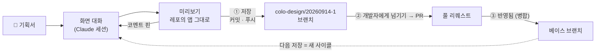

# Colo Design

> **기획서를 채팅에 붙여넣으면 화면이 되고, 미리보기에서 검증한 뒤 개발자에게 넘어간다 —
> git도 터미널도 열지 않고.**


이 문서는 읽는 사람에 따라 두 부분으로 나뉜다. 앞부분은 **기획자용** — 개발 지식이
없어도 이것만 읽으면 도구를 쓸 수 있다. [개발자 · 운영자 안내](#개발자--운영자-안내)부터는
소스를 고치거나 배포하는 사람을 위한 안내다.

## 이 도구가 뭔가요?

기획자가 기획서를 채팅에 첨부하면, 작업하는 서비스의 저장소("연결 레포") 안에서 도는
Claude 세션이 그것을 화면으로 만든다. 기획자는 미리보기에서 결과를 검증하고, 코드는
개발자에게 넘어간다. 이 도구가 존재하는 이유 전부다.

git 용어는 익히지 않아도 된다. 세 단어만 알면 된다.

- **저장** — 지금까지 만든 화면을 안전하게 묶는다.
- **개발자에게 넘기기** — 묶은 작업을 개발자에게 보낸다.
- **반영됨** — 개발자가 그 작업을 제품에 합쳤다.

브랜치 · 커밋 · 푸시 · 풀 리퀘스트 같은 말은 도구가 대신 다룬다.

그 밖에 알아둘 두 가지:

- **도구가 아는 일은 하나다.** 로컬 폴더 하나를 원격과 동기 상태로 유지하고, 그 안에서
  Claude 세션을 돌린다. 어떤 기술로, 어떤 디자인 시스템으로, 화면이 어디에 사는지 같은
  규칙은 전부 작업하는 서비스 쪽(연결 레포)이 자기 파일로 정한다. 미리보기에 뜨는 것도
  그 서비스의 앱을 있는 그대로 띄운 것이다.
- **한 사람, 한 대의 기계, 하나의 구독.** 각 사용자가 자기가 로그인한 Claude 로 자기만의
  데몬을 돌린다. GitHub 토큰과 로그인은 공유 서버를 거치지 않고 OS 자격 증명 저장소
  (맥 키체인 등)에만 있으며, 화면 쪽에는 절대 닿지 않는다.

## 설치

데스크톱 앱이 일반적인 쓰는 법이다(mac · Windows).

1. 릴리스 페이지(`inkwonjung-colosseum/colo-design`)에서 기계에 맞는 파일을 내려받아
   설치한다 — mac 은 `colo-design-<버전>-mac-arm64.dmg`, Windows 는
   `colo-design-Setup-<버전>-win-x64.exe`.
2. 서명이 없는 배포라 첫 실행에 한 번 허가가 필요하다 — mac 은 앱을 우클릭 → 열기,
   Windows 는 SmartScreen 의 `추가 정보` → `실행`. 같은 안내가 릴리스 노트에도 들어
   있다.
3. 앱에는 실행에 필요한 런타임(Node · pnpm)이 들어 있다. 따로 준비할 것은 둘 —
   로그인된 Claude Code CLI(`claude /login` 한 번)와 git.
4. 업데이트는 하루에 한 번 저절로 확인해 OS 알림으로 알린다(설정의 확인 버튼으로도 즉시
   확인할 수 있다). mac 은 새 버전을 앱이 스스로 교체한다.

## 작업은 한 바퀴로 흘러간다



상단 바의 상태 칩 하나가 지금 어디쯤인지 말한다. 판정은 전부 기계적 신호(저장 안 한
변경 건수, GitHub 이 보고하는 넘긴 요청 상태)라 사람이 임의로 바꿀 수 없다.

| 상태 칩 | 뜻 |
| --- | --- |
| `변경 없음` | 저장하지 않은 새 작업이 없다 |
| `저장 안 함 N건` | 저장하지 않은 작업이 N건 있다. Claude 가 고치는 중이면 `고치는 중 · N건`으로 읽는다. 넘긴 요청이 열려 있으면 저장분은 그 요청에 함께 담긴다 |
| `저장됨` | 저장했지만 아직 개발자에게 전달하지 않았다 |
| `개발자 검토 중` | 넘긴 요청을 개발자가 보고 있다 |
| `변경 요청` | 개발자가 넘긴 요청에 코멘트를 남겼다 — `상태 확인` 버튼으로 이어 간다 |
| `반영됨` | 작업이 제품에 합쳐졌다. 다음 저장은 새 사이클을 시작한다 |

## 사용 안내 — 여덟 걸음

### 1. 처음 켤 때 — 준비 확인

앱을 처음 열면 네 가지를 확인한다: Claude Code 로그인, git, 런타임(앱에 포함 — 없다고
나오면 앱 설치가 깨진 것), GitHub 토큰. 하나라도 안 되면 한국어로 이유를 말하고 고치는
길(버튼이나 안내)을 보여 준다. GitHub 토큰이 없어도 시작은 할 수 있다 — 공개 저장소로
작업하는 길은 열려 있고, 저장소 목록과 개발자에게 넘기기만 쓸 수 없게 된다.

### 2. 프로젝트 고르기 — 작업할 서비스

프로젝트는 곧 작업할 서비스 하나다. `프로젝트 추가` 목록에서 토큰이 접근할 수 있는
저장소를 고르거나, 목록에 없으면 `주소로 추가`로 직접 넣는다. 처음 연결하는 저장소가 뭔가를
설치하고 미리보기를 띄우는 일은 기획자의 승인 한 번(`실행 허용`) 뒤에만 돈다 — 승인은
기억되어 다시 묻지 않는다. 왼쪽 사이드바의 프로젝트를 고르면 그 서비스의 대화 ·
미리보기 · 변경 사항이 오른쪽에 뜬다.

### 3. 화면 만들기 — 기획서 붙여넣기

새 대화는 사이드바의 ＋, 행 메뉴, ⌘T 어디로든 연다. 기획서 파일을 첨부하고 원하는 말로
보낸다. 결과가 아니라 뼈대부터 보고 싶으면 입력창의 `계획 먼저` 칩을 켠 채 보낸다 —
Claude 의 첫 답은 `만들 것` 카드로 오고, 승인하면 착수한다. `바꿔 달라…`로 거절하면
이유를 갖고 다음 계획을 다시 받는다.

### 4. 미리보기에서 확인

미리보기는 그 서비스의 앱을 그대로 띄운 것이다. 주소창에 화면 주소를 치면 그 화면으로
이동하고 — 선언된 화면은 입력할 때 자동 완성으로 제안된다 — 상태 칩(`기본` · `비어 있음` ·
`오류`)은 실제 목 데이터로 화면을 그린다.
뒤로 · 앞으로 · 새로 고침, 주소창, 모바일 · 태블릿 화면, 배율 조절이 다 있다. 앱이 뜨지
않으면 오류 배너가 이유를 말한다.

### 5. 수정할 곳은 핀으로

미리보기에서 ⌥+클릭하면 그 자리에 핀이 찍혀 입력창 아래 트레이에 행이 담긴다 — 행마다
메모를 남길 수 있고, 여러 개를 찍은 뒤 문장을 붙여 한 번에 보낸다. 핀과 문장은 한
턴이 되고, 보낸 핀은 그 자리에서 화면을 떠난다 — 해결 표식을 붙이고 다니는 일은
없다. 다시 바라는 것이 있으면 그대로 대화에서 말하면 되고, 지금까지 보낸 코멘트는
더 보기 ▾ 의 `코멘트 목록`에서 기록으로 읽는다.

### 6. 저장 — 작업 묶기

`저장`을 누르면 이번에 바뀐 내용을 먼저 검토하게 되고, 검토한 변경만 골라 이번 작업
전용 보관함(브랜치)에 밀어 넣는다. 서비스의 원본(main)은 절대 건드리지 않는다. 레포의
자체 검사(`check`)는 저장을 막지 않는다 — 문제가 있으면 넘기기가 연 요청(풀 리퀘스트)에서
개발자가 보고 고친다. 저장한 시점들은 `저장 기록`에서 다시 볼 수 있다.

### 7. 개발자에게 넘기기

`개발자에게 넘기기`를 누르면 개발자에게 요청(풀 리퀘스트)을 연다 — 요청 본문에 이번
화면들의 제목 · 위치 · 상태가 적히고, 근거가 된 기획서도 함께 담겨 개발자가 읽는다.
빌드가 깨져 있어도 요청은 열린다 — 고칠 곳은 요청 안에서 개발자가 본다. 넘긴 뒤의 저장은
같은 요청에 쌓이고, 진행은 `상태 확인` 버튼으로 본다.

### 8. 반영된 뒤 — 최신 변경 받아오기

요청이 합쳐지면(병합) 상태 칩이 `반영됨`이 된다. 개발자가 반영한 내용은 화면 작업을
시작할 때와 화면 막대의 `최신 변경 받아오기` 버튼으로 받아 온다. 저장하지 않은 작업이
있으면 잠시 치워 뒀다가 그 위에 다시 얹는다 — 겹치지 않는 편집은 자동으로 합쳐지고,
정말 겹치는 부분만 Claude 의 첫 과제가 된다.

### 마음이 바뀌면 — 되돌리기

- 답변 카드의 `이 답변 이전으로 되돌리기` — 화면 파일만 그 답변이 시작하기 전 모습으로
  돌린다. 되돌리기도 기록에 쌓이므로 지금까지의 역사는 지워지지 않는다.
- 답변 카드의 `다시 요청` — 답을 통째로 버리고 대화와 파일을 그 전으로 돌려 같은 말로
  다시 받는다.
- `저장 기록`의 되돌리기 — 저장했던 시점으로 돌아간다.
- 단, 작업이 반영되고 나면 그 사이클의 되돌리기 기록은 사라진다 — 합쳐진 것을 거슬러
  갈 수는 없으므로.

### 알아두면 편한 것

- **알림** — Claude 가 작업을 마치거나 사용자 확인을 기다리거나 저장이 끝나지 못해 대화가
  멈췄을 때 OS 알림이 온다. 창이 앞에 있으면 조용히 하고, 알림을 누르면 창이 앞으로
  오며 그 대화를 연다(다른 프로젝트의 대화라면 전환까지 한다). 창이 뒤에 있는 동안
  도착한 것은 dock 배지가 센다. 확인 요청·중단은 언제나 오고, `완료` 알림만 설정에서
  `끔 · 오래 걸린 턴만(기본) · 모든 턴`으로 고를 수 있다(소리와 시험 알림도 그 옆).
- **여러 프로젝트** — 한 번에 하나의 프로젝트가 활성이지만, 떠난 프로젝트의 미리보기는
  따뜻하게 남는다(최근 두 개까지). 다시 고르면 서버를 새로 띄우거나 화면을 다시
  그리지 않고, 보던 자리 그대로 곧바로 돌아온다. 전환해도 다른 프로젝트에서 돌던
  Claude 작업은 끝까지 돈다 — 사이드바 행의 표식(작업 중 → 변경 N)이 알려 준다.
- **실행 중 보내기** — 턴이 도는 동안에도 입력창에서 바로 보낼 수 있다. 기본값인
  `다음 턴에 보내기`는 그 말을 대기 줄에 쌓아 지금 답변 다음으로 전달하고, 설정의
  `끊고 보내기`는 같은 보내기가 도는 턴을 끊고 새로 시작하게 한다. ⌥Enter 는 설정과
  관계없이 언제나 끊고 보낸다.
- **진행 시계** — 보낸 요청이 도는 동안 입력창 위 활동 줄(`생각하는 중`)에서
  초가 흐른다(`12초`, `1분 5초`). 시계는 창이 아니라 데몬의 것이라 새로고침해도,
  두 번째 창에서 열어도 실제 시작부터 이어 세고, 확인 카드 앞에 멈춰 기다린
  시간도 함께 센다. 턴이 끝나면 사라진다 — 끝난 턴의 길이는 기록의
  `걸렸습니다` 줄에 남는다.
- **잠긴 버튼** — 저장 · 넘기기 · 상태 확인 버튼은 항상 그려지고, 못 쓰는 상태면 마우스를
  올릴 때 이유가 뜬다(예: `먼저 저장해 주세요`).
- **대화 내보내기** — 행 메뉴에서 markdown 파일로 내보낼 수 있다. 지우기 전의 안전망이다.
- **미리보기 자리** — 미리보기가 쓰려는 자리를 다른 프로그램이 쓰고 있으면 도구가 그
  프로그램을 정리하고 미리보기를 띄운다. 활성 프로젝트가 선언한 자리는 활성 프로젝트의
  것이므로.

## 자주 묻는 질문

**GitHub 토큰과 Claude 로그인은 어디에 보관되나요?**
OS 자격 증명 저장소(맥 키체인 등)에만 있다. 토큰은 기계에 하나뿐이고 공유 서버를
거치지 않으며, 화면 쪽 코드에는 절대 전달되지 않는다.

**도구가 내 컴퓨터에 남기는 것은 뭔가요?**
홈의 숨은 폴더 하나 `~/.colo-design/` 전부다 — 설정 파일과 작업 중인 저장소 복사본.
설정 → 문제 해결의 `폴더 열기`로 열어 볼 수 있다.

**Claude 가 엉뚱한 화면을 만들었어요.**
저장하기 전이라면 뭐든 되돌릴 수 있다(위의 되돌리기). 저장했다면 `저장 기록`에서.

**Claude 프로그램이 죽으면 어떻게 되나요?**
크래시 카드가 대화에 뜨고, 다시 살리면 같은 대화를 이어받는다. 죽은 상태로는 새 전송이
거절될 뿐이다.

**인터넷이 끊기거나 앱을 다시 켜도 되나요?**
연결이 끊겨 다시 붙어도 잃는 것이 없다 — 대기 중이던 확인 카드는 이중으로 쌓이지 않고,
멈춰 있던 작업의 상태도 그대로 돌아온다.

**Node 나 터미널을 직접 설치해야 하나요?**
아니요. 데스크톱 앱에 필요한 런타임이 들어 있다. Claude Code CLI 와 git만 설치하고
(`claude /login`) 로그인하면 된다.

---

# 개발자 · 운영자 안내

> 여기부터는 소스를 고치거나 배포하는 사람을 위한 안내다.

## 개발 실행

```bash
pnpm install
pnpm build

# 터미널 1 — 토큰이 든 client url 을 인쇄한다
pnpm dev:daemon        # … client url: ws://127.0.0.1:7823?token=…

# 터미널 2
pnpm dev:web           # http://127.0.0.1:5273
```

`dev:daemon`(7823) · `dev:web`(5273) · `dev:desktop`(5273) 은 시작 직전
`scripts/free-port.mjs` 로 자기 포트를 먼저 확보한다 — 예전 실행이 남긴 좀비
리스너는 강제로 종료되므로, 포트가 겹쳐서 시작이 실패하는 일은 없다.

client URL 을 한 번 붙여넣는다. 첫 접속은 온보딩 마법사를 돈다 — Claude Code ·
git · GitHub 토큰 셋을 지나 `시작하기` 를 누르면, 프로젝트가 없는 작업 화면이 레포
목록을 보여 준다. 거기서 레포를 고르면 프로젝트가 된다(목록에 없는 주소는 `주소로
추가`). `pnpm doctor` 는 같은 검사와 활성 프로젝트의 레포 상태를 터미널에서
보고한다.

데스크톱 앱 자체를 고치거나 데스크톱 전용 면(safeStorage 키체인, 네이티브 미리보기,
메뉴 단축키, 업데이트 다리, OS 알림·배지)을 눈으로 보려면 Electron 을 띄운다 — 위의
브라우저 경로에는 그 면들이 없다.

```bash
# 빠른 고리 — 웹은 vite 가 주고(HMR), 데몬은 앱 안에 그대로 있다.
# 시작할 때 5273 을 먼저 확보한다 — 이미 도는 dev:web 이 있으면 그것을
# 끄고 이 실행이 새 vite 를 띄운다.
pnpm dev:desktop

# 릴리스와 같은 코드 경로 — 전부 빌드해 web-dist 를 스테이징하고 띄운다
pnpm --filter @colo-design/desktop dev
```

`pnpm dev:desktop` 은 웹 소스를 고치면 창이 즉시 바뀐다(타입 검사는 건너뛴다 —
`pnpm typecheck` 는 따로 돌린다). 데스크톱 메인 · 프리로드를 고치면 두 실행
경로 모두 다시 빌드해 앱을 재시작한다(빌드가 깨지면 지금 도는 앱을 그대로
둔다) — 데몬 · 프로토콜을 고치면 다시 실행해야 한다. 창이 다른 origin 을
여는 문은 `app.isPackaged` 가 아닌 실행에서만 열린다 — 패키징된 앱은
`COLO_DESIGN_DEV_SERVER` 를 보지 않는다.

**요구 사항** — 로그인된 Claude Code CLI(`claude /login`), git, 그리고 데몬 환경에
`ANTHROPIC_API_KEY` 가 없을 것. Node 22 + pnpm 은 데스크톱 앱에 포함되어 나오고,
브라우저 개발 경로에서는 온보딩의 Node·pnpm 게이트가 검사한다. 연결 레포의 `.npmrc`
가 private 레지스트리를 가리키면 그것을 읽을 `read:packages` 인증이 기계에 필요하다 —
없으면 데몬 상태의 경고 줄이 한국어로 그렇게 말한다.

## 도구가 기계에 남기는 것

도구가 쓰는 모든 것은 홈의 숨은 폴더 하나 `~/.colo-design/` 에 산다.

| 경로 | 무엇이 있는가 |
| --- | --- |
| `~/.colo-design/config/` | `daemon.json` (host/port/token), `projects.json` (레지스트리) — 전부 0600, 비밀 없음(그건 OS 저장소로 간다) |
| `~/.colo-design/logs/` | 데몬의 하루 로그(`daemon-YYYY-MM-DD.log`, 7일 보존) — 설정 → 문제 해결의 `로그 폴더 열기`가 여기를 엽니다 |
| `~/.colo-design/projects/<slug>/repo/` | 그 프로젝트의 연결 레포 클론 |

설정 → 문제 해결의 `폴더 열기` 가 이 폴더를 연다.

쓸 만한 환경 변수 오버라이드(모두 선택, 모두 테스트로 검증됨):

| 환경 변수 | 기본값 | 역할 |
| --- | --- | --- |
| `COLO_DESIGN_PROJECTS_SETTINGS` | `~/.colo-design/config/projects.json` | 프로젝트 레지스트리 파일 |
| `COLO_DESIGN_PROJECTS_DIR` | `~/.colo-design/projects` | 프로젝트 폴더의 위치 |
| `COLO_DESIGN_REPO_DIR` | `<project>/repo` | **활성** 프로젝트의 클론 디렉터리 |
| `COLO_DESIGN_REPO_URL` | 레지스트리 | **활성** 프로젝트의 레포 url(테스트는 fixture 원격을 쓴다) |
| `COLO_DESIGN_CLAUDE_BIN` | 자동 탐지 | 구동할 Claude Code 바이너리 |
| `COLO_DESIGN_GITHUB_FIXTURE` | unset | 녹화된 GitHub REST 짝(오프라인 넘기기 테스트) |
| `COLO_DESIGN_GITHUB_SLUG` | 레포 url 에서 | 넘기기가 겨눌 `owner/repo`; 테스트는 로컬 bare 원격을 클론하니 url 에 GitHub 프로젝트가 없다 |
| `COLO_DESIGN_CREDENTIAL_STORE` | 플랫폼 기본 | `memory` (테스트) 또는 `keychain` |
| `COLO_DESIGN_EXTRA_PATH` | unset | repo 명령의 PATH 접두어(데스크톱이 설정한다) |

## 상세 동작

### 만들고 고치는 루프

화면을 만드는 것과 고치는 것은 같은 턴이다. 새 대화는 사이드바의 ＋ · 행 메뉴 · 레일
팝오버 · 팔레트 · ⌘T 어디로든 열린다. 코멘트 핀은 ⌥+클릭으로 언제든 찍고, 보내는
순간 화면을 떠난다. 저장 · 넘기기는 원하는 시점에 누르는 배치 동작이다.
저장 · 넘기기 · 상태 확인 버튼은 언제나 그려지고, 잠겼을 때 마우스를 올리면 이유가
보인다. 변경 건수는 클론 준비 · 화면 턴 종료 · 저장 완료 세 트리거로 갱신된다 —
폴링 없음.

답이 어긋난 턴은 답변 카드에서 두 갈래로 되돌린다. `이 답변 이전으로 되돌리기` 는
화면 파일만 그 답변이 시작하기 전 모습으로 돌린다 — 되돌리기도 새 커밋이므로 역사는
줄지 않는다. `다시 요청` 은 답을 통째로 버리고 파일과 대화를 그 전으로 돌려 같은
말로 다시 받는다. 저장한 시점으로의 되돌리기는 저장 기록에서 누른다. 반영되면 그
사이클의 되돌리기 기록은 사라진다 — 머지를 거슬러 되돌아갈 수 없으므로. 대화는 행
메뉴에서 markdown 파일로 내보낼 수 있다 — 지우기 앞에 두는 안전망이다.

### 저장 · 개발자에게 넘기기 · 반영됨

세 단어가 git 명사 전부를 대신한다. 기획자는 브랜치, 커밋, 푸시, PR, 머지를 읽지 않는다.

- **저장** — 이번 사이클 것의 `colo-design/<YYYYMMDD>-<n>` 브랜치를 첫 사용 때 만들고
  (번호는 원격에 없는 것을 찾아 올라간다), 검토한 diff 만 정확히 커밋해 밀어 넣는다.
  베이스 브랜치에는 절대 쓰지 않는다.
- **개발자에게 넘기기** — 풀 리퀘스트를 열고, 본문에 이번 화면들의 제목 · 경로 · 상태를
  적는다. 근거 기획서는 화면 옆 `specs/` 에 커밋돼 있으니 개발자가 풀 리퀘스트 안에서
  읽는다. 이후 저장은 같은 풀 리퀘스트에 쌓인다.
- **반영됨** — 병합이다. 클론이 베이스 브랜치로 돌아오고, 다음 저장이 새 사이클을 시작한다.

레포의 `check` · `build` 는 이 셋 중 어느 것도 막지 않는다 (실사: 레포 검사에 걸린
저장은 기획자가 올릴 수 없는 일감을 남겼다). 문제는 넘기기가 여는 풀 리퀘스트에서
개발자가 잡고, Claude 는 턴 안에서 스스로 그 명령을 돌릴 수 있다 — 도구가 그 명령을
아는 이유는 하나다: Bash 한 줄을 `레포 검사` 로 이름 붙이기 위해서다.

### 레포 최신화

개발자가 반영한 내용은 화면 턴이 시작될 때와 화면 막대의 **최신 변경 받아오기**
버튼으로 받아 온다. 저장하지 않은 변경이 있으면 임시 보관한 뒤 클론을 최신으로 옮기고 그 위에
얹는다 — 겹치지 않는 편집은 git 의 기계적 병합이 혼자 합친다. git 이 혼자 못 합치는
진짜 충돌만 Claude 의 첫 과제가 된다(게이트 카드로 대화에 떨어진다). 열린 대화가
없으면 한국어 이유가 재시도 패널에 남는다. 베이스 브랜치의 원격 기록과 갈라진 커밋은
절대 덮어쓰지 않고 이름을 밝힌다. 도구가 임시 보관과 얹기 사이에 죽어서 변경이
보관에 남았으면, 다음 시작이 그것을 저절로 클론에 되돌려 놓는다 — 그 사용자가 손으로
만든 stash 는 건드리지 않는다.

### 프로젝트와 목록

프로젝트는 연결 레포 하나다. 다른 모든 말이 여기에 묶인다 — Claude 가 고치는 클론,
도는 미리보기 서버, 그리고(SDK 가 디렉터리별로 대화를 저장하므로) 세션 목록. 왼쪽
사이드바에 연결 레포가 줄을 서고, 하나를 고르면 그 레포의 대화 · 미리보기 · 변경
사항이 오른쪽에 뜬다. 한 대의 기계는 기획자가 작업하는 만큼 가지고, 정확히 하나가
활성이다. 미리보기 서버는 활성 프로젝트만 새로 띄울 수 있지만, 떠난 프로젝트의 서버는
따뜻하게 남는다 — 돌아오면 준비 단계 없이 곧바로 `ready` 고(레포 최신화는 서버를
건드리지 않는 조용한 pull), 데스크톱은 그 프로젝트의 페이지를 숨겨 두었다가 보던 자리
그대로 다시 보여 준다(reload 없음). 전환의 울타리는 둘이다: 두 레포가 같은
`preview.port` 를 선언할 수 있으므로 들어오는 프로젝트가 선언한 포트를 잡고 있는
우리 서버는 먼저 멈추고, 따뜻한 서버는 최근 두 개까지만 남는다(그 너머는 오래된 것부터
멈춘다). 페이지 쪽도 같은 상한(세 장)을 두고, `RepoStatus.previewEpoch`(서버 시작마다
새 번호)가 바뀐 페이지는 낡은 앱을 보이지 않도록 돌아올 때 다시 읽는다.
인스턴스끼리는 같은 포트를 두고 싸우지 않는다 — 어느 인스턴스가 미리보기를 띄웠는지
`~/.colo-design/run/` 에 한 줄 기록해 두고, 그 기록의 주인(데스크톱 앱 또는 다른
데몬)이 살아 있으면 점유자를 죽이지 않고 이쪽 준비는 `held-elsewhere` 카드로 멈춘다.
주인이 죽어 남은 고아 서버는 예전처럼 묻지 않고 정리한다.
Claude 세션은 죽지 않는다 — 다른 프로젝트에서 도는 턴은 끝까지 돌고, 행의
표식(작업 중 → 변경 N)과 OS 알림이 그것을 말한다. 소켓이 끊겨 다시 붙어도 잃는
것이 없다 — 대기 중이던 확인 카드는 새 소켓에만 다시 내려앉아 이중으로 쌓이지
않고, 멈춰 있던 턴의 상태도 그대로 돌아온다.

프로젝트 행의 `···` 메뉴에는 **지켜 줄 것**이 있다 — 이 프로젝트에서 Claude 가 늘
따랐으면 하는 규칙을 기획자의 말로 적는 상자 하나다(브랜치·커밋·PR 을 셋으로 쪼개지
않는다). 적은 내용은 `~/.colo-design/config/projects.json` 의 그 프로젝트에 저장되고,
**새로 시작하는 대화부터** 세션의 시스템 프롬프트 끝에 붙는다. 상자를 비우면 규칙도
사라진다. 돌고 있는 대화의 프롬프트는 중간에 바뀌지 않는다.

### 코멘트 핀

도구의 미리보기 오버레이는 화면을 **가리키는** 도구다 — 핀 모드, 호버 강조, 번호
배지. ⌥+클릭한 요소는 DOM 에서 정체(React 컴포넌트 이름, `data-screen`/`data-state`,
CSS 경로, 자기 텍스트, rect)와 그 순간의 crop 을 실어 컴포저의 첨부가 된다. 핀의
상태는 웹이 쥔다 — 화면·라우트 전환과 새로 고침에 살아남고, 오버레이의 배지는 그
투영이다. 보내면 문장과 핀 목록이 구조화된 한국어 턴 하나가 되고, 핀은 트레이에서
비워지며 `comments.json` 에 전달 기록으로만 남는다. 전달이 곧 정리다(자동 정리) —
해결 토글 · 다시 요청 단추는 없다; 다음 요청은 대화에서 말하는 것이 다른 메시지와
같은 길이다.
핀은 선언된 화면에만 찍히지 않는다 — `[data-screen]` 래퍼가 없는 페이지(아직 이
도구로 만지지 않은 레포의 원래 화면)에서도 ⌥+클릭이 핀을 남기고, 그 페이지의 경로가
화면 id 가 된다. 화면 목록이 비어 있어도 코멘트 → 수정의 고리는 처음부터 열려 있다.
⌥+클릭은 요소를, ⌥+드래그는 **영역**을 가리킨다(요소가 없는 빈 자리 · 여백도 짚을 수
있다). 핀 모드는 `⌘⇧P` 로도 켜고 끈다. 행마다 `수정 | 질문` 을 고를 수 있고, 질문만
담긴 턴은 "고치지 말고 설명해 주세요" 로 나간다 — 카드 제목도 `질문 N건` 으로 읽는다.
보낸 핀은 턴이 도는 동안 회색 배지로 남아 무엇이 나갔는지 보여 주고, 턴이 끝나면
사라진다. 요소 핀은 HTML · 계산된 스타일 · 접근성 이름 · React 컴포넌트 이름을 함께
싣는다. 레포가 개발 빌드에 `data-colo-src="<파일>:<줄>"` 를 남기면(연결 준비 브리프의
선택 항목) 핀은 화면이 아니라 **소스 위치**를 가리킨다.

### 기획자가 치지 않은 턴

코멘트 묶음, 화면 스레드를 여는 브리프, 실패한 게이트 — 셋 다
Claude 를 위해 Claude 의 어휘로 쓰인다. 첫 줄에 표식(`<!-- colo-design:<kind> {…} -->`,
Claude 가 지나쳐 읽는 HTML 주석 — 종류는 `comments` · `brief` · `gate`)을 달고,
대화록은 그것을 카드로 그린다. 무엇을 물었는지가 기획자의 말로,
Claude 가 실제로 받은 본문은 한 겹 접혀 있다. 표식은 SDK 가 이미 저장하는 문자열의
앞첨자라, 이어 든 스레드가 같은 카드를 다시 띄우며, 동기 맞출 별도 파일(sidecar)도
없다. 표식이 붙은 턴은 자기가 내려앉는 스레드의 이름을 절대 밝히지 않는다. 셋 모두
같은 방식으로 답하라고 배운다 — 파일 경로 없이, 컴포넌트 · prop 이름 없이, 화면과
기획서는 제목으로.

### 계획 먼저

새 화면은 결과가 아니라 의도부터 검토한다. 컴포저의 `계획 먼저` 칩을 켠 채 보내면
그 턴만 계획 자세로 들어가고, Claude 의 첫 답변은 `만들 것` 카드로 온다 — 무엇을
만들지의 마크다운이지 권한 카드가 아니다. 승인하면 도구가 작업 모드로 되돌린 뒤
착수하고, `바꿔 달라…` 는 이유와 함께 거절로 Claude 에게 돌아가 다음 계획을 끌어낸다.
권한 메뉴의 `계획만 세우기` 는 그 대화가 서는 자세다 — 승인 한 번으로 소비된다는
점만 같다. 승인 없이 턴이 끝나면 칩이 켜 둔 계획 자세는 저절로 풀린다.

### 화면 축

연결 레포는 자기가 그릴 수 있는 것을 선언한다 — 라우트, 제목, `states`, 그리고 근거가
된 기획서의 `specs/` 파일 이름(`spec`). 미리보기 브리지가 그 목록을
`colo-design.screens` 봉투로 도구에 올린다(데스크톱에서는 도구의 preload 가 내놓은
`window.coloDesign.post` 문으로, 브라우저 개발 경로에서는 postMessage 로). 미리보기
툴바의 선택기가 이 목록 그 자체다 — 기능별로 묶여, 화면을 고르면 미리보기가 그
화면으로 이동하고, 상태 칩은 `empty` 나 `error` 를 실제 목 데이터로 그린다. 화면의
상태(`변경 있음` / 넘김 / 반영됨)는 diff 와 풀 리퀘스트에서 기계적으로 파생된다.
화면이 기획서를 실제로 덮는지가 이 도구가 하지 않는 유일한 판단이다. 기획서를 어떻게
쓰는지는 레포의 결정이고, 읽는 것은 이 도구의 일이 아니기 때문.

### 내장 브라우저

데스크톱의 미리보기 칸은 iframe 이 아니라 앱의 뷰(`WebContentsView`)다. 주소창(전체 주소를
보여 주고, 미리보기 서버 안의 주소만 받는다), 뒤로 · 앞으로, 새로 고침(보고 있는 자리
그대로), 오류 배너(뷰 이벤트에서), 모바일 · 태블릿 실제 에뮬레이션. 코멘트 핀 오버레이도
도구의 preload 가
주입한다 — 어떤 연결 레포에서나 동작하고, 레포가 그 코드를 지울 수 없다. 모달이
열리면 뷰는 마지막 그림을 남기고 숨는다. 브라우저 개발 경로는 iframe 을 유지하며
화면 목록 · 이동만 있다(개발자 전용).

### 온보딩

기계 전체에 대해 한 번 답하는 게이트 넷이다 — Claude Code, git, Node·pnpm, GitHub
토큰. 각 실패는 한국어로 이유를 말하고 고치기 버튼이나 필요한 입력을 제시한다.
Node 는 링크로만 제시한다 — 도구가 기획자의 기계에 설치를 실행하지는 않는다(데스크톱
앱은 포터블 런타임을 싣고 나오니 이 게이트는 번들 누락을 잡는 자리다). 토큰이 없는
것은 차단이 아니라 주의다 — 공개 레포나 주소를 직접 넣는 길은 토큰 없이도 열려
있고, 없으면 레포 목록과 개발자에게 넘기기만 막힌다. 어느 레포로 일할지는 게이트가
아니다 — 프로젝트는 작업 화면에서 토큰이 접근할 수 있는 레포 목록에서 골라 추가하고,
내려받기 · 설치 진행은 미리보기 칸이 그린다. 토큰은 기계에 하나이고 OS 자격 증명
저장소로 간다 — 데스크톱 앱에서는 Electron `safeStorage` 경유 키체인, 그 외에는
`security` CLI — 그리고 선상에는 존재 여부만 건넌다.

### 데스크톱

메인 프로세스가 데몬을 in-process 로 호스팅하는 Electron 앱이다 — 임시 포트, 실행마다
바뀌는 토큰, 데몬이 스스로 서빙하는 웹 UI, 페어링 화면 없음. 포터블 node + corepack 이
extra resource 로 실려 repo 명령의 PATH 앞에 붙으므로, 기획자의 기계에는 둘 다
필요 없다. 업데이트는 하루에 한 번 저절로 확인해 OS 알림을 띄우고, 설정의 확인
버튼으로도 돌릴 수 있다 — 자가 교체는 mac 이다. 대화가 멈췄을 때(작업 완료 · Claude
가 확인 대기 · 게이트 실패) 데몬이 의미를 건네면 앱이 OS 알림으로 부른다 — 창이 앞에
있을 때는 조용히 하고, 알림을 누르면 창이 앞으로 오고 그 대화를 연다(다른
프로젝트의 대화면 전환까지 한다). 창이 뒤에 있는 동안 도착한 것은 dock 배지가
세운다. Windows 에서는 실행 중인 턴이 있을 때 창을 닫으면 한 번 묻는다 — 닫으면
그 작업이 멈춘다고. mac 은 ad-hoc 서명으로 나간다(인증서 없음, 공증 없음).

## 연결 레포 만들기

계약은 한 줄이다. 나머지는 레포가 이미 말한 것에서 읽는다.

```json
{ "preview": { "port": 5274 } }
```

| 값 | 어디서 읽는가 |
| --- | --- |
| 패키지 매니저 | 커밋된 락파일 — `pnpm-lock.yaml` · `package-lock.json` · `yarn.lock` · `bun.lock(b)` |
| `install` | 그 락파일이 정한다(`pnpm install` · `npm ci` · `yarn install` · `bun install`). 락파일이 없으면 설치는 돌지 않는다 — 없는 락파일을 만드는 변경을 기획자의 저장 검토에 올리지 않는다 |
| `check` · `build` | `package.json` 의 scripts 에 그 이름이 있으면 `<pm> run check` · `<pm> run build`. 없으면 도구가 그 명령을 모른다 |
| `preview.command` | scripts 의 `dev` → `start` → `serve` → `preview` 중 처음 있는 것 |
| `registry` | 레포가 커밋한 `.npmrc` 의 `@scope:registry=` 줄. GitHub 패키지 호스트만 받는다 — 이 값이 기계의 PAT 를 겨눈다 |
| `preview.port` | **오직 이 파일.** 개발 서버의 포트는 스크립트 인자나 프레임워크 설정 안에 있어 기계가 읽을 수 없고, 도구는 그 포트에 연결이 될 때까지 기다려야 한다 |

- `install` 은 매니페스트/락파일 해시가 움직일 때 돈다 — 도구가 스스로 돌리는 명령은
  이것과 `preview.command` 둘뿐이다.
- `check`/`build` 는 도구가 돌리지 않는다 — Claude 가 턴 안에서 돌릴 때 그 Bash 줄을
  `레포 검사` · `빌드 검사` 로 이름 붙이는 데 쓰인다.
- 처음 연결하는 레포의 `install` · `preview` 명령은 기획자의 승인 한 번 뒤에만
  돈다 — 프로젝트 추가 화면의 확인란이거나, 승인 없이 멈춘 준비 화면의 `실행 허용`
  버튼이고, 승인은 프로젝트 레지스트리에 남아 다시 묻지 않는다. 승인 카드는 돌릴
  명령을 문장으로 보여 준다.
- `preview.port` 는 도구가 준비됐다고 부르기 전에 연결을 받아야 한다.
- 추론이 틀린 자리는 같은 파일이 덮는다 — `install` · `check` · `build` ·
  `preview.command` · `registry` · `shots` 를 적으면 그 값이 이긴다. 모노레포의
  `pnpm --filter web dev` 처럼 관례를 벗어난 레포가 이 문을 쓴다.
- 그 밖의 키는 도구가 읽지 않는다 — 화면 레지스트리를 생성 · 검증하는 스크립트를
  `screens` 키로 달 수 있고, 그 목록이 도구에 닿는 길은 런타임의 오버레이
  엔벨로프뿐이다.

레포가 Claude 에게 들려주는 것도 레포가 정한다. `CLAUDE.md` 는 화면 세션의 규칙이다 —
스택, 관습, 화면이 사는 곳 — 터미널이 읽는 것과 같은 방식으로 클론에서 읽힌다.
화면 주소 규칙은 `/<feature>/<Screen>?state=<state>` 로 고정이고, 스크린 파일이
import 할 수 있는 것(react, `@colosseumcoinckr/*`, 같은 폴더), 데이터는
`<화면이름>.mock.ts` 에만 두는 규칙 같은 것들이 `CLAUDE.md` 에 적혀 있다.

`colo-design.json` 이 없어도 시작할 수 있다. 피커에서 `Claude 가 연결 준비하기` 를
고르면 준비 턴이 계약 넷(포트 한 줄 · 화면 브리지 · 래퍼 · CLAUDE.md)을 쓰고, 데몬이
기계 검증을 통과시킨 뒤 미리보기를 띄운다. 검증은 하나다: 준비 턴이 적은 설정에
명령이 있으면 한 번도 실행하지 않고 거부한다 — 명령은 레포의 락파일과 scripts 가
말하므로 Claude 가 적을 자리가 없다. 준비 커밋은 첫 저장이 실어 첫 넘기기 PR 이
된다 — 개발자의 수용 게이트는 그대로다.

도구를 자기 레포로 돌리려면 — GitHub 에 밀고, 작업 화면의 `프로젝트 추가` 목록에서
고른다(목록에 없으면 `주소로 추가`). 데몬이 클론하고, 설치하고, 미리보기 명령을
돌린다. 테스트가 fixture 원격으로 돌리는 것과 같은 코드 경로다.

## 전체 구조


| 패키지 | 하는 일 |
| --- | --- |
| `packages/protocol` | v13 선로 계약(zod 로 검증되는 클라이언트 메시지), 공유 수동 업데이트 확인 로직, 기계가 쓴 턴을 카드로 그리게 하는 턴 마커. |
| `packages/daemon` | 프로젝트 레지스트리, 세션, 레포 워크스페이스(clone · 저장/넘기기 게이트), 온보딩 검사, 자격 증명 저장, 데스크톱을 위한 정적 웹 서빙. |
| `packages/web` | 기획자 UI — 프로젝트 사이드바, 레포 피커(프로젝트 추가), 채팅, 레포 미리보기(주소창 · 핀 · 배율 · 단축키 시트), 상단 바 동작 셋, diff 검토, 온보딩 마법사, 설정. |
| `packages/desktop` | Electron 메인(데몬 in-process, safeStorage 저장소, 동반 런타임, 업데이트 브리지) + electron-builder 구성. |

데몬과 UI 사이의 선은 `packages/protocol` (v13) 이다. zod 로 검증되는 클라이언트
메시지, 평범한 타입의 서버 메시지, 접힌 이벤트로 스트리밍되는 세션. 모든 메시지는
활성 프로젝트 — 연결 레포 하나 — 스코프다. 어떤 메시지도 디렉터리를 이름하지 않고,
"그 레포"는 늘 활성 프로젝트의 것이며 `project.activate` 가 그 겨냥을 옮긴다. 세션은
프로젝트별 화면 스레드다 — SDK 는 디렉터리별로 대화를 저장할 뿐 그 이상은 모른다.
브라우저 개발 경로(별도 vite 서버, ws url 붙여넣기)도 여전히 돈다 — 데스크톱은 그것을
없앨 뿐이다.

세션 권한은 `default` 에 고정되고, 편집 급 도구는 쓰기 정책이 in-process 로 답한다.
세션은 클론을 소리 없이 쓰고 나머지 전부에 카드를 받는다.

## 데스크톱 패키징

```bash
# 패키징된 코드 경로의 개발 실행 (HMR 고리는 위 "개발 실행" 의 pnpm dev:desktop)
pnpm --filter @colo-design/desktop dev

# 포터블 런타임을 번들한 뒤 언팩 앱
node packages/desktop/scripts/bundle-runtimes.mjs
pnpm --filter @colo-design/desktop pack      # release/mac-arm64/Colo Design.app

# 설치 파일: dmg + zip (mac, ad-hoc 서명), nsis (win)
pnpm --filter @colo-design/desktop dist
```

데스크톱 앱은 appId `org.colo-design.desktop`, 제품명 `Colo Design` 이다. mac 경로는
ad-hoc 서명(`identity: "-"`, 인증서 없음)으로 나가고, `codesign -v` 가 깨끗하며,
패키징된 바이너리가 dev 와 같은 스모크를 통과한다. Windows 대상(NSIS, MinGit 동반)은
CI 가 릴리스마다 빌드한다. mac 자가 업데이트(zip 내려받기 → sha256 →
`/Applications/Colo Design.app` 교체)는 `app.isPackaged` 가드 안에서 돈다.

## 릴리스

태그 하나를 밀면 양 플랫폼을 모두 빌드해 릴리스 페이지를 연다.

```bash
# 1. packages/desktop/package.json 의 "version" 이 릴리스 버전이다 — 먼저 올린다.
# 2. 태그는 버전과 같아야 한다(워크플로우가 검사한다). 주석(annotated tag)
#    본문이 릴리스 노트가 된다.
git tag -a v0.3.6 -m "기획서 → 화면 파이프라인"
git push origin v0.3.6
# 3. .github/workflows/desktop-release.yml → mac(macOS dmg+zip)·win(NSIS exe)
#    빌드 → 릴리스 페이지에 4개 에셋 첨부(dmg, zip, exe, latest.json)
```

- 수동 실행(`workflow_dispatch`)은 빌드만 돌린다 — 릴리스는 만들지 않고, 실행
  페이지의 artifacts 에서 설치 파일을 검수한다.
- 에셋 이름은 `electron-builder.yml` 의 `artifactName` 에 고정돼 있다 —
  `colo-design-<v>-mac-arm64.dmg`, `colo-design-<v>-mac-arm64.zip`,
  `colo-design-Setup-<v>-win-x64.exe`. `latest.json`(`version`/`notes`/`sha256`/`url`)은
  앱의 업데이트 확인이 읽는 피드다(mac zip sha256 = 자가 교체 검증값).
- 앱의 업데이트 확인(`packages/protocol/src/update.ts`)은
  `inkwonjung-colosseum/colo-design` 의 릴리스를 읽는다. 확인 요청은 무인증
  fetch 라 **소스가 private 인 것은 상관없지만 설치 파일을 올린 릴리스는
  공개**여야 읽힌다.
- 미서명 배포 — macOS 는 첫 실행을 우클릭 → 열기, Windows 는 SmartScreen 추가
  정보 → 실행. 이 안내는 워크플로우가 릴리스 노트에 자동으로 넣는다.

## 테스트

real-Claude 로 표시된 두 스위트(구독 사용량을 쓴다)만 빼고 전부 로컬 fixture
(bare git 원격, 스텁 CLI)로 돈다.

```bash
pnpm test:contrast        # 오프라인 — 테마가 칠한 모든 색 짝이 WCAG AA 대비를 넘는다
pnpm test:unit            # 오프라인 — 플랫폼 분기, 보안/격리 회귀, 쓰기 정책, 레포 워크스페이스 단위, 넘기기 본문 초안, 턴 마커 파서
pnpm test:onboard-unit    # 오프라인 — 온보딩 게이트와 OS 자격 증명 저장소(이주, 키체인, npmrc 병합)
pnpm test:projects        # 오프라인 — 두 레포에 두 프로젝트, 활성 전환(떠난 서버는 따뜻하게 · 돌아오면 준비 단계 없이 ready · 같은 포트는 울타리), 화면 밖 턴의 변경 수, 지우기와 세션 닫기, 전환 직렬화, 레지스트리가 재시작을 살아남는다
pnpm test:rewind          # 오프라인 — 다시 요청의 절차: 체크포인트 복원 · 대화의 새 id 포크 · 같은 말 재전송 · 목록 정리
pnpm test:bootstrap       # 오프라인 — 계약 없는 레포의 연결 준비: 준비 턴(brief 마커) → 계약 작성 → 기계 검증 → 미리보기; 준비 커밋은 첫 저장을 기다리는 미해결 변경으로 남는다
pnpm test:sidebar-ui      # 오프라인 — 브라우저: 사이드바 행과 표식, 전환(앞 포트는 따뜻하게 남고 · 뒤 ready), 이름 바꾸기, 지우기 대화상자, 960 폭 접힘
pnpm test:midturn-send    # 오프라인 — 브라우저: 실행 중 보내기 — 기본은 대기 줄에 쌓여 다음 턴으로 가고, 설정의 끊고 보내기는 도는 턴을 끊고 새로 시작한다
pnpm test:repo            # 오프라인 — 로컬 bare 원격에 대한 clone/pull/install-skip/preview 수명 주기
pnpm test:publish         # 오프라인 — 저장 게이트, check 실패 → 세션 브리프, main 을 건드리지 않는 자기 브랜치 colo-design/*, build 는 넘기기에만 게이트, PR → 병합 → 새 사이클
pnpm test:plan            # 오프라인 — 스텁 CLI 의 ExitPlanMode 와이어: 만들 것 카드, 승인의 작업 모드 복귀, 거절의 이유 전달과 계획 모드 잔류
pnpm test:publish-ui      # 오프라인 — 브라우저: 저장 검토 → 저장 → 브랜치가 원격에 닿고 베이스는 닿지 않는다
pnpm test:settings        # 오프라인 — 테마/환경설정; 데몬 없이도 열린다
pnpm test:port-busy-ui    # 오프라인 — 브라우저: 포트 충돌 회복 — 활성 프로젝트가 선언한 포트의 점유자를 묻지 않고 정리하고 미리보기를 띄운다; .claude/settings.json 을 싣는 레포의 머리 경고도 한국어로
pnpm test:onboarding      # 오프라인 — 스텁 PATH/CLI · 녹화된 GitHub 픽스처로 진짜 소켓 위의 네 게이트, 토큰 저장 → 레포 목록 → 레포 검사 → 프로젝트 생성 → 클론 ready
pnpm test:onboarding-ui   # 오프라인 — 브라우저: 마법사 네 게이트(토큰 연결) → 시작하기 → 프로젝트 없는 작업 화면의 레포 목록 → 선택·검사 → 만들기 → 작업 공간; `+ 새 프로젝트` 대화상자
pnpm test:daemon          # REAL CLAUDE — 선상의 세션: 권한, 스트리밍, 문맥 이어받기
pnpm test:planner         # REAL CLAUDE — 제품 주장: 기획서를 채팅에 첨부하면 화면이 나와 미리보기에 렌더링된다
pnpm test:comments-ui     # 오프라인 — 레포 자체의 dev 미리보기 안의 화면 축 전체: 선언된 화면 → 주소창 자동 완성, 주소 이동 → 그 화면, 상태 칩 → 실제 목 데이터, 오버레이 → 엔벌로프 → 세션 턴 → 보낸 핀은 곧바로 화면을 떠난다
pnpm test:desktop-unit    # 오프라인 — 업데이트 확인/semver/sha256, 가짜를 넣은 safeStorage 저장소, PATH 접두어
pnpm test:desktop-smoke   # 오프라인 — Electron: 창, in-process 데몬 /health, 마법사, 업데이트 브리지(패키징된 앱에도 돈다)
pnpm test:desktop-switch  # 오프라인 — Electron: 프로젝트 전환 — 떠난 페이지는 숨겨 둔 그대로 돌아온다(reload 없음, 표식 생존, 수십 ms), 주소창·화면 목록은 보이는 페이지를 따른다
pnpm test:desktop-cover   # 오프라인 — Electron: 무대의 덮개(D65) — cover 의 답은 "이미 숨겼다"는 뜻이고, ⌘, 로 연 설정은 뷰를 덮은 채 유지되며, ⌘W 뒤 재오픈한 창에 미리보기가 다시 붙는다
pnpm test:crash           # 오프라인 — 죽은 CLI 로부터의 회복: 크래시 카드 · 그 이후 send 는 거절 · 같은 id 의 resume 이 새 CLI 에서 대화를 이어받는다
pnpm test:midturn-queue   # 오프라인 — 다음 턴에 보내기: 도는 턴에 보낸 말이 스텁 CLI 의 stdin 에 닿지 않고, 턴이 끝난 뒤에야 제 턴으로 나간다
pnpm test:turn-clock      # 오프라인 — 진행 시계의 와이어: 보내기가 시계를 놓고, 확인 카드 앞에서도 같은 시작을 유지하며(목록으로 새 창도 같은 시작을 읽는다), 턴이 끝나면 사라진다
pnpm test                 # 위 전부를 4개 병렬 레인으로(아래)
pnpm test:smoke "<url>"   # 이미 도는 데몬에 대한 생존 검사; 아무것도 시작하지 않는다
```

`pnpm test` 는 모든 것을 `scripts/test-parallel.mjs` 로 돌린다 — 네 레인이 동시에:
L1 단위 + Electron 앱 스위트(comments · smoke), L2 오프라인 데몬 소켓 e2e, L3 여섯
브라우저 스위트(각자 고정 포트에서, 레인 안은 순서대로), L4 real-Claude 두 스위트.
레인별 로그는 `.test-logs/`(gitignored)에 쌓이고, `pnpm test:sequential` 은 같은
스위트 집합을 한 번에 하나씩 돌려 준다. 브라우저 스위트는 먼저
`pnpm --filter @colo-design/web build`(또는 풀 `pnpm build`)이 필요하다.

fixture 설계를 한 문단으로 — git 원격은 최소 `colo-design.json` 앱을 담은 bare
레포지터리고, 모델 턴이 주제가 아닌 곳의 Claude CLI 는 전부 스텁 스크립트다.

## 정책

Anthropic 의 약관은 바이너리를 고치지 않고 최종 사용자 각자가 자기 자격 증명으로
인증할 때 제품이 Claude Code 를 구동하는 것을 허용한다. 나가는 것이 정확히 그것이다 —
데몬(과 그것을 감싼 데스크톱 앱)은 사용자 자기 설치 CLI 를 돌리고, 로그인은
Anthropic 자기 흐름을 거치고, 어떤 토큰도 우리가 수집 · 저장 · 전달하지 않는다.

Agent SDK 문서는 사전 승인 없이 서드파티 앱이 자기 앱에서 claude.ai 로그인을
제공하지 말라고 한다. 그 문장은 외부 고객에게 제공되는 제품을 겨눈 것이고 이건
내부 도구지만, 그 구분은 롤아웃 전에 Anthropic 담당자와 서면으로 확인해야 한다.

## 이름

Colo Design 이 이 도구의 이름이다. 회사 디자인 시스템은 CDS(`@colosseumcoinckr/cds`)이고,
이 도구는 기획서를 그 시스템의 컴포넌트로 짜인 화면으로 바꾼다.
