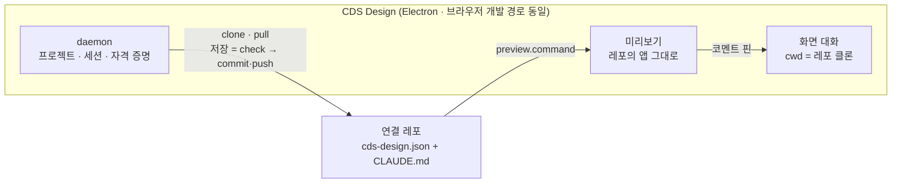

# CDS Design

기획자가 기획서를 채팅에 첨부하고, Claude Code 세션이 연결 레포 안에서 그것을
화면으로 만들고, 기획자는 렌더링된 미리보기에서 검증한 뒤 코드를 개발자에게
넘긴다 — git도 터미널도 열지 않고.

도구가 아는 일은 하나다: 로컬 폴더 하나를 원격과 동기 상태로 유지하고, 그 안에서
Claude Code 세션을 돌린다. 도메인 모양의 것 — 스택, 디자인 시스템, 화면 규칙,
검사, 미리보기 명령 — 은 전부 **연결 레포**가 자기의 `cds-design.json` 과
`CLAUDE.md` 로 정한다. 기획자가 미리보기에서 보는 것은 그 레포의 앱을 있는
그대로 띄운 것이다.

한 사람, 한 대의 기계, 하나의 구독: 각 사용자가 자기가 로그인한 Claude Code
CLI를 몰아주는 자기만의 데몬을 돌린다. 자격 증명은 공유 서버를 거치지 않고 OS
자격 증명 저장소에만 있으며, 렌더러에는 절대 닿지 않는다.

## 이름

CDS 는 회사 디자인 시스템(`@colosseumcoinckr/cds`)이다. 이 도구는 기획서를
그 시스템의 컴포넌트로 짜인 화면으로 바꾸니, 이름은 결국 하는 일 그 자체다.
첫 빌드의 코드명은 `agent-hub`, 두 번째는 `Drafthouse` 였다 — 지금은 이 문단
밖 어디에도 남지 않는다(패키지, 환경 변수, 경로, 문자열 모두). 하나라도 발견하면
버그다.

## 지금 담긴 것

- **루프와 배치.** 화면을 만드는 것과 고치는 것은 같은 턴이다 — 새 대화는
  사이드바의 ＋ · 행 메뉴 · 레일 팝오버 · 팔레트 · ⌘T 어디로든 열린다. 미리보기가
  떠 있는 한 코멘트 핀이 화면 위에 살고(⌥+클릭은 언제든 찍는다), 저장 · 넘기기는
  원하는 시점에 누르는 배치 동작이다. 상단 바의 상태 칩 하나가 사이클의 현재
  위치를 말하고(변경 없음 · 저장 안 함 · 저장됨 · 개발자 검토 중 · 변경 요청 ·
  반영됨), 저장 · 넘기기 · 상태 확인 버튼은 언제나 그려지고 잠겼을 때 마우스를
  올리면 이유가 보인다. 판정은 전부 기계적 신호다 — 클론의 저장 안 한 변경
  건수, GitHub 이 보고하는 풀 리퀘스트. 일이 좋은지는 묻지 않는다. 변경 건수는
  클론 준비·화면 턴 종료·저장 완료 세 트리거로 갱신된다(폴링 없음).
- **저장 · 개발자에게 넘기기 · 반영됨.** 세 단어가 git 명사 전부를 대신하고,
  기획자는 브랜치, 커밋, 푸시, PR, 머지를 읽지 않는다. **저장**은 이번 사이클
  것의 `cds-design/<YYYYMMDD>-<n>` 브랜치를 첫 사용 때 만들고(번호는 원격에
  없는 것을 찾아 올라간다), 레포의 `check` 를 돌리고, 검토한 diff 만 정확히
  커밋해 밀어 넣는다 — 베이스 브랜치에는 절대 쓰지 않는다. 개발자는 이 일을
  읽고, 돌려보고, 거절할 수 있는 풀 리퀘스트로 받는다. **개발자에게 넘기기**는
  `build` 를 돌리고 그 풀 리퀘스트를 열며, 본문에 이번 화면들의 제목 · 경로 ·
  상태를 적는다 — 근거 기획서는 화면 옆 `specs/` 에 커밋돼 있으니 개발자가 풀
  리퀘스트 안에서 읽는다. 이후 저장은 같은 풀 리퀘스트에 쌓인다. **반영됨**은 병합이다:
  클론이 베이스 브랜치로 돌아오고 다음 저장이 새 사이클을 시작한다. `build` 는
  넘기기에만 걸린다 — 저장마다 풀 빌드 값을 치르게 하면 기획자는 드물게 저장하는
  법을 배운다. 게이트가 실패하면 그 출력이 한국어로 다음 과제가 되어 Claude 에게
  가고, 아무것도 개발자에게 닿지 않는다.
- **레포 최신화.** 개발자가 반영한 내용은 화면 턴이 시작될 때와 화면 막대의
  **최신화** 버튼으로 받아 온다. 저장하지 않은 변경이 있으면 임시 보관한 뒤
  클론을 최신으로 옮기고 그 위에 얹는다 — 겹치지 않는 편집은 git 의 기계적
  병합이 혼자 합친다. git 이 혼자 못 합치는 진짜 충돌만 Claude 의 첫 과제가
  된다(게이트 카드로 대화에 떨어진다): 열린 대화가 없으면 한국어 이유가
  재시도 패널에 남는다. 베이스 브랜치의 원격 기록과 갈라진 커밋은 절대
  덮어쓰지 않고 이름을 밝힌다.
- **프로젝트.** 프로젝트는 연결 레포 하나다. 다른 모든 말이 여기에 묶인다 —
  Claude 가 고치는 클론, 도는 미리보기 서버, 그리고 (SDK 가 디렉터리별로 대화를
  저장하므로) 세션 목록. 한 대의 기계는 기획자가 작업하는 만큼 가지고, 정확히
  하나가 활성이다 — 두 레포가 같은 `preview.port` 를 선언할 수 있기 때문이다.
- **코멘트 핀.** 연결 레포는 개발 전용 오버레이를 싣는다: 코멘트 모드, 호버
  강조, 번호가 붙은 핀과 인라인 입력. 수정 요청 N건은 **한 통의** 엔벨로프를
  도구로 보낸다(요소 정체성 = React 컴포넌트 이름, `data-screen`/`data-state`,
  CSS 경로, 자기 텍스트, rect). 도구는 그것을 구조화된 한국어 턴으로 전달한다.
  핀은 턴이 도는 동안 남아 있다가 끝나면 지워진다. v1 은 클릭·코멘트·전송이다 —
  스크린샷과 화살표는 범위 밖.
- **기획자가 치지 않은 턴.** 코멘트 묶음, 화면 스레드를 여는 브리프, 넘기기 전
  점검, 실패한 게이트 — 넷 다 Claude 를 위해 Claude 의 어휘로 쓰이고, 넷 다
  예전에는 기획자의 채팅에 CSS 경로와 명령 출력으로 내려앉았다. 이제 첫 줄에
  표식(`<!-- cds-design:<kind> {…} -->`, Claude 가 지나쳐 읽는 HTML 주석 —
  종류는 `comments` · `brief` · `precheck` · `gate`)을 달고, 대화록은 그것을
  카드로 그린다 — 무엇을 물었는지가 기획자의 말로, Claude 가 실제로 받은
  본문은 한 겹 접혀 있다. 표식은 SDK 가 이미 저장하는 문자열의 앞첨자라, 이어
  든 스레드가 같은 카드를 다시 띄우며, 동기 맞출 별도 파일(sidecar)도 없다. 표식이 붙은 턴은
  자기가 내려앉는 스레드의 이름을 절대 밝히지 않는다. 넷 모두 같은 방식으로
  답하라고 배운다: 파일 경로 없이, 컴포넌트·prop 이름 없이, 화면과 기획서는
  제목으로.
- **화면 축.** 연결 레포는 자기가 그릴 수 있는 것을 선언한다 — 라우트, 제목,
  `states`, 그리고 근거가 된 기획서의 `specs/` 파일 이름(`spec`) — 고, 미리보기
  브리지가 그 목록을 `cds-design.screens` 봉투로 도구에 올린다(데스크톱에서는
  도구의 preload 가 내놓은 `window.cdsDesign.post` 문으로, 브라우저 개발 경로에서는
  postMessage 로). 미리보기 툴바의 선택기가 이 목록 그 자체다 — 기능별로 묶여,
  화면을 고르면 미리보기가 그 화면으로 이동하고, 상태 칩은 `empty` 나 `error` 를
  실제 목 데이터로 그린다. 화면의 상태(`변경 있음` / 넘김 / 반영됨)는 diff 와 풀
  리퀘스트에서 기계적으로 파생된다 — 일이 좋은지에 대한 의견은 없다. 화면이
  기획서를 실제로 덮는지가 이 도구가 하지 않는 유일한 판단이다: 넘기기 전 점검은
  화면 스레드에게 물어 답을 채팅에 남긴다 — 기획서를 어떻게 쓰는지는 레포의
  결정이고, 읽는 것은 이 도구의 일이 아니기 때문.
- **내장 브라우저(PLAN D64–D69).** 데스크톱의 미리보기 칸은 iframe 이 아니라 앱의
  뷰(`WebContentsView`)다: 주소창(미리보기 서버 안의 경로만), 뒤로 · 앞으로, 새로
  고침(보고 있는 자리 그대로), 오류 배너(뷰 이벤트에서), 모바일 · 태블릿 실제
  에뮬레이션. 코멘트 핀 오버레이도 도구의 preload 가 주입한다 — 어떤 연결 레포에서나
  동작하고, 레포가 그 코드를 지울 수 없다. 모달이 열리면 뷰는 마지막 그림을 남기고
  숨는다. 브라우저 개발 경로는 iframe 을 유지하며 화면 목록 · 이동만 있다(개발자
  전용).
- **온보딩.** 기계 전체에 대해 한 번 답하는 게이트 넷이다 — Claude Code, git,
  Node·pnpm, GitHub 토큰. 각 실패는 한국어로 이유를 말하고 고치기 버튼이나 필요한 입력을
  제시한다. Node 는 링크로만 제시한다 — 도구가 기획자의 기계에 설치를 실행하지는
  않는다(데스크톱 앱은 포터블 런타임을 싣고 나오니 이 게이트는 번들 누락을 잡는 자리다).
  토큰이 없는 것은 차단이 아니라 주의다: 공개 레포나 주소를 직접
  넣는 길은 토큰 없이도 열려 있고, 없으면 레포 목록과 개발자에게 넘기기만
  막힌다. 어느 레포로 일할지는 게이트가 아니다 — 프로젝트는 작업 화면에서
  토큰이 접근할 수 있는 레포 목록에서 골라 추가하고, 내려받기·설치 진행은
  미리보기 칸이 그린다. 토큰은 기계에 하나이고 OS 자격 증명 저장소로 간다 —
  데스크톱 앱에서는 Electron `safeStorage` 경유 키체인, 그 외에는 `security`
  CLI — 그리고 선상에는 존재 여부만 건넌다.
- **프로젝트 목록.** 왼쪽 사이드바에 연결 레포가 줄을 서고, 하나를 고르면
  그 레포의 대화 · 미리보기 · 변경 사항이 오른쪽에 뜬다. 미리보기 서버는
  보고 있는 프로젝트 하나만 — 전환하면 앞 서버는 죽고 뒤 서버가 뜬다.
  Claude 세션은 죽지 않는다: 다른 프로젝트에서 도는 턴은 끝까지 돌고,
  행의 표식(작업 중 → 변경 N)과 OS 알림이 그것을 말한다.
- **데스크톱.** 메인 프로세스가 데몬을 in-process 로 호스팅하는 Electron 앱이다:
  임시 포트, 실행마다 바뀌는 토큰, 데몬이 스스로 서빙하는 웹 UI, 페어링 화면
  없음. 포터블 node + corepack 이 extra resource 로 실려 repo 명령의 PATH 앞에
  붙으므로, 기획자의 기계에는 둘 다 필요 없다. 업데이트 확인은 수동뿐.
  대화가 멈췄을 때(작업 완료 · Claude 가 확인 대기 · 게이트 실패) 데몬이
  의미를 건네면 앱이 OS 알림으로 부른다 — 창이 앞에 있을 때는 조용히 하고,
  알림을 누르면 창이 앞으로 온다. 창이 뒤에 있는 동안 도착한 것은 dock 배지가
  세운다. mac 은
  ad-hoc 서명으로 나간다(인증서 없음, 공증 없음).

## 전체 구조



- 데몬과 UI 사이의 선은 `packages/protocol` (v11) 이다: zod 로 검증되는 클라이언트
  메시지, 평범한 타입의 서버 메시지, 접힌 이벤트로 스트리밍되는 세션. 모든
  메시지는 활성 프로젝트 — 연결 레포 하나 — 스코프다: 어떤 메시지도 디렉터리를
  이름하지 않고, "그 레포"는 늘 활성 프로젝트의 것이며 `project.activate` 가 그
  겨냥을 옮긴다. 세션은 프로젝트별 화면 스레드다 — SDK 는 디렉터리별로 대화를
  저장할 뿐 그 이상은 모른다. 브라우저 개발 경로(별도 vite 서버, ws url
  붙여넣기)도 여전히 돈다 — 데스크톱은 그것을 없앨 뿐이다.
- 세션 권한은 `default` 에 고정되고, 편집 급 도구는 쓰기 정책이 in-process 로
  답한다: 세션은 클론을 소리 없이 쓰고 나머지 전부에 카드를 받는다.

## 빠른 시작

```bash
pnpm install
pnpm build

# 터미널 1 — 토큰이 든 client url 을 인쇄한다
pnpm dev:daemon        # … client url: ws://127.0.0.1:7823?token=…

# 터미널 2
pnpm dev:web           # http://127.0.0.1:5273
```

client URL 을 한 번 붙여넣는다. 첫 접속은 온보딩 마법사를 돈다 — Claude Code ·
git · GitHub 토큰 셋을 지나 `시작하기` 를 누르면, 프로젝트가 없는 작업 화면이
레포 목록을 보여 준다. 거기서 레포를 고르면 프로젝트가 된다(목록에 없는 주소는
`주소로 추가`). `pnpm doctor` 는 같은 검사와 활성 프로젝트의 레포 상태를
터미널에서 보고한다.

요구 사항: 로그인된 Claude Code CLI(`claude /login`), git, 그리고 데몬 환경에
`ANTHROPIC_API_KEY` 가 없을 것. Node 22 + pnpm 은 데스크톱 앱에 포함되어 나오고,
브라우저 개발 경로에서는 온보딩의 Node·pnpm 게이트가 검사한다. 연결 레포가 private
`registry` 를 선언하면 그것을 읽을 `read:packages` 인증이 기계에 필요하다
(없으면 데몬 상태의 경고 줄이 한국어로 그렇게 말한다).

도구가 쓰는 모든 것은 홈의 숨은 폴더 하나 `~/.cds-design/` 에 산다:

| 경로 | 무엇이 있는가 |
| --- | --- |
| `~/.cds-design/config/` | `daemon.json` (host/port/token), `projects.json` (레지스트리) — 전부 0600, 비밀 없음(그건 OS 저장소로 간다) |
| `~/.cds-design/projects/<slug>/repo/` | 그 프로젝트의 연결 레포 클론 |

점 없는 옛 설치(`~/cds-design`)와 프로젝트 도입 이전 설치(`~/cds-design/repo` 가
클론이던 때)는 첫 시작에 스스로 이주한다: 폴더는 `~/.cds-design` 이 되고(둘 다
있으면 아무것도 옮기지 않고 경고 한 줄을 남긴다), 옛 단일 클론은
`projects/default/` 아래로 옮겨지고 옛 `config/repo.json` 의 url 이 그
프로젝트의 것이 된다. 클론 경로가 바뀌었으므로 옛 세션 대화록은 목록에
돌아오지 않는다. 설정 → 문제 해결의 `폴더 열기` 가 이 폴더를 연다.

쓸 만한 환경 변수 오버라이드 (모두 선택, 모두 테스트로 검증됨):

| `CDS_DESIGN_PROJECTS_SETTINGS` | `~/.cds-design/config/projects.json` | 프로젝트 레지스트리 파일 |
| `CDS_DESIGN_PROJECTS_DIR` | `~/.cds-design/projects` | 프로젝트 폴더의 위치 |
| `CDS_DESIGN_REPO_DIR` | `<project>/repo` | **활성** 프로젝트의 클론 디렉터리 |
| `CDS_DESIGN_REPO_URL` | 레지스트리 | **활성** 프로젝트의 레포 url(테스트는 fixture 원격을 쓴다) |
| `CDS_DESIGN_CLAUDE_BIN` | 자동 탐지 | 구동할 Claude Code 바이너리 |
| `CDS_DESIGN_GITHUB_FIXTURE` | unset | 녹화된 GitHub REST 짝(오프라인 넘기기 테스트) |
| `CDS_DESIGN_GITHUB_SLUG` | 레포 url 에서 | 넘기기가 겨눌 `owner/repo`; 테스트는 로컬 bare 원격을 클론하니 url 에 GitHub 프로젝트가 없다 |
| `CDS_DESIGN_CREDENTIAL_STORE` | 플랫폼 기본 | `memory` (테스트) 또는 `keychain` |
| `CDS_DESIGN_EXTRA_PATH` | unset | repo 명령의 PATH 접두어(데스크톱이 설정한다) |

## 연결 레포 만들기

계약은 파일 하나다. 나머지는 전부 레포의 결정이다.

```json
{
  "install": "pnpm install",
  "check":   "pnpm check",
  "build":   "pnpm build",
  "preview": { "command": "pnpm dev", "port": 5274 },
  "registry": { "host": "npm.pkg.github.com", "scope": "@colosseumcoinckr" }
}
```

`install` 은 매니페스트/락파일 해시가 움직일 때 돈다. `check`/`build` 는 저장과
넘기기의 게이트다. 없는 레포는 그냥 커밋해 밀어 넣는다. `preview.port` 는 도구가 준비됐다고
부르기 전에 연결을 받아야 한다. `registry` 는 선택이고 private 패키지에만
의미가 있다. 그 밖의 키는 도구가 읽지 않는다 — 참조 구현은 화면 레지스트리를
생성·검증하는 자기 스크립트를 `screens` 키로 달고 있고, 그 목록이 도구에
닿는 길은 런타임의 오버레이 엔벨로프뿐이다.

레포가 Claude 에게 들려주는 것도 레포가 정한다. `CLAUDE.md` 는 화면 세션의
규칙이다 — 스택, 관습, 화면이 사는 곳 — 터미널이 읽는 것과 같은 방식으로
클론에서 읽힌다. 이 모노레포의 `reference-repo/` 가 참조 구현이다(Next.js +
`@colosseumcoinckr/cds`). 화면 주소 규칙은 `/<feature>/<Screen>?state=<state>`
로 고정이고, 스크린 파일이 import 할 수 있는 것(react, `@colosseumcoinckr/*`,
같은 폴더), 데이터는 `<화면이름>.mock.ts` 에만 두는 규칙 같은 것들이
`CLAUDE.md` 에 적혀 있다.

도구를 자기 레포로 돌리려면: GitHub 에 밀고, 작업 화면의 `프로젝트 추가` 목록에서
고른다(목록에 없으면 `주소로 추가`). 데몬이 클론하고, 설치하고, 미리보기 명령을 돌린다 — 테스트가
fixture 원격으로 돌리는 것과 같은 코드 경로다.

## 데스크톱 패키징

```bash
# 패키징된 코드 경로의 개발 실행
pnpm --filter @cds-design/desktop dev

# 포터블 런타임을 번들한 뒤 언팩 앱
node packages/desktop/scripts/bundle-runtimes.mjs
pnpm --filter @cds-design/desktop pack      # release/mac-arm64/CDS Design.app

# 설치 파일: dmg + zip (mac, ad-hoc 서명), nsis (win)
pnpm --filter @cds-design/desktop dist
```

데스크톱 앱은 appId `org.cds-design.desktop`, 제품명 `CDS Design` 이다. mac
경로는 오늘날 실제로 돌려 봤다: ad-hoc 서명(`identity: "-"`, 인증서 없음),
`codesign -v` 깨끗, 패키징된 바이너리가 dev 와 같은 스모크를 통과한다. Windows
대상(NSIS, MinGit 동반)은 구성이 끝났고 CI 가 릴리스마다 빌드한다. mac 자가
업데이트(zip 내려받기 → sha256 → `/Applications/CDS Design.app` 교체)는
`app.isPackaged` 가드 안에 구현돼 있고, 확인 흐름은 로컬 피드 fixture 로
증명됐다.

## 릴리스

태그 하나를 밀면 양 플랫폼을 모두 빌드해 릴리스 페이지를 연다:

```bash
# 1. packages/desktop/package.json 의 "version" 이 릴리스 버전이다 — 먼저 올린다.
# 2. 태그는 버전과 같아야 한다(워크플로우가 검사한다). 주석(annotated tag)
#    본문이 릴리스 노트가 된다.
git tag -a v0.1.0 -m "첫 릴리스: 기획서 → 화면 파이프라인"
git push origin v0.1.0
# 3. .github/workflows/desktop-release.yml → mac(macOS dmg+zip)·win(NSIS exe)
#    빌드 → 릴리스 페이지에 4개 에셋 첨부(dmg, zip, exe, latest.json)
```

- 수동 실행(`workflow_dispatch`)은 빌드만 돌린다 — 릴리스는 만들지 않고,
  실행 페이지의 artifacts 에서 설치 파일을 검수한다.
- 에셋 이름은 `electron-builder.yml` 의 `artifactName` 에 고정돼 있다:
  `cds-design-<v>-mac-arm64.dmg`, `cds-design-<v>-mac-arm64.zip`,
  `cds-design-Setup-<v>-win-x64.exe`. `latest.json`(`version`/`notes`/
  `sha256`/`url`)은 앱의 업데이트 확인이 읽는 피드다(mac zip sha256 = 자가
  교체 검증값).
- 앱의 업데이트 확인(`packages/protocol/src/update.ts`)은
  `inkwonjung-colosseum/cds-design` 의 릴리스를 읽는다. 확인 요청은 무인증
  fetch 라 **소스가 private 인 것은 상관없지만 설치 파일을 올린 릴리스는
  공개**여야 읽힌다. 공개 릴리스가 아직 없는 동안 확인 버튼은 "아직 공개된
  릴리스가 없습니다"라고 답한다 — 고장이 아니라 배포 전 상태다.
- 미서명 배포: macOS 는 첫 실행을 우클릭 → 열기, Windows 는 SmartScreen
  추가 정보 → 실행. 이 안내는 워크플로우가 릴리스 노트에 자동으로 넣는다.

## 테스트

real-Claude 로 표시된 두 스위트(구독 사용량을 쓴다)만 빼고 전부 로컬 fixture
(bare git 원격, 스텁 CLI)로 돈다.

```bash
pnpm test:unit            # 오프라인 — 플랫폼 분기, 보안/격리 회귀, 쓰기 정책, 레포 워크스페이스 단위, 홈 폴더 이관, 넘기기 본문 초안, 턴 마커 파서
pnpm test:onboard-unit    # 오프라인 — 온보딩 게이트와 OS 자격 증명 저장소(이주, 키체인, npmrc 병합)
pnpm test:projects        # 오프라인 — 두 레포에 두 프로젝트, 활성 전환, 화면 밖 턴의 변경 수, 지우기와 세션 닫기, 전환 직렬화, 레지스트리가 재시작을 살아남는다
pnpm test:sidebar-ui      # 오프라인 — 브라우저: 사이드바 행과 표식, 전환(앞 포트 닫힘 · 뒤 ready), 이름 바꾸기, 지우기 대화상자, 960 폭 접힘
pnpm test:repo            # 오프라인 — 로컬 bare 원격에 대한 clone/pull/install-skip/preview 수명 주기
pnpm test:publish         # 오프라인 — 저장 게이트, check 실패 → 세션 브리프, main 을 건드리지 않는 자기 브랜치 cds-design/*, build 는 넘기기에만 게이트, PR → 병합 → 새 사이클
pnpm test:publish-ui      # 오프라인 — 브라우저: 저장 검토 → 저장 → 브랜치가 원격에 닿고 베이스는 닿지 않는다
pnpm test:settings        # 오프라인 — 테마/환경설정; 데몬 없이도 열린다
pnpm test:onboarding      # 오프라인 — 스텁 PATH/CLI · 녹화된 GitHub 픽스처로 진짜 소켓 위의 네 게이트, 토큰 저장 → 레포 목록 → 레포 검사 → 프로젝트 생성 → 클론 ready
pnpm test:onboarding-ui   # 오프라인 — 브라우저: 마법사 네 게이트(토큰 연결) → 시작하기 → 프로젝트 없는 작업 화면의 레포 목록 → 선택·검사 → 만들기 → 작업 공간; `+ 새 프로젝트` 대화상자
pnpm test:daemon          # REAL CLAUDE — 선상의 세션: 권한, 스트리밍, 문맥 이어받기
pnpm test:planner         # REAL CLAUDE — 제품 주장: 기획서를 채팅에 첨부하면 화면이 나와 미리보기에 렌더링된다
pnpm test:comments-ui     # 오프라인 — 레포 자체의 dev 미리보기 안의 화면 축 전체: 선언된 화면 → 피커, 화면 선택 → 그 화면, 상태 칩 → 실제 목 데이터, 오버레이 → 엔벨로프 → 세션 턴 → 핀 지워짐
pnpm test:desktop-unit    # 오프라인 — 업데이트 확인/semver/sha256, 가짜를 넣은 safeStorage 저장소, PATH 접두어
pnpm test:desktop-smoke   # 오프라인 — Electron: 창, in-process 데몬 /health, 마법사, 업데이트 브리지(패키징된 앱에도 돈다)
pnpm test                 # 위 전부를 4개 병렬 레인으로(아래)
pnpm test:smoke "<url>"   # 이미 도는 데몬에 대한 생존 검사; 아무것도 시작하지 않는다
```

`pnpm test` 는 모든 것을 `scripts/test-parallel.mjs` 로 돌린다: 네 레인이
동시에 — L1 단위 스위트, L2 오프라인 데몬 소켓 e2e, L3 네 브라우저 스위트(각자
고정 포트에서, 레인 안은 순서대로), L4 real-Claude 두 스위트. 레인별 로그는
`.test-logs/` (gitignored)에 쌓이고, `pnpm test:sequential` 은 같은 스위트
집합을 한 번에 하나씩 돌려 준다. 브라우저 스위트는 먼저
`pnpm --filter @cds-design/web build`(또는 풀 `pnpm build`)이 필요하다.

fixture 설계를 한 문단으로: git 원격은 최소 `cds-design.json` 앱을 담은 bare
레포지터리고, 모델 턴이 주제가 아닌 곳의 Claude CLI 는 전부 스텁 스크립트다.

## 패키지

| 패키지 | 하는 일 |
| --- | --- |
| `packages/protocol` | v11 선로 계약(zod 로 검증되는 클라이언트 메시지), 공유 수동 업데이트 확인 로직, 기계가 쓴 턴을 카드로 그리게 하는 턴 마커. |
| `packages/daemon` | 프로젝트 레지스트리, 세션, 레포 워크스페이스(clone · 저장/넘기기 게이트), 온보딩 검사, 자격 증명 저장, 데스크톱을 위한 정적 웹 서빙. |
| `packages/web` | 기획자 UI: 프로젝트 사이드바, 레포 피커(프로젝트 추가), 채팅, 레포 미리보기(주소창 · 핀 · 배율 · 단축키 시트), 상단 바 동작 셋, diff 검토, 온보딩 마법사, 설정. |
| `packages/desktop` | Electron 메인(데몬 in-process, safeStorage 저장소, 동반 런타임, 업데이트 브리지) + electron-builder 구성. |
| `reference-repo/` | 참조 연결 레포 — Next.js + CDS, 자기 git 역사, 화면 레지스트리와 dev 전용 미리보기 브리지. 커밋된 상태가 `test:comments-ui` 가 클론하는 것이니, 여기의 변경은 커밋되기 전까지 진짜가 아니다. |

## 정책

Anthropic 의 약관은 바이너리를 고치지 않고 최종 사용자 각자가 자기 자격 증명으로
인증할 때 제품이 Claude Code 를 구동하는 것을 허용한다. 나가는 것이 정확히
그것이다: 데몬(과 그것을 감싼 데스크톱 앱)은 사용자 자기 설치 CLI 를 돌리고,
로그인은 Anthropic 자기 흐름을 거치고, 어떤 토큰도 우리가 수집·저장·전달하지
않는다.

Agent SDK 문서는 사전 승인 없이 서드파티 앱이 자기 앱에서 claude.ai 로그인을
제공하지 말라고 한다. 그 문장은 외부 고객에게 제공되는 제품을 겨눈 것이고 이건
내부 도구지만, 그 구분은 롤아웃 전에 Anthropic 담당자와 서면으로 확인해야
한다.

## 번호 대응표 — 코드 주석이 부르는 앞 판의 결정

코드 주석의 `PLAN D<n>` 은 판이 지날며 쌓였고 같은 번호가 다른 뜻으로 두 번 쓰인
자리가 있다. 이 표가 그 번호를 푼다. 각 판의 PLAN.md 는 구현 완료로 삭제된다 —
D35–D63 판(2026-09-11)과 내장 브라우저 판(D64–D75)이 그랬다.

| 번호 | 뜻 | 어디서 부르나 |
|---|---|---|
| D1 | 홈 폴더 `~/.cds-design` + 이주 | `environment.ts` · `index.ts` · `server.ts` · `home-dir.test.mjs` |
| D2 | **충돌.** ⓐ 프로젝트 = 연결 레포 하나 (Drafthouse 판 D3 의 뜻) — `projects.ts` · `server.ts:328` · `projects-e2e.mjs`; ⓑ `폴더 열기` — `main.ts` · `preload.ts` | |
| D4 | 게이트 넷, `project` 게이트 삭제 | `onboarding.ts` |
| D5 | **충돌.** ⓐ 저장 · 개발자에게 넘기기 · 반영됨(git 어휘 셋) — `github.ts` · `repo.ts` · `protocol` · `projects.ts` · `github.test.mjs` · `publish-e2e.mjs`; ⓑ `runtime` 게이트 판정 — `onboarding.ts:129` · `onboarding.test.mjs:359` | |
| D6 | pnpm 영어 경고 삭제 | `environment.ts:453` |
| D7 | 레포가 선언하는 화면(`cds-design.screens` 엔벨로프) | `protocol:632` |
| D8 | `pendingChanges` — 스테퍼의 숫자, 폴링 없음 | `repo.ts` · `server.ts` · `protocol:575` · `publish-e2e.mjs` |
| D9 | 기계 텍스트는 마커 카드로 | `repo.ts:75` · `session.ts:486` · `turn-marker.ts` · `publish-e2e.mjs` |
| D10 | **충돌.** ⓐ 모델 · 생각 시간 · 권한을 설정으로, 컴포저는 `⋯` — `Composer.tsx:96` · `settings.ts:43` (이 판 D42 가 칩 표시를 되살린다; 저장 위치 규칙은 유지); ⓑ `github` 게이트 판정(warn 비차단) — 직접 부르는 주석 없음 | |
| D12 | **어긋남.** 주석은 "프로젝트는 게이트가 아니다"(= 앞 판 D4)의 뜻으로 쓴다 — `onboarding.ts:6,213` · `index.ts:76`. 앞 판 표의 D12 는 어휘(`프로젝트`) | |
| D15 | 사이드바 행 `작업 중` | `session-manager.ts:97` |
| D16 · D17 · D18 | 비활성 프로젝트 상태는 `project.changed` 로 · 200ms 스로틀 · 시작 시 전 프로젝트 워크스페이스 | `server.ts` · `protocol:13,381` · `repo.ts:514` · `AddProjectDialog.tsx:7` |
| D19 · D21 · D25 · D28 · D31 | 사이드바 폭 · 지우기 순서 · 피커 자리 · `cds-design.json` 없는 레포 차단 · 주소로 추가 | `Shell.tsx` · `Sidebar.tsx` · `RepoPicker.tsx` · `settings.ts` |
| M1 · M5.5 | 첫 판의 단계 번호(프로젝트 모델 토대 · 배포 파이프라인) | `index.ts:61` · `electron-builder.yml:11` |
| DESIGN §5–§8 | 이 트리에 없는 문서(`DESIGN.md`)의 절 — 미리보기 origin 검사 · 데스크톱 패키징 · 온보딩 | `Preview.tsx` · `onboarding.ts` · `electron-builder.yml` · `preload.ts` |
| D76 | 세션 보관 철회 — 지우기 하나와 확인 하나 | `useSessions.ts` · `Sidebar.tsx` · `ChatColumn.tsx` · `PageWorkspace.tsx` · `Shell.tsx` · `settings.ts` |
| D77 | 프로젝트 삭제가 대화록까지 | `session-manager.ts` · `server.ts` · `Sidebar.tsx` · `projects-e2e.mjs` |
