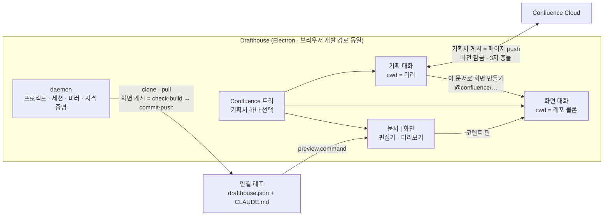

# Drafthouse

A planner writes a 기획서, chats with Claude Code to turn it into screens, and
validates the plan against the real rendered app — without ever opening git,
Confluence, or a terminal.

The tool knows one thing: keep a local folder in sync with a remote, and run a
Claude Code session inside it. Everything domain-shaped — the stack, the design
system, the screen rules, the checks, the preview command — is decided by the
**connected repo** through its `drafthouse.json` and `CLAUDE.md`. What the
planner sees in the preview is that repo's own app, framed as-is.

One person, one machine, one subscription: each user runs their own daemon that
drives the Claude Code CLI they signed in to. No credentials pass through a
shared server; secrets live in the OS credential store and never reach the
renderer.

## The name

A **draft** is what this tool moves through its whole pipeline: a 기획서 draft
becomes a screen draft, the planner looks at the rendered thing and marks it up,
and the draft goes around again. The **house** is where that happens — one
folder, one daemon, one place where the drafts live until they are good enough
to publish. Nothing here is a finished build; everything is a screening of a cut
that is still being edited.

The codename during the first build was `agent-hub`. Outside this paragraph it
survives nowhere — no package, env var, path, or string. If you find one, it is
a bug.

## What shipped

- **One workspace, on the page axis.** The Confluence tree picks a 기획서 and
  everything else is that page's: the threads in the tab strip, the document in
  the editor, the screen in the preview. Underneath, two halves survive because
  they must — 기획 runs a Claude session *in the Confluence mirror* (it writes
  and revises pages, and 기획서 게시 pushes the space back), 화면 runs one *in
  the connected repo clone* with the mirror mounted read-only (and 화면 게시
  runs the repo's gates and pushes git). A thread belongs to a page and to one
  of those halves; the strip shows both, labelled, so a planner can flip
  between writing the spec and building the screen without leaving it.
  이 문서로 화면 만들기 in the editor opens a 화면 thread on the same page with
  the brief prefilled — never auto-sent.
- **Connected-repo contract.** The daemon clones the repo the planner points it
  at (`git clone` with PAT auth), pulls at session start, runs the repo's own
  `install`, and starts the repo's own `preview.command` on the declared port.
  The tool never parses what renders inside the frame.
- **저장 · 개발자에게 넘기기 · 반영됨.** Three words replace every git noun, and
  the planner never reads 브랜치, 커밋, 푸시, PR or 머지. **저장** creates this
  cycle's own `drafthouse/<YYYYMMDD>-<n>` branch on its first use, runs the
  repo's `check`, and commits and pushes exactly the reviewed diff there — the
  base branch is never written to, because a developer receives this work as a
  pull request they can read, run and refuse. **개발자에게 넘기기** runs `build`
  and opens that pull request, its body linking each 기획서 in Confluence
  beside the `pageId` the tree badges ✓ 넘김 from; later saves
  accumulate on the same one. **반영됨** is the merge: the clone returns to the
  base branch and the next 저장 starts a new cycle. `build` gates only the
  handoff — a save that paid for a full build every time would teach the
  planner to save rarely. A failing gate hands its output to Claude as the next
  task, in Korean, and nothing reaches the developer.
- **Projects.** A project is one Confluence subtree set plus one connected
  repo, and it is what every other word is scoped to — the mirror that gets
  cloned, the clone Claude edits, the preview server that runs, and (because
  the SDK stores transcripts per directory) the session list. A machine
  carries as many as the planner works on; exactly one is active, because two
  repos may declare the same `preview.port`. One page may never live in two
  projects: creating a project whose root sits inside another's subtree is
  refused by name, which is what keeps the mirror's optimistic lock from
  splitting in two.
- **Confluence mirror.** A project's subtrees clone to
  `~/drafthouse/projects/<slug>/confluence/<space>/` as hybrid Markdown: YAML frontmatter
  (`pageId version space title parentPageId`) plus a body where anything
  Markdown cannot hold — macros, merged cells, layouts — survives verbatim in
  ` ```confluence ` fences. Round-trips are lossless both ways. Pushes use
  `version.number + 1` optimistic locking; a page that moved on both sides
  becomes a three-way choice (내 것으로 덮기 / 원격 받기 / 직접 보기), and the
  local edit is never overwritten silently. A page a 기획 session wrote but
  nobody has pushed carries a local `pageId: new-…` and shows in the tree as
  신규; 게시 creates it remotely and rewrites the file with the real id. The
  count on the 게시 button is exactly what would go up.
  스페이스 트리의 **+ 스페이스** picks any space the credentials can see and
  clones it — the mirror holds one folder per space, so taking a second one
  (or re-taking a clone that died halfway) is a normal action, not a
  first-run-only step. A clone writes its sync state as it walks, so an
  interruption leaves a smaller mirror rather than nothing.
- **Personal spaces.** A personal Confluence space is keyed `~<accountId>`, and
  a path component starting with `~` reads as a home reference to the Claude
  CLI — it would treat the session's own mirror as foreign and ask permission
  for every file in it. Those spaces mirror under `_<accountId>` instead. The
  space key is unchanged everywhere else: frontmatter, the API, the tree's
  Confluence links. A doc path's first segment is the folder, so it is the
  spelling `@confluence/…` mentions use.
- **The editor.** TipTap WYSIWYG with an 원문 (raw markdown) toggle; every
  editor save goes through the daemon's single normalization path, so both
  editor forms land in the mirror in one canonical shape. Claude's own writes
  go through the same path: the mirror watcher normalizes a changed page file
  before broadcasting it, and leaves already-canonical content untouched, so
  the editor, the 수정됨 marker and the push body never disagree about a page.
  Preserved blocks render as atomic grey cards — movable, deletable, never
  editable inside. While a 기획 turn runs, the editor goes read-only with a
  Korean reason (a 디자인 turn does not lock it — it never touches the mirror);
  a background pull defers to unsaved editor work. Selecting text offers 인용,
  which lands in the composer as a quote of page + heading + text.
- **Comment pins.** The connected repo carries a dev-only overlay: comment
  mode, hover highlight, numbered pins with inline input. 수정 요청 N건 sends
  ONE envelope to the tool (element identity = React component name,
  `data-screen`/`data-state`, CSS path, own text, rect), which forwards it as a
  structured Korean turn. Pins stay while the turn runs, clear when it
  settles. v1 is click, comment, send — screenshots and arrows are out.
- **Turns the planner did not type.** A comment bundle, the brief that opens a
  화면 thread, a 기획서 comparison, a failed gate: all four are written for
  Claude, in Claude's vocabulary, and all four used to land in the planner's own
  chat as CSS paths and command output. They now carry a marker on their first
  line (`<!-- drafthouse:<kind> {…} -->`, an HTML comment Claude reads past) and
  the transcript renders them as a card — what was asked, in the planner's
  words, with the text Claude actually received one fold away. The marker is a
  prefix on the same string the SDK already stores, so a resumed thread replays
  the same card with no sidecar to keep in sync, and a marked turn never names
  the thread it lands in. Both halves are told to answer the same way: no file
  paths, no component or prop names, screens and 기획서 by their titles.
- **The screen axis.** The connected repo declares what it can render — route,
  title, `states`, and the mirror-relative path of the 기획서 it was built from
  — and its overlay posts that list to the tool. Picking a 기획서 in the tree
  navigates the preview to its screen; a state chip renders `empty` or `error`
  on real mock data; a 폭 toggle narrows the frame without telling the app.
  Every page in the tree carries how far it has come: `○` 기획 중, `◐` 화면
  있음, `✓` 넘김, `●` 반영됨 — each decided from something mechanical, a screen
  the repo declared or a pull request GitHub reports, never from an opinion
  about whether the work is good. Whether a screen actually covers its 기획서 is
  the one judgement the tool refuses to make: 넘기기 전 점검 asks the 화면
  thread and leaves the answer in the chat, because how a 기획서 is written is
  the repo's decision and reading one is not the tool's job.
- **Onboarding.** Four gates before the workspace opens. Three are machine-wide
  and answered once — Claude Code, git, the Confluence site; the fourth is the
  project: a name, the Confluence page its 기획서 live under, and the repo its
  screens go into. Each failure says why in Korean and offers a fix button or the
  inputs it needs. Credentials (repo PAT, Confluence API token) go to the OS
  credential store — Keychain via Electron `safeStorage` in the desktop app,
  `security` CLI otherwise — and cross the wire as presence only.
- **Desktop.** An Electron app whose main process hosts the daemon in-process:
  ephemeral port, per-run token, web UI served by the daemon itself, no pairing
  screen. Portable node + corepack ship as extra resources and prepend to PATH
  for repo commands, so the planner's machine needs neither. Manual update
  check only; mac ships ad-hoc signed (no identities, no notarization).

## How it fits together



- The wire between daemon and UI is `packages/protocol` (v5): zod-validated
  client messages, plain-typed server messages, sessions streamed as folded
  events. `session.create`/`session.list`/`repo.files` name a `workspace`; the
  daemon owns what that means — cwd, write policy, extra read roots, and (for
  기획) the instructions appended to Claude Code's own system prompt. Those two
  messages also carry a `pageId`, and the daemon keeps a per-project
  `sessions.json` mapping thread → 기획서: the SDK stores transcripts per
  directory and knows nothing else about them. A page's local `new-…` id
  becoming its real Confluence id on 게시 re-points that map in the same step
  that rewrites the file, so a page's first publish does not scatter its own
  threads. The browser dev path (separate vite server, pasted ws url) still
  works — the desktop just removes it.
- Session permissions are pinned to `default` with edit-class tools answered
  in-process by the workspace's write policy: 기획 writes mirror pages silently
  and is refused `.confluence-sync.json`; 화면 writes the clone silently and
  gets a card for anything else, including the mirror it reads through
  `<repo>/confluence` (a local-only symlink, excluded via `.git/info/exclude`).

## Quickstart

```bash
pnpm install
pnpm build

# terminal 1 — prints a client url containing the pairing token
pnpm dev:daemon

# terminal 2
pnpm dev:web      # http://127.0.0.1:5273
```

Paste the client URL once. First connect runs the onboarding wizard; fill in
the 연결 레포 url (+PAT for a private repo) and Confluence site/email/token
there. `pnpm doctor` reports the same checks from a terminal.

Requirements: Node 22 + pnpm 11, Claude Code CLI signed in (`claude /login`),
git, no `ANTHROPIC_API_KEY` in the daemon environment. If the connected repo
declares a private `registry`, the machine needs `read:packages` auth for it
(the onboarding repo step says so in Korean when it does not).

Everything the tool writes lives under one folder, `~/drafthouse/`:

| Path | What it holds |
| --- | --- |
| `~/drafthouse/config/` | `daemon.json` (host/port/token), `projects.json` (the registry), `confluence.json` — all mode 0600, no secrets (those go to the OS store) |
| `~/drafthouse/projects/<slug>/repo/` | That project's clone of its connected repo |
| `~/drafthouse/projects/<slug>/confluence/<space>/` | That project's mirror, one folder per space it owns a subtree of (a personal space's `~<accountId>` folds to `_<accountId>`) |

A pre-projects installation migrates itself on first start: `~/drafthouse/repo`
and `~/drafthouse/confluence` move under `projects/default/`, and the old
`config/repo.json` url becomes that project's. Nothing is re-downloaded.

Useful environment overrides (all optional, all test-driven):

| Variable | Default | What it changes |
| --- | --- | --- |
| `DRAFTHOUSE_PROJECTS_SETTINGS` | `~/drafthouse/config/projects.json` | The project registry file |
| `DRAFTHOUSE_PROJECTS_DIR` | `~/drafthouse/projects` | Where project folders live |
| `DRAFTHOUSE_REPO_DIR` | `<project>/repo` | The **active** project's clone directory |
| `DRAFTHOUSE_REPO_URL` | registry | The **active** project's repo url (tests use fixture remotes) |
| `DRAFTHOUSE_CONFLUENCE_DIR` | `<project>/confluence` | The **active** project's mirror root |
| `DRAFTHOUSE_CLAUDE_BIN` | auto-detect | Which Claude Code binary to drive |
| `DRAFTHOUSE_GITHUB_FIXTURE` | unset | Recorded GitHub REST pairs (offline handoff tests) |
| `DRAFTHOUSE_GITHUB_SLUG` | from the repo url | `owner/repo` a handoff targets; tests clone local bare remotes, which name no GitHub project |
| `DRAFTHOUSE_CREDENTIAL_STORE` | platform default | `memory` (tests) or `keychain` |
| `DRAFTHOUSE_EXTRA_PATH` | unset | PATH prefix for repo commands (desktop sets it) |

## Authoring a connected repo

The contract is one file. Everything else is the repo's own decision.

```json
{
  "install": "pnpm install",
  "check":   "pnpm check",
  "build":   "pnpm build",
  "preview": { "command": "pnpm dev", "port": 5274 },
  "registry": { "host": "npm.pkg.github.com", "scope": "@colosseumcoinckr" },
  "planning": { "rules": "화면 기획서는 '개요 · 화면 목록 · …' 순서로 쓴다." }
}
```

`install` runs when the manifest/lockfile hash moves. `check`/`build` gate
publishing; a repo without them just commits and pushes. `preview.port` must
accept connections before the tool calls it ready. `registry` is optional and
only matters for private packages.

The repo decides both halves of what Claude is told. `CLAUDE.md` is the 디자인
workspace's rules — stack, conventions, where screens live — loaded from the
clone the way a terminal would load it. `planning.rules` is the 기획
workspace's: how this team writes a 기획서, its sections, its vocabulary. The
tool appends that below its own mirror-format invariants (frontmatter fields
that must not move, ` ```confluence ` fences that must not be edited, how a
new page is spelled) — and where the two disagree, the invariants win.
`connected-repo/` in this monorepo is the reference implementation
(Next.js + `@colosseumcoinckr/cds`).

To point the tool at your own repo: push it to GitHub, then enter the url (and
PAT) in the onboarding wizard or 설정. The daemon clones, installs, and runs
your preview command — the same code path the fixture remotes exercise in
tests.

## Desktop packaging

```bash
# dev run of the packaged code path
pnpm --filter @drafthouse/desktop dev

# bundle portable runtimes, then an unpacked app
node packages/desktop/scripts/bundle-runtimes.mjs
pnpm --filter @drafthouse/desktop pack        # release/mac-arm64/Drafthouse.app

# installers: dmg + zip (mac, ad-hoc signed), nsis (win)
pnpm --filter @drafthouse/desktop dist
```

The desktop app is mac-exercised today: ad-hoc signing (`identity: "-"`,
no certificate), `codesign -v` clean, and the packaged binary passes the same
smoke as dev. The Windows target (NSIS, MinGit bundling) is config-complete
and built by CI on every release. Mac self-update (download zip → sha256 →
swap `/Applications/Drafthouse.app`) is implemented behind an
`app.isPackaged` guard; the check flow is proven against a local feed
fixture.

## Releases

One tag push builds both platforms and publishes the release page:

```bash
# 1. packages/desktop/package.json "version" 이 릴리스 버전이다 — 먼저 올린다.
# 2. 태그는 버전과 같아야 한다(워크플로우가 검사한다). 주석(annotated tag)
#    본문이 릴리스 노트가 된다.
git tag -a v0.1.0 -m "첫 릴리스: 기획서 → 화면 파이프라인"
git push origin v0.1.0
# 3. .github/workflows/desktop-release.yml → mac(macOS dmg+zip)·win(NSIS exe)
#    빌드 → 릴리스 페이지에 4개 에셋 첨부(dmg, zip, exe, latest.json)
```

- 수동 실행(`workflow_dispatch`)은 빌드만 돌린다 — 릴리스는 만들지 않고,
  실행 페이지의 artifacts 에서 설치 파일을 검수한다.
- 에셋 이름은 `electron-builder.yml` 의 `artifactName` 에 고정돼 있고,
  `latest.json`(`version`/`notes`/`sha256`/`url`)은 앱의 업데이트 확인이
  읽는 피드다(mac zip sha256 = 자가 교체 검증값).
- `RELEASES_REPO`(`packages/protocol/src/update.ts`)는
  `inkwonjung-colosseum/cds-open-design` 을 가리킨다. 확인 요청은 무인증
  fetch 라 **소스가 private 인 것은 상관없지만 설치 파일을 올린 릴리스는
  공개**여야 읽힌다. 공개 릴리스가 아직 없는 동안 확인 버튼은 "아직 공개된
  릴리스가 없습니다"라고 답한다 — 고장이 아니라 배포 전 상태다.
- 미서명 배포: macOS 는 첫 실행을 우클릭 → 열기, Windows 는 SmartScreen
  추가 정보 → 실행. 이 안내는 워크플로우가 릴리스 노트에 자동으로 넣는다.

## Tests

Everything runs offline against local fixtures (bare git remotes, recorded
Confluence REST pairs, stub CLI) except the two suites marked real-Claude,
which spend subscription usage.

```bash
pnpm test:unit            # offline — platform branches, security/containment regressions, workspace write policies + 기획 rules, repo workspace units, the editor's markdown grammar, the turn-marker parser
pnpm test:onboard-unit    # offline — onboarding gates and the OS credential store (migration, keychain, npmrc merge)
pnpm test:confluence-unit # offline — storage↔markdown lossless round-trips, REST golden pass, engine pull/push/conflict/deferral
pnpm test:projects        # offline — two projects on two subtrees of one space, overlap refused, activation re-points the tree, registry survives a restart
pnpm test:repo            # offline — clone/pull/install-skip/preview lifecycle over a local bare remote
pnpm test:confluence      # offline — mirror clone/pull/push/conflict through the real daemon socket + fixture transport, plus outside-write normalization and 신규 pages in the tree
pnpm test:publish         # offline — save gates, failing check → session brief, its own drafthouse/* branch with main untouched, build gates only the handoff, PR → merged → new cycle
pnpm test:publish-ui      # offline — browser: 저장 검토 → 저장 → the branch reaches the remote, the base does not
pnpm test:editor-ui       # offline — TipTap typing → normalized mirror file, 원문, locks, quote chip, 3-way conflict → resolve mine → 게시 → 기획→디자인 handoff
pnpm test:settings        # offline — theme/preferences; opens with no daemon at all
pnpm test:onboarding      # offline — the four gates over the real socket with stubbed PATH/CLI, including the no-project first run
pnpm test:onboarding-ui   # offline — browser wizard: Confluence credentials → project form (space, root page, repo) → workspace opens
pnpm test:daemon          # REAL CLAUDE — sessions over the wire: permissions, streaming, context carry-over
pnpm test:planner         # REAL CLAUDE — the product claim: 기획서 in, screens out, rendered in the preview
pnpm test:comments-ui     # offline — the whole screen axis in the repo's own dev preview: declared screens → picker, 기획서 selection → that screen, state chip → real mock data, tree badges, then overlay → envelope → session turn → pins clear
pnpm test:desktop-unit    # offline — update check/semver/sha256, safeStorage store with a fake, PATH prefix
pnpm test:desktop-smoke   # offline — Electron: window, in-process daemon /health, wizard, update bridge (also runs against the packaged app)
pnpm test                 # all of the above, run as 4 parallel lanes (see below)
pnpm test:smoke "<url>"   # liveness check against an already-running daemon; starts nothing
```

`pnpm test` runs everything through `scripts/test-parallel.mjs`: four lanes
at once — L1 unit suites, L2 offline daemon-socket e2e, L3 the five browser
suites (each on its own fixed port, sequential inside the lane), L4 the two
real-Claude suites. Per-lane logs land in `.test-logs/` (gitignored);
`pnpm test:sequential` runs the identical suite set one at a time if you
prefer. The browser suites need `pnpm --filter @drafthouse/web build` (or a
full `pnpm build`) first.

The fixture design, one paragraph: Confluence interactions replay recorded
request/response pairs (`packages/daemon/test/fixtures/confluence/`) through
the same transport interface production uses, consumed strictly in order —
which is what makes version-conflict simulation and PUT-body assertions real;
git remotes are bare repositories seeded with a minimal `drafthouse.json` app;
the Claude CLI is a stub script wherever no model turn is the subject.

## Packages

| Package | What it does |
| --- | --- |
| `packages/protocol` | v5 wire contract (zod-validated client messages), the shared manual-update-check logic, and the turn markers that let the UI render a machine-authored turn as a card. |
| `packages/daemon` | The project registry, sessions, the repo workspace (clone/pull/publish/gates), the Confluence mirror engine with the storage↔markdown converter, onboarding checks, credential storage, static web serving for the desktop. |
| `packages/web` | The planner UI: project switcher, page tree, session tab strip, chat, the 문서/화면 segment (TipTap editor + repo preview), diff review, conflict chooser, onboarding wizard, settings. |
| `packages/desktop` | Electron main (daemon in-process, safeStorage store, bundled runtimes, update bridge) + electron-builder config. |
| `connected-repo/` | The reference connected repo — Next.js + CDS, its own git history, the screen registry and the dev-only preview bridge. Its committed state is what `test:comments-ui` clones, so a change here is not real until it is committed. |

## Policy

Anthropic's terms allow a product to run Claude Code when the binary is
unmodified and each end user authenticates with their own credentials. That is
exactly what ships: the daemon (and the desktop app wrapping it) runs the
user's own installed CLI, sign-in happens through Anthropic's own flow, and no
token is ever collected, stored, or relayed by us.

The Agent SDK documentation asks third-party developers not to offer claude.ai
login in their own applications without prior approval. That sentence targets
products offered to outside customers, and this is an internal tool, but the
distinction should be confirmed in writing with our Anthropic account contact
before rollout. `PLAN.md` tracks that and everything else still open.
