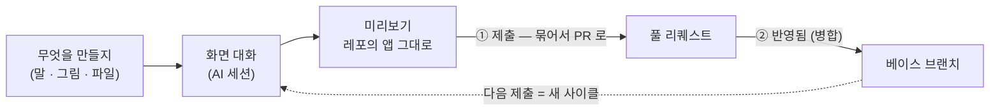
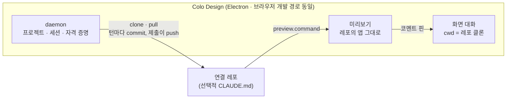

# Colo Design

> **개발 지식이 전혀 없는 사람이, 개발자의 레포에 연결해 채팅으로 화면을 만들고 고치는
> 도구 — git, 터미널 같은 건 몰라도 쓴다.**


이 문서는 읽는 사람에 따라 두 부분으로 나뉜다. 앞부분은 **비개발자용** — 개발 지식이
없어도 이것만 읽으면 도구를 쓸 수 있다. [개발자 · 운영자 안내](#개발자--운영자-안내)부터는
소스를 고치거나 배포하는 사람을 위한 안내다.

## 이 도구가 뭔가요?

**비개발자를 위한 화면 만들기 도구다.** git이나 터미널을 한 번도 써 본 적
없는 사람이 — 기획자든 디자이너든 사업·운영 담당자든 — 작업할 서비스의 저장소("연결
레포")를 연결하면, 그 안에서 도는 AI 세션이 말을 화면으로 만들어 준다. 결과는
미리보기에서 직접 확인하고, 완성하면 개발자에게 넘어간다. 이 도구가 존재하는 이유 전부다.

입력은 말과 그림과 파일이다. 만들고 싶은 화면을 그냥 말해도 되고, 참고할 그림을
붙여넣어도 되고, 적어 둔 내용은 텍스트로 붙여넣거나 문서 파일을 그대로 붙여도 된다.

git 용어는 익히지 않아도 된다. 두 단어만 알면 된다.

- **제출** — 완성된 화면을 개발자에게 보낸다. 도구가 안전하게 묶어(보관함) 요청으로
  연다.
- **반영됨** — 개발자가 그 작업을 제품에 합쳤다.

브랜치 · 커밋 · 푸시 · 풀 리퀘스트 같은 말은 도구가 대신 다룬다. **저장이라는 말도
없다** — AI 가 한 차례 답할 때마다 도구가 스스로 그 시점을 보관하므로, 누를 것은
`제출` 하나뿐이다. 보관된 차례들은 `작업 기록`에서 다시 보고 되돌릴 수 있다.

그 밖에 알아둘 두 가지:

- **도구가 아는 일은 하나다.** 로컬 폴더 하나를 원격과 동기 상태로 유지하고, 그 안에서
  AI 세션을 돌린다. 어떤 기술로, 어떤 디자인 시스템으로, 화면이 어디에 사는지 같은
  규칙은 전부 작업하는 서비스 쪽(연결 레포)이 자기 파일로 정한다. 미리보기에 뜨는 것도
  그 서비스의 앱을 있는 그대로 띄운 것이다.
- **한 사람, 한 대의 기계, 하나의 구독.** 각 사용자가 자기가 로그인한 AI 에이전트로 자기만의
  데몬을 돌린다. GitHub 토큰과 로그인은 공유 서버를 거치지 않고 OS 자격 증명 저장소
  (맥 키체인 등)에만 있으며, 화면 쪽에는 절대 닿지 않는다.

## 설치

데스크톱 앱이 일반적인 쓰는 법이다(mac · Windows).

1. 릴리스 페이지(`inkwonjung-colosseum/colo-design`)에서 기계에 맞는 파일을 내려받아
   설치한다 — mac 은 `colo-design-<버전>-mac-arm64.dmg`, Windows 는
   `colo-design-Setup-<버전>-win-x64.exe`.
2. 서명이 없는 배포라 첫 실행에 한 번 허가가 필요하다 — mac 은 앱을 우클릭 → 열기,
   Windows 는 SmartScreen 의 `추가 정보` → `실행`. 같은 안내가 릴리스 노트에도 들어
   있다.
3. 앱에는 실행에 필요한 런타임(Node · pnpm)이 들어 있다. 따로 준비할 것은 둘 —
   화면을 만드는 AI 에이전트 하나(Claude Code · Codex 중
   설치하고 로그인한 것)와 git.
4. 개발자에게 받은 **초대 파일**(`*.colo-invite`)을 시작 화면에 놓는다 — 이것이
   시작하는 유일한 길이다. 파일에는 개발자가 고른 프로젝트가 모두 들어 있다.
5. 업데이트는 저절로 확인한다 — 앱을 켤 때, 앱으로 돌아올 때, 그리고 하루에 한 번.
   새 버전이 있으면 OS 알림으로 알린다(설정의 확인 버튼으로도 즉시 확인할 수 있다).
   설치는 앱이 스스로 한다 — mac 은 새 버전으로 자신을 교체하고, Windows 는 설치
   파일을 내려받아 무인으로 다시 설치한 뒤 다시 열린다.

## 작업은 한 바퀴로 흘러간다



상단 바의 상태 칩 하나가 지금 어디쯤인지 말한다. 판정은 전부 기계적 신호(이번
사이클에 보관된 작업이 있는지, GitHub 이 보고하는 넘긴 요청 상태)라 사람이 임의로
바꿀 수 없다.

상태 칩의 말은 셋뿐이다 — 코멘트·반려 같은 세부는 칩의 색과 마우스를 올렸을 때의
한 문장이 말한다.

| 상태 칩 | 뜻 |
| --- | --- |
| `만드는 중` | AI 가 도는 중이다 — 어느 상태에 있든 이 말이 앞선다 |
| `제출 전` | 만든 것이 이 컴퓨터에 보관돼 있다. 아직 개발자에게 가지 않았다 |
| `개발자가 보고 있어요` | 넘긴 요청이 개발자에게 있다 — 검토 중 · 코멘트 도착 · 반려가 모두 이 색깔과 문장으로 읽힌다 |
| `반영됐어요` | 작업이 제품에 합쳐졌다. 다음에 만드는 것은 새 사이클이다 |

## 사용 안내 — 일곱 걸음
### 1. 처음 켤 때 — 준비 확인

앱을 처음 열면 세 가지를 확인한다: 에이전트 로그인(설정에서 고른 AI), git, 런타임(앱에
포함 — 없다고 나오면 앱 설치가 깨진 것). 하나라도 안 되면 한국어로 이유를 말하고 고치는
길(버튼이나 안내)을 보여 준다. 그다음이 **초대 파일** — 개발자에게 받은
`*.colo-invite` 가 시작하는 유일한 길이다. 파일 하나로 모든 프로젝트가 설정되고,
첫 프로젝트가 먼저 열린다.

터미널은 열지 않는다. **에이전트 로그인은 앱 안에서 끝난다** — 로그인 버튼을 누르면
도구가 AI 의 로그인 명령을 대신 몰아 로그인 주소를 띄우고, 브라우저에서 받은 코드를
앱의 칸에 붙여 넣으면 된다. git 이 없으면 mac 은 OS 의 설치 대화상자를 바로 띄우고,
Windows 는 앱에 함께 실려 온 git 을 쓴다.

개발자가 보내 준 **초대 파일**(`*.colo-invite`)을 시작 화면에 열거나 창에 끌어다
놓는 것으로 연결 코드 저장과 프로젝트 만들기가 한 번에 끝난다 — 초대장에 실린
프로젝트 전부가 등록되고 첫 프로젝트가 먼저 열린다. 파일 내용은 가려져 있지만
연결 코드가 들어 있으니 가져온 뒤에는 지운다(화면이 그렇게 안내한다).

### 2. 프로젝트 고르기 — 작업할 서비스

프로젝트는 초대 파일이 정한다 — 파일에 실린 레포들이 곧 사용자의 프로젝트다.
사이드바의 다른 프로젝트는 처음 고를 때 준비에 몇 분 걸린다(내려받기 · 설치 ·
미리보기 기동). 레포를 더 붙이거나 설정이 바뀌면 개발자가 새 초대 파일을
보낸다 — 사용자는 앱 어디에나 끌어다 놓거나 설정 → 연결 → 초대 파일 열기로
받는다.
초대 파일로 온 프로젝트는 개발자가 명령 실행을 미리 허용해 두므로 이 승인 단계가
없다. 처음 연결하는 저장소가 뭔가를 설치하고 미리보기를 띄우는 일은 사용자의 승인
한 번(`준비 시작`) 뒤에만 돈다 — 개발 실행의 피커로 추가한 레포만 묻는 말이다.
화면은 이것을 실패가 아니라 첫 실행으로
말한다(`이 서비스를 이 컴퓨터에서 처음 켭니다 — 준비에 몇 분 걸립니다`).
승인은 기억되어 다시 묻지 않는다. 왼쪽 사이드바의 프로젝트를 고르면 그 서비스의
대화 · 미리보기 · 변경 사항이 오른쪽에 뜬다.
프로젝트 행에 마우스를 올리면 카드가 뜬다 — 저장소와 돌고 있는 미리보기 주소가
줄로 서고, 누르면 그 자리로 간다.

연결 준비는 따로 필요 없다 — 프로젝트를 고르면 도구가 클론하고, 설치하고,
개발 서버까지 스스로 띄운다. 핀과 미리보기는 어느 레포에서나 처음부터 동작한다.

### 3. 화면 만들기 — 말로 시작하기

새 대화는 사이드바의 「＋ 새 대화 시작」 행, 행 메뉴, ⌘T 어디로든 연다. 원하는 화면을 말로 보낸다 —
참고 그림이나 문서 파일을 함께 붙이면 더 빠르지만, 말만으로도 된다.

입력창의 설정 칩(`모델 · 생각` 요약)에서 모델과 생각 시간을 고른다. 확인 방식은
고를 것이 없다 — 모든 대화가 `바로 진행`으로 돌아 아무것도 묻지 않는다.
레포가 정한 명령은 이름으로 읽힌다(`레포 검사` · `설치 실행` — 날 명령줄은
`자세히 보기` 안에 있다).

### 4. 미리보기에서 확인

미리보기는 그 서비스의 앱을 그대로 띄운 것이다. 주소창에 화면 주소를 치면 그 화면으로
이동하고, 화면의 모든 컨트롤(검색 · 버튼 · 폼)은 실제 목 데이터와 동작한다.
뒤로 · 앞으로 · 새로 고침, 주소창, 모바일 · 태블릿 화면, 배율 조절이 다 있다. 화면에
오류가 나거나 앱이 뜨지 않아도 사람이 할 일은 없다 — 오류 문장도, 고쳐 달라는 버튼도
뜨지 않는다. 도구가 그 화면을 다시 열어 확인하고, 정말 깨져 있으면 AI 가 알아서 고친다
(진행은 대화에 보인다).

### 5. 수정할 곳은 핀으로

미리보기 막대의 `수정할 곳 찍기` 를 켜고 화면을 클릭하거나, 언제든 ⌥+클릭하면 그
자리에 핀이 찍혀 입력창 아래 트레이에 행이 담긴다 — 행마다
메모를 남길 수 있고, 여러 개를 찍은 뒤 문장을 붙여 한 번에 보낸다. 핀과 문장은 한
턴이 되고, 보낸 핀은 그 자리에서 화면을 떠난다 — 해결 표식을 붙이고 다니는 일은
없다. 보낸 코멘트는 대화록에 카드로 남는다; 도구 어디에도 그것을 되읽는 목록은
없고, 다시 바라는 것이 있으면 그대로 대화에서 말하면 된다. 기록은 넘길 때 한 번
더 쓰인다 — 개발자가 받는 요청 본문의 `수정 요청` 목록이 그것이다.

### 6. 제출 — 완성하면 한 번

`제출`을 누르면 이번에 바뀐 내용을 이번 작업 전용 보관함(브랜치)에 묶어 개발자에게
요청(풀 리퀘스트)으로 보낸다 — 제목과 본문은 도구가 쓰고, 서비스의 원본(main)은
절대 건드리지 않는다. 빌드가 깨져 있어도 요청은 열린다 — 고칠 곳은 요청 안에서
개발자가 본다. 이미 열린 요청이 있으면 제출은 같은 요청에 쌓이고, 진행은 `상태 확인`
버튼으로 본다. 개발자가 코멘트를 남기면(리뷰에 달든 요청 밑에 그냥 달든) 도구가
스스로 반영한다 — AI 가 고친 뒤 같은 요청에 다시 실어 보내고, 완료 알림이 온다
(코멘트는 대화의 카드에서 곧장 `답하기`로 답할 수 있다 — E3). 제출이 무사히 끝나면 같은 자리에 영수증이 선다(E5): 넘긴 내용
링크와 리뷰를 부탁한 개발자들. 제출까지의 보관은 도구가 알아서 한다 — AI 가 한 차례 답할
때마다 그 시점이 `작업 기록`에 쌓이고, 제출은 그것을 묶어 보낸다.

### 7. 반영된 뒤 — 받아오기는 도구가 먼저 한다

요청이 합쳐지면(병합) 상태 칩이 `반영됐어요`가 된다. 개발자가 반영한 내용은 도구가
스스로 받아 온다 — 말을 보내기 직전에 한 번, 그리고 10 분에 한 번. 아직 보관되지 않은
작업이 있으면 잠시 치워 뒀다가 그 위에 다시 얹는다 — 겹치지 않는 편집은 자동으로
합쳐지고, 정말 겹치는 부분만 AI 의 첫 과제가 된다. 받아오기를 기다리는 버튼은 없다:
받아와야 할 순간에 도구가 이미 받아 왔기 때문이다.

### 마음이 바뀌면 — 되돌리기

- 한 요청이 끝난 줄(정산 줄) 오른쪽의 `···` 메뉴 — `여기서 새 대화` 는 **대화만** 이
  답까지로 이어받는다. 화면은 지금 모습 그대로다(워크트리는 하나이므로 분기는 기억만
  갈라 낸다). 그 사실이 메뉴 안에 적혀 있고, 화면까지 되돌리고 싶은 사람을 위해 같은
  메뉴에 `작업 기록에서 되돌리기` 링크가 선다. 지금 대화는 목록에 그대로 남으므로 한
  지점에서 두 갈래로 이어해 볼 수 있다. 정산 줄에는 소요 시간과 `전체 복사` 만 한 줄로 선다.
- `작업 기록`의 되돌리기 — 보관된 차례 하나로 화면을 되돌린다. 되돌리기도 새 차례로
  쌓이므로 지금까지의 역사는 지워지지 않는다. `더 보기 ▾` 메뉴에서 연다.
- 단, 작업이 반영되고 나면 그 사이클의 되돌리기 기록은 사라진다 — 합쳐진 것을 거슬러
  갈 수는 없으므로.

### 알아두면 편한 것

- **답변 복사 · 전체 복사** — 답변 카드의 `답변 복사` 는 그 조각만, 턴 끝 줄의 `전체 복사` 는
  그 요청이 낸 답 전부를 클립보드에 담는다.
- **첨부 파일** — 그림만이 아니라 문서도 함께 보낼 수 있다(한 건 8MB 까지. 그림은
  알아서 줄어 든다). 그림은 AI 가 눈으로 보고, 읽히는 문서는 말에 함께 실리며, 그
  밖의 파일(PDF · 압축 파일 등)은 작업 폴더에 잠시 놓여 AI 가 직접 열어 읽는다.
- **빠르게** — 입력창의 `빠르게` 토글을 켜면 같은 모델을 더 빠른 응답으로 돌린다. 켜짐은
  에이전트가 받아들인 순간을 따르므로, 요금제가 막는 순간에는 토글이 눌리기 전
  자리로 되돌아온다. 받지 않는 모델 위에서는 토글이 아예 나타나지 않는다.
- **에이전트 고르기** — 입력창의 설정 칩 팝오버 맨 윗줄 `프로바이더`(또는 설정의
  에이전트 목록)에서 다음 대화가 어느 AI 로 돌지 고른다. 고른 것이 곧 설정에 남고,
  이미 열린 대화는 태어난 에이전트를 그대로 유지한다 — 열린 대화의 프로바이더
  단계는 고름이 다음 새 대화부터 먹는다는 노트를 먼저 읽혀 둔다. 쓸 수 있는
  에이전트가 하나뿐이면 고르는 줄 자체가 나오지 않는다(B1) — 설치되지 않은 에이전트는
  설정의 접힌 목록 안에 이유와 함께 있다.
- **알림** — AI 가 작업을 마치거나 사용자 확인을 기다리거나 화면 확인 게이트가 대화를
  다시 열었을 때 OS 알림이 온다. 창이 앞에 있으면 조용히 하고, 알림을 누르면 창이 앞으로
  오며 그 대화를 연다(다른 프로젝트의 대화라면 전환까지 한다). 창이 뒤에 있는 동안
  도착한 것은 dock 배지가 센다. 확인 요청·중단은 언제나 오고, `완료` 알림만 설정에서
  `끔 · 오래 걸린 턴만(기본) · 모든 턴`으로 고를 수 있다(소리와 시험 알림도 그 옆).
  알림을 보일지 말지는 마지막에 OS 가 정한다 — 컴퓨터마다 한 번만 묻고, 그때 거절했거나
  모르고 지나갔으면 그 뒤로는 조용히 알림 센터에만 쌓인다. 시험 알림을 눌렀는데 배너가
  오지 않으면 그 경우이므로, 같은 자리의 `시스템 알림 설정 열기`로 이 앱의 알림을 켠다.
- **여러 프로젝트** — 한 번에 하나의 프로젝트가 활성이지만, 떠난 프로젝트의 미리보기는
  따뜻하게 남는다(최근 두 개까지). 다시 고르면 서버를 새로 띄우거나 화면을 다시
  그리지 않고, 보던 자리 그대로 곧바로 돌아온다. 전환해도 다른 프로젝트에서 돌던
  AI 작업은 끝까지 돈다 — 사이드바 행의 표식(작업 중 → 변경 N)이 알려 준다.
- **홈** — 사이드바 맨 위의 `홈` 행. 돌아오면 무엇이 끝났고 무엇이 아직 도는지 한 화면에서
  본다 — 답을 기다리는 확인 카드가 맨 앞에 서고, 지금 진행 중 · 방금 있던 일 · 다른
  프로젝트 소식(코멘트 도착 · 반영 · 반려)은 한 단 접혀 있다. 기다리는 일이 있으면
  홈 행에 숫자 배지가 붙는다.
- **진행 시계** — 보낸 요청이 도는 동안 기록 맨 아래 `작업 중` 줄에서
  초가 흐른다(`12초`, `1분 5초`) — 첫 블록이 도착하면 테이프가 스스로 말하므로
  줄은 물러난다. 시계는 창이 아니라 데몬의 것이라 새로고침해도, 두 번째 창에서
  열어도 실제 시작부터 이어 세고, 확인 카드 앞에 멈춰 기다린 시간도 함께
  센다. 턴이 끝나면 사라진다 — 끝난 턴의 길이는 기록의 `걸렸습니다` 줄에 남는다.
- **잠긴 버튼** — 제출 · 상태 확인 버튼은 항상 그려지고, 못 쓰는 상태면 마우스를
  올릴 때 이유가 뜬다(예: `AI가 고치는 중 — 끝나면 제출할 수 있습니다`).
- **개발자 부르기** — 도구도 AI 도 고칠 수 없는 자리(준비가 끝내 멈춤 · 데몬 환경의
  API 키)에서는 카드에 `개발자 부르기` 가 선다. 누르면 개발자의 슬랙으로 상황이
  그대로 간다(설정 → 알림에 연결돼 있을 때. 아니면 이유와 함께 잠긴다). 같은 자리의
  `안내 복사` 는 어디든 붙여넣을 수 있는 길이다.
- **첫 안내** — 처음 쓰는 기계에서는 안내가 한 번에 하나씩, 순서대로 뜬다:
  미리보기의 `수정할 곳 찍기` → 상단 바의 `제출`. 한 번 지나가면 다시 오지 않는다.

- **스스로 다시 시도** — 보낸 말이 일시적인 문제(전송 거절 · 일시 오류 · 잠시 채워진
  사용량)로 답을 못 받으면 도구가 같은 말로 알아서 다시 시도한다(기껏해야 두 번).
  대화에 그 사실이 한 줄 남고, 두 번까지 실패하면 실패 카드가 사람의 손을 기다린다.
  사용량이 다시 채워질 시각을 아는 한도라면 그 시각에 맞춰 이어간다. 중지하면
  재시도도 함께 멈춘다.
- **개발자 알림 (Slack)** — 연결 코드 만료 · 넘기기 실패처럼 AI 도 고칠 수 없는 문제가
  생기면 개발자의 슬랙으로 알린다. 설정 → 알림의 `개발자 알림` 에 웹훅 주소 또는
  봇 토큰+채널을 넣어 연결한다. 같은 문구는 10분에 한 번만 가고(위의 `개발자 부르기`
  는 프로젝트 이름과 시각을 실어 두 번째 누름도 가게 한다), 채널이 죽어도 도구는
  조용히 견딘다.
- **미리보기 자리** — 미리보기가 쓰려는 자리를 다른 프로그램이 쓰고 있으면 도구가 그
  프로그램을 정리하고 미리보기를 띄운다. 활성 프로젝트가 선언한 자리는 활성 프로젝트의
  것이므로.

## 자주 묻는 질문

**연결 코드와 AI 로그인은 어디에 보관되나요?**
OS 자격 증명 저장소(맥 키체인 등)에만 있다. 연결 코드(GitHub 토큰)는 기계에 하나뿐이고
공유 서버를 거치지 않으며, 화면 쪽 코드에는 절대 전달되지 않는다.

**도구가 내 컴퓨터에 남기는 것은 뭔가요?**
홈의 숨은 폴더 하나 `~/.colo-design/` 전부다 — 설정 파일과 작업 중인 저장소 복사본.
설정 → 문제 해결의 `폴더 열기`로 열어 볼 수 있다.

**AI 가 엉뚱한 화면을 만들었어요.**
말로 고쳐 달라고 하면 된다. 대화만 되감고 싶으면 정산 줄의 `여기서 새 대화` 로 갈라서
다시 받고, 화면까지 되돌리려면 `더 보기 ▾` 의 `작업 기록`에서 그 시점으로 돌아간다.

**AI 프로그램이 죽으면 어떻게 되나요?**
도구가 스스로 다시 일으킨다 — 새 프로그램이 같은 대화를 이어받아 방금 하던 일을
계속하고, 대화에는 그 사실이 한 줄 남는다. 되살리기가 거듭 실패하는 세계(망가진
프로그램)에서는 두 번만 스스로 일어나 보고, 그다음은 크래시 카드가 사람에게 온다.

**인터넷이 끊기거나 앱을 다시 켜도 되나요?**
연결이 끊겨 다시 붙어도 잃는 것이 없다 — 대기 중이던 확인 카드는 이중으로 쌓이지 않고,
멈춰 있던 작업의 상태도 그대로 돌아온다.

**Node 나 터미널을 직접 설치해야 하나요?**
아니요. 데스크톱 앱에 필요한 런타임이 들어 있고, 에이전트 로그인도 앱 안에서 끝난다
(도구가 로그인 명령을 대신 몰고, 사람은 브라우저에서 받은 코드를 붙여 넣는다).
에이전트 CLI 하나만 설치돼 있으면 되고 — Claude Code · Codex 중 고른다 — git 은
mac 이면 앱이 OS 설치 대화상자를 띄우고 Windows 면 앱에 실려 온 것을 쓴다.

**우리 서비스 저장소를 이 도구에 연결하려면요?**
개발자가 소개 페이지의 `초대장 만들기` 폼으로 이 레포의 초대 파일을 만들어
사용자에게 보내면, 사용자는 그 파일을 시작 화면에 놓는 것만으로 연결된다 — 클론 ·
설치 · 개발 서버 기동까지 도구가 한다. 자세한 동작은
[연결 레포 만들기](#연결-레포-만들기)에.

**연결 코드가 만료됐다고 나와요**
개발자에게 새 초대 파일을 받아 그 창에 끌어다 놓거나 열어 주세요 — 대화와
저장된 작업은 그대로 남아 있어요.

---

# 개발자 · 운영자 안내

> 여기부터는 소스를 고치거나 배포하는 사람을 위한 안내다.

## 개발 실행

```bash
pnpm install
pnpm build

# 터미널 1 — 토큰이 든 client url 을 인쇄한다
pnpm dev:daemon        # … client url: ws://127.0.0.1:7823?token=…

# 터미널 2
pnpm dev:web           # http://127.0.0.1:29173
```

client URL 을 한 번 붙여넣는다. 첫 접속은 온보딩 마법사를 돈다 — 에이전트 ·
git · 런타임을 지나 `시작하기` 를 누르면, 프로젝트가 없는 시작 화면이 초대 파일을
기다린다. 개발 실행에서는 초대 파일 없이 시작하는 예비 길(연결 코드 붙여넣기 ·
레포 목록)이 그 화면 아래에 접혀 있다. `pnpm doctor` 는 같은 검사와 활성
프로젝트의 레포 상태를 터미널에서 보고한다.

데스크톱 앱 자체를 고치거나 데스크톱 전용 면(safeStorage 키체인, 웹뷰 미리보기,
메뉴 단축키, 업데이트 다리, OS 알림·배지)을 눈으로 보려면 Electron 을 띄운다 — 위의
브라우저 경로에는 그 면들이 없다.

```bash
# 빠른 고리 — 웹은 vite 가 주고(HMR), 데몬은 앱 안에 그대로 있다.
# 이미 도는 dev:web 이 있으면 그 서버를 그대로 쓰고, 없으면 vite 를 띄운다.
pnpm dev:desktop

# 릴리스와 같은 코드 경로 — 전부 빌드해 web-dist 를 스테이징하고 띄운다
pnpm --filter @colo-design/desktop dev
```

`pnpm dev:desktop` 은 웹 소스를 고치면 창이 즉시 바뀐다(타입 검사는 건너뛴다 —
`pnpm typecheck` 는 따로 돌린다). 데스크톱 메인 · 프리로드를 고치면 두 실행
경로 모두 다시 빌드해 앱을 재시작한다(빌드가 깨지면 지금 도는 앱을 그대로
둔다) — 데몬 · 프로토콜을 고치면 다시 실행해야 한다. 창이 다른 origin 을
여는 문은 `app.isPackaged` 가 아닌 실행에서만 열린다 — 패키징된 앱은
`COLO_DESIGN_DEV_SERVER` 를 보지 않는다.

**요구 사항** — 로그인된 에이전트 CLI 하나 이상(Claude Code `claude /login` · Codex;
개발 실행에서는 omp 도 — 아래 **개발용 에이전트**), git, 그리고 Claude 를
쓸 때는 데몬 환경에 `ANTHROPIC_API_KEY` 가 없을 것. Node(22 이상) + pnpm 은 데스크톱
앱에 포함되어 나오고, 브라우저 개발 경로에서는 온보딩의 Node·pnpm 게이트가 검사한다.
연결 레포의 `.npmrc` 가 private 레지스트리를 가리키면 그것을 읽을 `read:packages`
인증이 기계에 필요하다 — 없으면 데몬 상태의 경고 줄이 한국어로 그렇게 말한다.

**개발용 에이전트** — omp 는 개발 실행에서만 프로바이더 목록에 선다. 실사용자는
Claude Code · Codex 만 쓴다: 이 도구의 개발자만 omp 를 쓰므로 그 길은 개발
실행에만 열어 둔다. 켜는 자리는 둘 — `pnpm dev:daemon` 이
`COLO_DESIGN_DEV_AGENTS=1` 로 켜고, 데스크톱은 `app.isPackaged` 가 아닌 실행에서
스스로 켠다. 패키징된 앱은 어느 경로로도 켜지지 않는다. 개발에서 omp 를 고른 설정이
남아 있어도 실사용 앱은 첫 쓸 수 있는 프로바이더로 옮겨 앉는다.

omp 는 자기 선로(`omp --mode rpc-ui`)로 돈다. `rpc` 가 아니라 `rpc-ui` 인 이유는
하나다 — `-ui` 접미사만이 도구 경로에 UI 문맥을 달아 승인과 `ask` 를
`extension_ui_request` 로 호스트에 보낸다; 맨 `rpc` 는 그 자리에서 "승인이
필요한데 대화형 UI 가 없다"로 닫힌다. 그 선로가 주는 것: 절단 포크(`branch`),
바로 실어 보내기(`steer`), 빠르게(`set_fast_mode`), 요약 경계 통지
(`auto_compaction_*`), 그리고 호스트 도구 — 브라우저 도구는 MCP 자식 없이 데몬이
in-process 로 답한다. 승인 모드는 런치에 `--approval-mode always-ask` 로 고정된다:
rpc 에는 모드를 바꿀 명령이 없고, 모든 쓰기·실행이 데몬을 거쳐야 쓰기 정책이
집행되기 때문이다(읽기는 티어 규칙이 조용히 통과시킨다).

## 도구가 기계에 남기는 것

도구가 쓰는 모든 것은 홈의 숨은 폴더 하나 `~/.colo-design/` 에 산다.

| 경로 | 무엇이 있는가 |
| --- | --- |
| `~/.colo-design/config/` | `daemon.json` (host/port/token), `projects.json` (레지스트리) — 전부 0600, 비밀 없음(그건 OS 저장소로 간다) |
| `~/.colo-design/logs/` | 데몬의 하루 로그(`daemon-YYYY-MM-DD.log`, 7일 보존) — 값의 비밀·이메일·계정 경로는 `~/{path}` 따위로 눌러 닫힌다. 설정 → 문제 해결의 `로그 폴더 열기`가 여기를 엽니다 |
| `~/.colo-design/logs/turn-stats-YYYY-MM-DD.jsonl` | 턴 통계 — 한 턴의 종류(사람 말 · 핀 · 게이트) · 길이 · 도구 묶음별 호출 수 · 컨텍스트 토큰 · 첫 답까지(`firstDeltaMs`)·첫 편집까지(`firstEditMs`) · 실패 단계(`failure`) · 핀 턴의 payload 크기(`pinBytes`). 무엇이 턴을 느리게 하는지 재는 잣자리로, 사용자의 말도 화면도 남기지 않는다(7일 보존) |
| `~/.colo-design/projects/<slug>/repo/` | 그 프로젝트의 연결 레포 클론 |

설정의 `개발자용` 폴드 → 문제 해결 `폴더 열기` 가 이 폴더를 연다(F1) — 진단 도구는
기본 설정 화면에서 접혀 있다.

쓸 만한 환경 변수 오버라이드(모두 선택, 모두 테스트로 검증됨):

| 환경 변수 | 기본값 | 역할 |
| --- | --- | --- |
| `COLO_DESIGN_PROJECTS_SETTINGS` | `~/.colo-design/config/projects.json` | 프로젝트 레지스트리 파일 |
| `COLO_DESIGN_PROJECTS_DIR` | `~/.colo-design/projects` | 프로젝트 폴더의 위치 |
| `COLO_DESIGN_REPO_DIR` | `<project>/repo` | **활성** 프로젝트의 클론 디렉터리 |
| `COLO_DESIGN_REPO_URL` | 레지스트리 | **활성** 프로젝트의 레포 url(테스트는 fixture 원격을 쓴다) |
| `COLO_DESIGN_OPEN_BIN` | `open`/`xdg-open`/`explorer` | 사이드바 프로젝트 카드의 `폴더 열기`가 쓰는 프로그램(테스트는 기록 스텁을 쓴다) |
| `COLO_DESIGN_CLAUDE_BIN` · `…_CODEX_BIN` · `…_OMP_BIN` | 자동 탐지 | 구동할 각 에이전트 CLI 바이너리 |
| `COLO_DESIGN_GITHUB_FIXTURE` | unset | 녹화된 GitHub REST 짝(오프라인 넘기기 테스트) |
| `COLO_DESIGN_GITHUB_SLUG` | 레포 url 에서 | 넘기기가 겨눌 `owner/repo`; 테스트는 로컬 bare 원격을 클론하니 url 에 GitHub 프로젝트가 없다 |
| `COLO_DESIGN_CREDENTIAL_STORE` | 플랫폼 기본 | `memory` (테스트) 또는 `keychain` |
| `COLO_DESIGN_EXTRA_PATH` | unset | repo 명령의 PATH 접두어(데스크톱이 설정한다) |
| `COLO_DESIGN_COMMAND_STALL_MS` | `300000` | 레포 명령이 아무 말도 하지 않아도 기다리는 시간(설치 정지 감시) |
| `COLO_DESIGN_ENFORCE_REPO_SETTINGS` | unset(신뢰) | `1` 이면 연결 레포가 실어 보낸 에이전트 설정(Claude Code · omp)의 권한 확장 키를 절단하고 검역 기록과 함께 경고한다 — 외부 레포를 받는 배포용. 기본은 레포 파일을 그대로 두고 절단도 경고도 하지 않는다 |
| `COLO_DESIGN_DEV_AGENTS` | unset(끔) | `1` 이면 개발용 에이전트(omp)가 프로바이더 목록에 선다. 실사용 앱은 Claude Code · Codex 만 쓴다 — omp 는 이 도구의 개발자만 쓰기 때문이다. `pnpm dev:daemon` 이 켜고, 데스크톱은 `app.isPackaged` 가 아닌 실행에서 스스로 켠다(패키징된 앱은 절대) |

## 상세 동작

### 만들고 고치는 루프

화면을 만드는 것과 고치는 것은 같은 턴이다. 새 대화는 사이드바의 「＋ 새 대화 시작」 행 ·
행 메뉴 · 레일 팝오버 · 팔레트 · ⌘T 어디로든 열린다. 코멘트 핀은 ⌥+클릭으로 언제든 찍고, 보내는
순간 화면을 떠난다. 사람이 누르는 배치 동작은 **제출** 하나다 — 보관(커밋)은 답을 낸
턴마다 도구가 스스로 한다. 제출 · 상태 확인 버튼은 언제나 그려지고, 잠겼을 때 마우스를
올리면 이유가 보인다. 변경 건수는 클론 준비 · 화면 턴 종료 · 보관 완료 세 트리거로
갱신된다 — 폴링 없음.

답이 어긋나면 정산 줄의 `여기서 새 대화` 로 갈라 선다 — 이 답까지를 남기는 포크다.
절단 재개가 가능한 프로바이더(Claude · Codex)에서만 단추가 보이고, 원래 대화는
지워지지 않으며, 파일은 되돌리지 않는다(줄 위의 한 문장이 그렇게 말하고, 같은 줄의
`작업 기록에서 되돌리기` 가 화면을 되돌리는 문이다). 반영되면 그 사이클의 작업 기록은
사라진다 — 머지를 거슬러 되돌아갈 수 없으므로. 대화는 행 메뉴에서 markdown 파일로
내보낼 수 있다 — 지우기 앞에 두는 안전망이다.

### 첨부

입력창은 그림 외의 파일도 받는다 — 한 건 8MB, 대기열 저장소의 항목 예산과 같은 값.
배달은 mediaType 이 정한다: `image/*` 는 비전 블록, 디코드되는 텍스트(256KB 까지)는
턴의 말에 `<attachment>` 섹션으로 인라인, 그 밖의 것(PDF · 압축 파일 · 큰 텍스트)은
디스크에 적힌 뒤 절대 경로가 같은 섹션으로 건네진다 — 어느 SDK 도 임의 바이너리
블록을 받지 않으므로, 파일 도구를 가진 에이전트가 직접 읽는 길이 전 프로바이더에서
동작한다. 적히는 곳은 클론의 `.git` 안(`git status` 가 보지 않는 유일한 작업실 내부
공간)이고, 적은 지 7일이 지난 파일은 다음 적기 때 거둔다. 대기줄과 잃어낸 보내기는
그림과 파일을 따로 세고(`이미지 2장 · 파일 1개`), 다시 보내는 턴은 첨부를 그대로
되살린다. 대화록 카드와 내보낸 markdown 은 파일 이름을 나열한다 — 그림 썸네일과 같은
자리다.

### 자동 보관 · 개발자에게 넘기기 · 반영됨

사용자가 읽는 말은 **제출**과 **반영됨** 둘이다. 브랜치, 커밋, 푸시, PR, 머지는
읽지 않는다 — `저장` 이라는 중간 단어도 없앴다.

- **자동 보관(커밋)** — 답을 낸 턴이 끝날 때마다 데몬이 스스로 커밋한다. 첫 커밋이
  이번 사이클의 `colo-design/<YYYYMMDD>-<n>` 브랜치를 만들고(번호는 원격에 없는 것을
  찾아 올라간다), 베이스 브랜치에는 절대 쓰지 않는다. 커밋 제목은 **그 턴을 연
  사용자의 말** 첫 줄이다 — 제목을 받으려고 모델 턴을 하나 더 돌리지 않는다(매 턴
  돌리면 구독이 두 배로 탄다). 푸시는 백그라운드이고, 실패하면 30 초 간격 세 번 다시 민다(D6): 오프라인에서
  턴의 끝이 멈추지 않으면서 잠깐의 끊김은 스스로 아문다. 세 번 다 실패한 밀린 커밋은
  제출이 기다려서 민다.
  화면 확인 게이트가 걸린 턴은 게이트의 판정이 끝난 **뒤**에 한 번만 커밋한다.
- **제출(개발자에게 넘기기)** — 남은 것까지 담고 푸시를 **기다린 뒤** 풀 리퀘스트를
  열어, 본문에 이번 화면들의 제목 · 경로와 작성자 이름을 적는다. 푸시 실패를 게이트로
  올리는 길은 이것뿐이다. 이후의 보관은 같은 풀 리퀘스트에 쌓인다.
- **반영됨** — 병합이다. 클론이 베이스 브랜치로 돌아오고, 다음 커밋이 새 사이클을 시작한다.

레포의 `check` · `build` 는 이 중 어느 것도 막지 않는다 (실사: 레포 검사에 걸린
보관은 사용자가 올릴 수 없는 일감을 남겼다). 문제는 넘기기가 여는 풀 리퀘스트에서
개발자가 잡고, AI 는 턴 안에서 스스로 그 명령을 돌릴 수 있다 — 도구가 그 명령을
아는 이유는 둘이다: Bash 한 줄을 `레포 검사` 로 이름 붙이기 위해서, 그리고 그 이름이
확인 카드의 머리줄이 되기 위해서다.

### 레포 최신화

개발자가 반영한 내용은 도구가 스스로 받아 온다(E1) — 말이 나가기 직전에 한 번(20 초
안에 못 끝내면 말이 먼저 나가고 받아오기는 뒤에서 이어된다), 그리고 10 분에 한 번. 아직 커밋되지 않은 변경이 있으면 임시 보관한 뒤 클론을 최신으로 옮기고 그 위에
얹는다 — 겹치지 않는 편집은 git 의 기계적 병합이 혼자 합친다. git 이 혼자 못 합치는
진짜 충돌만 AI 의 첫 과제가 된다(게이트 카드로 대화에 떨어진다). 열린 대화가
없으면 한국어 이유가 재시도 패널에 남는다. 베이스 브랜치의 원격 기록과 갈라진 커밋은
절대 덮어쓰지 않고 이름을 밝힌다. 도구가 임시 보관과 얹기 사이에 죽어서 변경이
보관에 남았으면, 다음 시작이 그것을 저절로 클론에 되돌려 놓는다 — 그 사용자가 손으로
만든 stash 는 건드리지 않는다.

### 프로젝트와 목록

프로젝트는 연결 레포 하나다. 다른 모든 말이 여기에 묶인다 — AI 가 고치는 클론,
도는 미리보기 서버, 그리고(SDK 가 디렉터리별로 대화를 저장하므로) 세션 목록. 왼쪽
사이드바에 연결 레포가 줄을 서고, 하나를 고르면 그 레포의 대화 · 미리보기 · 변경
사항이 오른쪽에 뜬다. 한 대의 기계는 사용자가 작업하는 만큼 가지고, 정확히 하나가
활성이다. 미리보기 서버는 활성 프로젝트만 새로 띄울 수 있지만, 떠난 프로젝트의 서버는
따뜻하게 남는다 — 돌아오면 준비 단계 없이 곧바로 `ready` 고(레포 최신화는 서버를
건드리지 않는 조용한 pull), 데스크톱은 그 프로젝트의 페이지를 숨겨 두었다가 보던 자리
그대로 다시 보여 준다(reload 없음). 전환의 울타리는 하나다: 따뜻한 서버는 최근 두
개까지만 남고, 그 너머는 오래된 것부터 멈춘다. 들어오는 프로젝트의 개발 서버는 빈
포트를 스스로 고르므로 따뜻한 서버와 부딪히지 않는다. 페이지 쪽도 같은 상한(세 장)을
두고, `RepoStatus.previewEpoch`(서버 시작마다 새 번호)가 바뀐 페이지는 낡은 앱을
보이지 않도록 돌아올 때 다시 읽는다.
프로젝트 행에 마우스를 올리면 카드가 뜬다 — 저장소와 살아 있는 미리보기 주소.
둘은 GitHub · 미리보기로 가는 링그다. 브랜치와 클론 경로는 개발자의 어휘라 카드에서
치웠다(E10).
도구가 스스로 연 대화(연결 준비 · 리뷰 반영 · 최신화/저장/넘기기 문제 해결)는
목록 맨 아래 `도구가 한 일` 접힌 그룹에 산다 — 펼치면 보고, 누르면 열린다. 사람의
대화 목록이 도구의 작업 기록으로 덮이지 않는다(B7).

AI 세션은 죽지 않는다 — 다른 프로젝트에서 도는 턴은 끝까지 돌고, 행의
표식(작업 중 → 변경 N)과 OS 알림이 그것을 말한다. 소켓이 끊겨 다시 붙어도 잃는
것이 없다 — 대기 중이던 확인 카드는 새 소켓에만 다시 내려앉아 이중으로 쌓이지
않고, 멈춰 있던 턴의 상태도 그대로 돌아온다.

프로젝트 행의 `···` 메뉴에는 **지켜 줄 것**이 있다 — 이 프로젝트에서 AI 가 늘
따랐으면 하는 규칙을 사용자의 말로 적는 상자 하나다(브랜치·커밋·PR 을 셋으로 쪼개지
않는다). 적은 내용은 `~/.colo-design/config/projects.json` 의 그 프로젝트에 저장되고,
**새로 시작하는 대화부터** 세션의 시스템 프롬프트 끝에 붙는다. 상자를 비우면 규칙도
사라진다. 돌고 있는 대화의 프롬프트는 중간에 바뀌지 않는다.

### 코멘트 핀

도구의 미리보기 오버레이는 화면을 **가리키는** 도구다 — 핀 모드, 호버 강조, 번호
배지. ⌥+클릭한 요소는 DOM 에서 정체(태그 이름, `body` 부터의 CSS 경로, React 파이버
owners — 개발 빌드, 자기 텍스트, testid, rect)와 그 순간의 crop 을 실어 컴포저의
첨부가 된다. 핀의
상태는 웹이 쥔다 — 화면·라우트 전환과 새로 고침에 살아남고, 오버레이의 배지는 그
투영이다. 보내면 문장과 핀 목록이 구조화된 한국어 턴 하나가 되고, 핀은 트레이에서
비워지며 `comments.json` 에 전달 기록으로만 남는다. 전달이 곧 정리다(자동 정리) —
해결 토글 · 다시 요청 단추는 없다; 다음 요청은 대화에서 말하는 것이 다른 메시지와
같은 길이다. 저장소는 쓰기 전용이다 — 코멘트는 대화에서 소비되므로 도구는 그것을
다시 목록으로 그리지 않는다. 한 명의 독자만 남는다: 그 대화를 보지 못하는 개발자,
즉 넘긴 요청 본문의 `### 수정 요청` 절이다.
핀은 어느 페이지에나 찍힌다 — 이 도구로 만지지 않은 레포의 원래 화면에서도
⌥+클릭이 핀을 남기고, 그 페이지의 경로(앞 슬래시 없는 id, 루트는 `index`)가 화면
id 가 된다. 코멘트 → 수정의 고리는 처음부터 열려 있다.
⌥+클릭은 요소를, ⌥+드래그는 **영역**을 가리킨다(요소가 없는 빈 자리 · 여백도 짚을 수
있다). 핀 모드는 `⌘⇧P` 로도 켜고 끈다. 뜻은 문장이 정한다 — "고쳐 줘" 로 보내면
고치고 "이게 뭐야?" 로 보내면 설명이 온다. 고르는 칸은 없다(C1). 보낸 핀은 턴이
도는 동안 회색 배지로 남아 무엇이 나갔는지 보여 주고, 턴이 끝나면 사라진다. 요소 핀은 HTML · 계산된 스타일 · 접근성 이름 · React 컴포넌트 이름을 함께
싣는다. 정체는 오버레이가 스스로 뽑는다 — 레포가 표식을 남길 필요는 없다(2026-09-21
레포 마커 철거).
핀 턴이 나가기 전에 데몬이 한 일 더 한다 — 핀이 실은 정체(testid · React 컴포넌트
이름 · 요소의 글자)로 클론을 훑어 그 요소가 살 것 같은 파일 세 개를 `파일 후보:` 줄로
블록마다 얹는다. 에이전트가 첫 tool call로 반복할 검색을 토큰 없이 대신하는 자리다.
어디까지나 후보다 — 판단은 여전히 AI 가 한다. node_modules · 생성물은 훑지 않고,
후보를 못 찾으면 조용히 줄만 없을 뿐 턴은 그대로 간다.

### 사용자가 치지 않은 턴
코멘트 묶음, 화면 스레드를 여는 브리프, 실패한 게이트 — 셋 다
AI 를 위해 AI 의 어휘로 쓰인다. 첫 줄에 표식(`<!-- colo-design:<kind> {…} -->`,
AI 가 지나쳐 읽는 HTML 주석 — 종류는 `comments` · `brief` · `gate`)을 달고,
대화록은 그것을 카드로 그린다. 무엇을 물었는지가 사용자의 말로,
AI 가 실제로 받은 본문은 한 겹 접혀 있다. 표식은 SDK 가 이미 저장하는 문자열의
앞첨자라, 이어 든 스레드가 같은 카드를 다시 띄우며, 동기 맞출 별도 파일(sidecar)도
없다. 표식이 붙은 턴은 자기가 내려앉는 스레드의 이름을 절대 밝히지 않는다. 셋 모두
같은 방식으로 답하라고 배운다 — 파일 경로 없이, 컴포넌트 · prop 이름 없이, 화면은
제목으로.

### 턴 끝의 화면 확인

화면을 만진 턴이 끝나면 도구가 **그 턴이 열어 본 화면들을 다시 열어 본다**. 보는 것은
셋이다 — 문서가 완전히 로드됐는지, 콘솔의 오류 · 실패한 요청, 그리고 다 로드됐는데
글자도 그림도 없는 빈 화면(D2). 답변에 적힌 미리보기 링크도 확인 대상이다(D1) —
사람이 누를 링크가 죽어 있으면 그것을 발견하는 쪽은 다시 사용자가 되기 때문이다.
경고는 세지 않는다(레포 개발 빌드의 기본 소음이라 게이트가 그것으로
울면 매 턴이 멈춘다). 문제가 있으면 완료 알림 대신 `화면 확인` 게이트 카드가 뜨고
같은 대화가 그대로 이어져 AI 가 고친다. 사용자가 할 일은 없다 — 오류를 먼저
발견하는 쪽이 비개발자여서는 안 되기 때문이다.

판정의 범위가 "이 턴이 연 화면" 인 이유는 하나다: 바뀐 파일에서 화면 주소를 끌어낼
길이 없다. 선언된 화면 전부를 쓸면 이번 턴과 무관한 화면의 문제까지 AI 에게
떠넘기게 된다. 게이트는 **사용자의 한 턴에 한 번만** 걸린다 — 기계 둘이 서로 답하며
구독을 태우지 않도록, 두 번째 문제는 사람의 다음 턴이 본다. 미리보기 창이 없는
브라우저 개발 경로에서는 게이트도 조용히 없다.

게이트와 같은 판정을 AI 가 턴 안에서도 부를 수 있다 — 브라우저 도구의 `screen_check`.
주소를 받아 검증 창에서 그 화면을 열어 보고 문서 완료 로드 · 콘솔 오류 · 빈 화면
판정을 돌려준다
(스냅샷 없음 — 확인 한 번에 수천 토큰을 태우지 않는다). 공통 규칙이 화면을 고친 뒤
답하기 전에 이 도구를 부르라고 가르치므로, 게이트가 실패로 새 턴을 여는 일이
턴 안에서 이미 좁혀진다. 사용자가 보는 미리보기 창은 건드리지 않는다.

### 계획 먼저

새 화면은 결과가 아니라 의도부터 검토한다. 입력창의 설정 칩에서 `확인 방식` 을
`계획 먼저 보기`(선로의 `plan`) 로 정해 보내면 대화가 계획 자세로 서고, AI 의 첫 답변은 `만들 것` 카드로 온다 — 무엇을
만들지의 마크다운이지 권한 카드가 아니다. 승인하면 도구가 작업 모드로 되돌린 뒤
착수하고, `바꿔 달라…` 는 이유와 함께 거절로 AI 에게 돌아가 다음 계획을 끌어낸다.
승인 없이 턴이 끝나면 자세는 계획에 남는다 — 다음 보내기에서 다시 계획을 받거나,
칩에서 다른 확인 방식을 직접 고른다.

### 화면 축

화면은 주소(경로)다. 레포가 화면에 무슨 표식을 남길 필요는 없다(2026-09-21 레포
마커 철거) — 화면의 신원은 주소창의 경로(앞 슬래시 없는 id, 루트는 `index`)가 전부고,
경로를 치면 그 화면으로 이동한다. 상태를 고르는 주소 문법은 없다(2026-09-21 상태 축
철거) — 화면은 풀 인터랙션
목업이므로, 모든 컨트롤(검색 · 버튼 · 폼)은 실제 목 데이터와 동작하고 빈 상태 같은
것도 화면을 비우는 조작으로 닿는다. 이 규칙은 공통 지침(모든 세션의 시스템 프롬프트
끝에 붙는다)이 AI 에게 가르친다. 화면의 상태(`제출 전` / 넘김 / 반영됨)는 이번 사이클의 커밋과
풀 리퀘스트에서 기계적으로 파생된다. 화면이 말한 대로 만들어졌는지가 이 도구가
하지 않는 유일한 판단이다 — 그 답은 미리보기를 보는 사람에게 있고, 대신
판정하는 것은 이 도구의 일이 아니기 때문.

### 내장 브라우저

데스크톱의 미리보기 칸은 앱이 관리하는 `<webview>` 게스트다 — 화면 UI 의 DOM 위에
떠 있지 않아 모달·팝오버가 그 위에 그대로 그려지고, 게스트는 별 프로세스라 레포 앱이
멈춰도 도구는 산다. 주소창(미리보기 안의 경로만 보여 주고 받는다 — 외부 주소는 한 문장으로
거절한다), 뒤로 · 앞으로, 새로 고침(보고 있는 자리 그대로), 오류 배너, 모바일 ·
태블릿 실제 에뮬레이션. 서버가 저절로 꺼지면 도구가 먼저 두 번 다시 켠다(C5) — 그
사이 카드는 `화면을 다시 켜는 중` 으로 말하고, 두 번 다 실패하면 그때부터 AI 가
고친다. 코멘트 핀 오버레이도 도구의 preload 가 주입한다 — 어떤 연결 레포에서나
동작하고, 레포가 그 코드를 지울 수 없다. 프로젝트를 떠나도 게스트는 살아 있어
돌아오면 그 자리 그대로다. 브라우저 개발 경로는 iframe 을 유지하며 주소 이동만
있다(개발자 전용).

### 온보딩

기계 전체에 대해 한 번 답하는 게이트 넷이다 — 에이전트 로그인(설정에서 고른 것), git,
Node·pnpm, 연결 코드(GitHub PAT). 각 실패는 한국어로 이유를 말하고 고치기 버튼이나
필요한 입력을 제시한다.

**에이전트 로그인은 터미널을 열지 않는다.** 데몬이 드라이버가 선언한 로그인 명령
(`AgentDriver.loginCommand`)을 `stdio: "pipe"` 로 띄워 직접 몬다 — 출력에서 OAuth 주소를
뽑아 `agent.login.url` 로 방송하면 데스크톱이 기본 브라우저를 열고, 웹의 붙여넣기 칸이
받은 코드를 `agent.login.code` 로 자식의 stdin 에 쓴다. 스파이크로 확인한 계약:
`claude auth login` 은 주소를 stdout 에 내고 "Paste code here" 에서 stdin 을 읽는다
(`claude /login` 은 TTY 를 요구해 파이프에서 거절된다), `codex login` 은 주소를 stderr 에
내고 콜백만 기다린다. **git** 은 darwin 에서 `xcode-select --install` 을 실제로 띄우고
(OS 가 제 설치 대화상자를 연다), win32 는 번들 MinGit(`resources/bin/cmd/git.exe`)을
후보 맨 앞에 둔다. Node 는 링크로만 제시한다 — 데스크톱 앱은 포터블 런타임을 싣고
나오니 이 게이트는 번들 누락을 잡는 자리다.

첫 실행은 초대 파일을 요구한다 — 시작 화면이 그 한 장으로 서 있고, 개발 실행만
예비 길(토큰 붙여넣기 · 레포 목록)이 접혀 있다. 초대장이 실어 온 연결 코드의
게이트는 `whoAmI` 뿐 아니라 **쓰기 가능한 레포 수**도 본다: 0 개면 "개발자에게
받은 코드가 이 레포에 닿지 않습니다" 로 말한다. **이 작업에 적을 이름** 은 초대장이
실어 온다(`--author` · 페이지의 작업 이름 칸) — 초대장에 이름이 없을 때만 시작 화면의
확인 카드가 선택 칸으로 묻는다. 봇 계정으로 열리는 풀 리퀘스트의 본문(`> 작성: <이름>`)과
커밋 identity 가 그 이름을 쓴다. 어느 레포로 일할지는 게이트가 아니다 — 첫
프로젝트는 초대 파일이 만들고, 더 추가하는 것은 작업 화면의 `프로젝트 추가` 가
맡는다. 내려받기 · 설치 진행은 미리보기 칸이 그린다. 코드는 기계에 하나이고 OS
자격 증명 저장소로 간다 — 데스크톱 앱에서는 Electron `safeStorage` 경유 키체인,
그 외에는 `security` CLI — 그리고 선상에는 존재
여부만 건넨다.

**초대 파일** — 개발자가 사용자마다 한 번 만들어 주는 `*.colo-invite`. 바깥 봉투는
v3 — 앱에 내장된 고정 키의 AES-256-GCM 으로 내용을 가린다. 키가 공개 페이지
소스와 앱에 함께 있으므로 이것은 비밀 보호가 아니라 가림이다 — 비밀은 전달
경로(사용자만 보는 곳)가 지킨다. 안쪽 v3 은 기계 몫(연결 코드 · 작성자 ·
안내문)과 프로젝트 목록이다(옛 평문 v1/v2 도 읽는 쪽이 연다 — 이미 보낸
초대장이 계속 열려야 하므로).

다시 받기의 규칙: 레포 주소로 짝짓는다(표기 차이는 무시), 짝이 있는 프로젝트는
기본 가지 · 리뷰어 · 명령 허용만 갱신하고 이름과 지켜 줄 것(지침)은 사용자
몫이라 그대로 둔다. 초대장에 없는 프로젝트는 지우지 않고, 연결 코드와 작성자는
새 값으로 덮는다. 새 코드가 닿지 않는 기존 프로젝트는 경고로 알린다. 첫 실행은
첫 프로젝트만 열고 나머지는 등록만 한다(`project.create` 의 `activate: false`).
작업 화면에서도 파일을 받는 곳은 있다 — 창 전체에 끌어다 놓기 · 입력창 ·
설정 → 연결 · 토큰 만료 카드. 입력창은 초대 파일을 첨부하지 않고 가져오기로
넘긴다.

만드는 길은 둘이다 — 소개 페이지(GitHub Pages, `docs/` — `초대장 만들기`)의
폼(연결 코드 → 레포 불러오기 → 체크; 코드는 브라우저 메모리에만 있고 요청은
GitHub 에만 간다)과 `node scripts/make-invite.mjs --repo … --token … --repo …` 의
반복. 둘은 같은 형식 모듈(`scripts/invite-format.mjs`, 페이지에는 그 복사본
`docs/invite-format.mjs`)을 쓰므로 만들어지는 파일은 같다. 페이지의 미리 채움
주소 매개변수: `?repos=owner/a,owner/b` · `?reviewers=dev1,dev2` ·
`?author=이름`. `--author`/`?author=` 는 넘긴 요청의 `> 작성:` 줄에 적힐
이름이고, 리뷰어(`--reviewer` · `?reviewers=`)는 넘긴 요청의 리뷰를 부탁할
개발자들이다(E4) — 사용자가 리뷰어를 고르는 일은 없다. URL 스킴을 쓰지 않는
이유는 하나다 — `colo-design://…?token=…` 은 토큰이 프로세스 argv 와 OS 로그에
남지만, 파일 경로만 argv 에 남는 초대 파일은 비밀이 파일 안에 있다. OS 파일
연결(단계 B)은 아직 없다.

### 데스크톱

메인 프로세스가 데몬을 in-process 로 호스팅하는 Electron 앱이다 — 임시 포트, 실행마다
바뀌는 토큰, 데몬이 스스로 서빙하는 웹 UI, 페어링 화면 없음. 포터블 node + corepack 이
extra resource 로 실려 repo 명령의 PATH 앞에 붙으므로, 사용자의 기계에는 둘 다
필요 없다. 업데이트는 앱을 켤 때 · 앱으로 돌아올 때(시간당 1회) · 하루에 한 번 저절로
확인해 OS 알림을 띄우고, 설정의 확인 버튼으로도 돌릴 수 있다 — 자가 교체는 mac·
Windows 둘 다다(mac 은 앱 번들 교체, Windows 는 NSIS 무인 재설치).
대화가 멈췄을 때(작업 완료 · AI 가 확인 대기 · 게이트 실패) 데몬이 의미를 건네면
앱이 OS 알림으로 부른다 — 창이 앞에 있을 때는 조용히 하고, 알림을 누르면 창이 앞으로
오고 그 대화를 연다(다른 프로젝트의 대화면 전환까지 한다). 창이 뒤에 있는 동안 도착한
것은 dock 배지가 세운다. Windows 에서는 실행 중인 턴이 있을 때 창을 닫으면 한 번
묻는다 — 닫으면 그 작업이 멈춘다고.

mac 알림에는 서명이 필수다. Electron 44 의 알림은 UNNotification 위에 있고 그 API 는
서명되지 않은(=`linker-signed`) 앱의 알림을 `failed`(UNErrorDomain 1)로 거절한다 —
`pnpm dev:desktop` 이 띄우는 `node_modules` 의 `Electron.app` 이 정확히 그 상태라,
개발 실행에서는 알림이 오지 않는다(설정의 시험 알림이 그 이유를 그대로 보여 준다).
보려면 그 바이너리를 한 번 서명한다:
`codesign --force --deep --sign "<키체인의 코드서명 인증서 CN>" packages/desktop/node_modules/electron/dist/Electron.app`.
서명이 붙어도 마지막 결정은 OS 의 알림 허용 스위치다 — 한 번 거절된 앱은 설정 →
알림에서만 다시 켤 수 있고, 앱의 `시스템 알림 설정 열기` 가 그 자리로 데려간다.

## 연결 레포 만들기

준비란 거의 없다. 도구가 클론 · 설치 · 개발 서버 기동을 전부 하고, 핀과 미리보기는
- **GitHub 레포** — 실사용에서는 초대 파일이 레포를 정한다. 개발 실행의 피커
  목록은 쓰기 가능한 저장소만 보여 주고, 읽기 전용 저장소는 주소로 직접 넣으면
  화면 작업은 되지만 `개발자에게 넘기기`(풀 리퀘스트)가 막힌다.

- **도는 개발 서버** — `package.json` 의 scripts 에 `dev`(없으면 `start` · `serve` ·
  `preview` 중 하나)가 있으면 된다. 포트는 적을 필요가 없다 — 도구가 서버가 뜬
  주소를 출력과 소켓에서 읽어 내고, 그 주소를 iframe · webview 에 그대로 띄운다.
- **커밋된 락파일** — 있으면 도구가 설치를 대신 돌린다. 없으면 설치를 돌리지 않는다.

### 1. 설정 파일은 없다

아무 파일도 새로 만들 필요가 없다. 도구는 락파일과 `package.json` 의 scripts 에서
설치 · 미리보기 명령을 읽고([아래 표](#도구가-값을-읽는-곳)), 서버가 뜬 포트는
출력된 주소나 프로세스의 LISTEN 소켓에서 감지한다. `http://127.0.0.1:<port>/` 가
응답할 때까지 기다린 뒤에야 `준비됨`이라고 부른다.

서버가 주소를 출력하지 않고 소켓 스캔도 못 찾으면 준비가 멈추고, 도구가 사람의
클릭 없이 그 실패를 대화로 넘겨 AI 가 서버가 주소를 출력하게 고친다(D4). 고친 뒤에도
같은 단계에서 또 멈추면 한 번 더 넘기고, 그래도 못 넘으면 AI 를 멈추고 개발자
알림으로 한 번 알린다 — 준비가 서면 그 셈은 처음부터 다시 한다.

### 2. `CLAUDE.md` — 레포의 규칙

레포가 Claude 에게 들려주는 것도 레포가 정한다. 터미널의 Claude Code 가 읽는 것과 같은
파일을 클론에서 같은 방식으로 읽는다 — 스택, 관습, 화면이 사는 곳. 스크린 파일이 import
할 수 있는 것(react, `@colosseumcoinckr/*`, 같은 폴더), 데이터는 `<화면이름>.mock.ts`
에만 두는 규칙 같은 것들이 여기 적힌다.

다섯 줄이면 AI 의 첫 왕복 몇 개를 통째로 아낀다 — 턴마다 반복하는 검색(화면이 어디에
사는지, 주소가 어떻게 생기는지, 무엇으로 짓는지)을 문서가 대신 답하기 때문이다.
측정(`turn-stats`)의 `firstEditMs`(첫 편집까지) 가 이 문서의 성적표다. 적을 것:

1. **화면이 사는 곳** — 폴더 하나와 파일 이름 규칙.
2. **라우트 등록** — 새 화면의 주소가 어느 파일의 어떤 줄에서 생기는지.
3. **데이터 관례** — 목 데이터를 두는 곳과 그 모양.
4. **자주 쓰는 컴포넌트 다섯 개** — import 문과 쓰임 한 줄씩. 디자인 시스템의
   전체 목록이 아니라 이 레포가 실제로 쓰는 것만.
5. **검사 명령** — 화면을 바꾼 뒤 돌려 보는 것.

### 3. 스스로 한 번 확인

커밋하기 전에 개발자가 직접 본다 — 도구 없이도 성립해야 하는 것들이다.

```bash
pnpm run dev                         # 뜨는 주소를 출력하거나 빈 포트를 골라야 한다 (npm·yarn·bun 도 같다)
curl -sI http://127.0.0.1:5274/      # 도구가 준비됐다고 부르는 조건 — 출력된 주소로 확인
open 'http://127.0.0.1:5274/member/MemberList'   # 라우팅
```

### 4. 앱에서 추가

GitHub 에 밀고, 개발 실행에서는 작업 화면의 레포 목록에서 고른다(실사용에서는
초대 파일이 프로젝트를 만든다). 피커가 클론 전에 한 번 판정한다 — 개발 서버
스크립트가 있는지, 이 토큰으로 넘길 수 있는지, 넘기기가 겨눌 기본 브랜치가
무엇인지. 데몬이 클론하고, 설치하고, 미리보기 명령을 돌린다. 테스트가 fixture
원격으로 돌리는 것과 같은 코드 경로다.

### 도구가 값을 읽는 곳

| 값 | 어디서 읽는가 |
| --- | --- |
| 패키지 매니저 | 커밋된 락파일 — `pnpm-lock.yaml` · `package-lock.json` · `yarn.lock` · `bun.lock(b)` |
| `install` | 그 락파일이 정한다(`pnpm install` · `npm ci` · `yarn install` · `bun install`). 락파일이 없으면 설치는 돌지 않는다 — 없는 락파일을 만드는 변경을 사용자의 커밋에 몰래 올리지 않는다 |
| `check` · `build` | `package.json` 의 scripts 에 그 이름이 있으면 `<pm> run check` · `<pm> run build`. 없으면 도구가 그 명령을 모른다 |
| `preview.command` | scripts 의 `dev` → `start` → `serve` → `preview` 중 처음 있는 것 |
| `registry` | 레포가 커밋한 `.npmrc` 의 `@scope:registry=` 줄. GitHub 패키지 호스트만 받는다 — 이 값이 기계의 PAT 를 겨눈다 |

- `install` 은 매니페스트/락파일 해시가 움직일 때 돈다 — 도구가 스스로 돌리는 명령은
  이것과 `preview.command` 둘뿐이다.
- `check`/`build` 는 도구가 돌리지 않는다 — AI 가 턴 안에서 돌릴 때 그 Bash 줄을
  `레포 검사` · `빌드 검사` 로 이름 붙이는 데 쓰인다.
- 처음 연결하는 레포의 `install` · `preview` 명령은 사용자의 승인 한 번 뒤에만
  돈다 — `프로젝트 만들기` 를 누르는 것 자체가 첫 승인이고(A2), 승인 없이 멈춘 준비
  화면의 `준비 시작` 버튼이 그 자리를 지킨다. 승인은 프로젝트 레지스트리에 남아 다시
  묻지 않는다. 승인 카드는 돌릴 명령을 문장으로 보여 준다.

## 전체 구조



| 패키지 | 하는 일 |
| --- | --- |
| `packages/protocol` | v17 선로 계약(zod 로 검증되는 클라이언트 메시지), 공유 업데이트 확인 로직(자동 확인과 설정의 버튼이 함께 쓴다), 기계가 쓴 턴을 카드로 그리게 하는 턴 마커. |
| `packages/daemon` | 프로젝트 레지스트리, 세션, 레포 워크스페이스(clone · 턴마다의 자동 커밋 · 넘기기 게이트), 온보딩 검사와 에이전트 로그인 몰기, 자격 증명 저장, 데스크톱을 위한 정적 웹 서빙. |
| `packages/web` | 사용자(비개발자) UI — 홈(받은 편지함), 프로젝트 사이드바, 초대 파일 가져오기(개발 실행의 레포 피커), 채팅, 레포 미리보기(주소창 · 핀 · 배율 · 단축키 시트), 상단 바의 제출 · 상태 확인, 작업 기록 드로어, 온보딩 마법사, 설정. |
| `packages/desktop` | Electron 메인(데몬 in-process, safeStorage 저장소, 동반 런타임, 업데이트 브리지) + electron-builder 구성. |

데몬과 UI 사이의 선은 `packages/protocol` (v17) 이다. zod 로 검증되는 클라이언트
메시지, 평범한 타입의 서버 메시지, 접힌 이벤트로 스트리밍되는 세션. 클라이언트
명령의 `id` 는 응답 상관을 겸하는 **멱등 키**다 — 데몬은 같은 id 의 실행을 한 번만
하고(`command-dedupe.ts`, 정산 답 512개·하루 보관), 끝난 답은 ok·error 다 함께
재전송에 되돌려지므로 타임아웃 뒤의 다시 보내기가 같은 명령을 두 번 실행하지 않는다.
모든 메시지는
활성 프로젝트 — 연결 레포 하나 — 스코프다. 어떤 메시지도 디렉터리를 이름하지 않고,
"그 레포"는 늘 활성 프로젝트의 것이며 `project.activate` 가 그 겨냥을 옮긴다. 세션은
프로젝트별 화면 스레드다 — SDK 는 디렉터리별로 대화를 저장할 뿐 그 이상은 모른다.
브라우저 개발 경로(별도 vite 서버, ws url 붙여넣기)도 여전히 돈다 — 데스크톱은 그것을
없앨 뿐이다.

확인 방식은 대화마다 고른다. 화면의 이름은 **결과의 말**이고 선로의 값은 CLI 의 것
그대로다 — `실행 전에 물어보기`(default) · `계획 먼저 보기`(plan) ·
`화면 수정은 바로`(acceptEdits) · `바로 진행`(bypassPermissions). 이름은 두 곳에
있다: 웹의 표(`lib/chat-options.ts`)와 드라이버의 표(claude · codex · omp). **드라이버가
준 라벨이 웹 표를 이기므로**(Composer 의 modeRow) 한 쪽만 고치면 두 말이 엇갈린다.
omp 의 rpc 선로에는 계획 모드 와이어가 없어 그 자세는 칩에 서지 않는다.

아무도 고르지 않았을 때의 기본은 묻지 않는 `바로 진행` 이다 — 첫 턴이 모르는 확인
카드에 멈추지 않게. `실행 전에 물어보기` 에서는 세션이 클론을 소리 없이 쓰고 나머지
전부에 카드를 받으며, 편집이 무엇에 닿을 수 있는가는 어느 모드에서든 데몬의 쓰기
정책이 in-process 로 답한다. 확인 카드의 Bash 머리줄은 레포가 정한 명령이면 그 이름
(`레포 검사` · `설치 실행`)으로 읽히고, 날 명령줄은 `자세히 보기` 안에 남는다.

`/` 슬래시 자동완성(컴포저)은 개발 실행에서만 선다 — `DaemonStatus.dev` 가 그 문이다.
CLI 의 슬래시 명령은 터미널의 어휘이지 이 도구의 어휘가 아니기 때문이다. ⌘K 팔레트는
대화·프로젝트 전환이라 실사용에서도 그대로 있다.

## 데스크톱 패키징

```bash
# 패키징된 코드 경로의 개발 실행 (HMR 고리는 위 "개발 실행" 의 pnpm dev:desktop)
pnpm --filter @colo-design/desktop dev

# 포터블 런타임을 번들한 뒤 언팩 앱
node packages/desktop/scripts/bundle-runtimes.mjs
pnpm --filter @colo-design/desktop pack      # release/mac-arm64/Colo Design.app

# 설치 파일: dmg + zip (mac, 서명 필수 — 아래), nsis (win)
pnpm --filter @colo-design/desktop dist
```

데스크톱 앱은 appId `org.colo-design.desktop`, 제품명 `Colo Design` 이다. mac 경로는
**반드시 서명되어 나간다**(`forceCodeSigning: true`) — 서명이 없으면 알림이 죽기
때문이다. 기본 identity 는 키체인의 자체 서명 인증서 `Colo Design Dev` 이고, 그
인증서가 없는 기계·러너는 진짜 ad-hoc 으로 짓는다:
`pnpm --filter @colo-design/desktop exec electron-builder -c.mac.identity=-`. 둘 다
UNNotification 이 받아들이며, 차이는 cdhash 의 안정성이다 — ad-hoc 은 빌드마다 값이
바뀌어 업데이트할 때마다 키체인(Safe Storage) 허용을 다시 묻는다. **릴리스 CI 는
언제나 ad-hoc 으로 짓는다**: 인증서를 시크릿으로 두던 길은 p12 암호가 어긋나면
릴리스 전체를 막았고(v0.3.8), 그 한 번의 키체인 허용이 막힌 릴리스보다 싸다.
공증은 없다.
`codesign -v` 가 깨끗하고, 패키징된 바이너리가 dev 와 같은 스모크를 통과한다.
Windows 대상(NSIS, MinGit 동반)은 CI 가 릴리스마다 빌드한다. 자가 업데이트는 두
플랫폼 모두 `app.isPackaged` 가드 안에서 돈다 — mac 은 zip 내려받기 → sha256 →
`/Applications/Colo Design.app` 교체, Windows 는 설치 파일 내려받기 → sha256 →
앱 종료 대기 → NSIS 무인 설치(`/S`) → 다시 실행.

## 릴리스

태그 하나를 밀면 양 플랫폼을 모두 빌드해 릴리스 페이지를 연다.

```bash
# 1. packages/desktop/package.json 의 "version" 이 릴리스 버전이다 — 먼저 올린다.
# 2. 태그는 버전과 같아야 한다(워크플로우가 검사한다). 주석(annotated tag)
#    본문이 릴리스 노트가 된다.
git tag -a v0.3.6 -m "말과 문서가 화면이 되는 파이프라인"
git push origin v0.3.6
# 3. .github/workflows/desktop-release.yml → mac(macOS dmg+zip)·win(NSIS exe)
#    빌드 → 릴리스 페이지에 4개 에셋 첨부(dmg, zip, exe, latest.json)
```

- 수동 실행(`workflow_dispatch`)은 빌드만 돌린다 — 릴리스는 만들지 않고, 실행
  페이지의 artifacts 에서 설치 파일을 검수한다.
- 에셋 이름은 `electron-builder.yml` 의 `artifactName` 에 고정돼 있다 —
  `colo-design-<v>-mac-arm64.dmg`, `colo-design-<v>-mac-arm64.zip`,
  `colo-design-Setup-<v>-win-x64.exe`.
  `latest.json`(`version`/`notes`/`url`/`sha256`/`winUrl`/`winSha256`)은 앱의 업데이트
  확인이 읽는 피드다 — `url`·`sha256` 은 mac zip, `winUrl`·`winSha256` 은 Windows
  설치 파일이고 둘 다 자가 교체의 검증값이다.
- 앱의 업데이트 확인(`packages/protocol/src/update.ts`)은
  `inkwonjung-colosseum/colo-design` 의 릴리스를 읽는다. 확인 요청은 무인증
  fetch 라 **소스가 private 인 것은 상관없지만 설치 파일을 올린 릴리스는
  공개**여야 읽힌다.
- 미서명 배포 — macOS 는 첫 실행을 우클릭 → 열기, Windows 는 SmartScreen 추가
  정보 → 실행. 이 안내는 워크플로우가 릴리스 노트에 자동으로 넣는다.

## 테스트

2026-09-21 운영 판단으로 테스트 스위트를 걷어냈다. CI(릴리스 워크플로우가
돌리는 것과 같은 트리)는 `typecheck` 와 `build` 만 검증한다 — 이 두 가지가
깨지면 에셋이 못 나오므로 태그를 밀기 전에 이 문이 잡는다.

배경: 러너(Linux)와 실제 배포 플랫폼(mac·Windows)의 환경이 어긋나, 제품이
아니라 러너를 탓하는 빨간 신호가 릴리스 2건(v0.3.10·v0.3.11) 동안 지속됐다.
그 창구에 발견된 제품 결함은 수정해 main 에 들어갔다(미리보기 포트 스캔이
자식이 물려받은 부모 소켓을 잡던 것 — `daemonOwnedPorts`). 검증은 이제
사람이 로컬에서 돌리는 개발 실행과 미리보기로 한다.

```bash
pnpm typecheck              # 타입 검사 — CI 와 같은 문
pnpm build                  # 빌드 — 릴리스와 같은 경로
pnpm dev:desktop            # 눈으로 보는 검증
```

## 정책

Anthropic 의 약관은 바이너리를 고치지 않고 최종 사용자 각자가 자기 자격 증명으로
인증할 때 제품이 Claude Code 를 구동하는 것을 허용한다. 나가는 것이 정확히 그것이다 —
데몬(과 그것을 감싼 데스크톱 앱)은 사용자 자기 설치 CLI 를 돌리고, 로그인은
Anthropic 자기 흐름을 거치고, 어떤 토큰도 우리가 수집 · 저장 · 전달하지 않는다.

Agent SDK 문서는 사전 승인 없이 서드파티 앱이 자기 앱에서 claude.ai 로그인을
제공하지 말라고 한다. 그 문장은 외부 고객에게 제공되는 제품을 겨눈 것이고 이건
내부 도구지만, 그 구분은 롤아웃 전에 Anthropic 담당자와 서면으로 확인해야 한다.

같은 원칙이 다른 에이전트에도 그대로다 — Codex · omp 도 각 사용자가
자기 기계에 설치한 CLI 를 자기 로그인으로 구동하며, 어떤 자격 증명도 이 도구가
수집 · 저장 · 전달하지 않는다. 각 CLI 의 이용 약관은 그 벤더와 사용자 사이의
관계이며, 이 도구는 그 이용을 대행하지 않는다.

## 이름

Colo Design 이 이 도구의 이름이다. 회사 디자인 시스템은 CDS(`@colosseumcoinckr/cds`)이고,
이 도구는 사용자의 말과 문서를 그 시스템의 컴포넌트로 짜인 화면으로 바꾼다.
