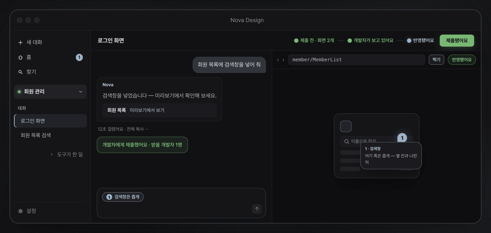

<div align="center">


# Nova Design

### 말과 문서가 화면이 됩니다

**기획자 · 디자이너 · 사업/운영 담당자를 위한 AI 화면 제작 도구.**<br/>
말로 부탁하면, 우리 서비스의 **진짜 화면**이 그 자리에서 바뀝니다.

<br/>

[](https://github.com/inkwonjung-colosseum/nova-design/releases)
[](https://inkwonjung-colosseum.github.io/nova-design/)


<br/>

<picture>
  <source media="(prefers-reduced-motion: reduce)" srcset=".github/assets/readme-hero.png" />
  
</picture>

<sub><b>말하고 · 찍고 · 제출.</b> 왼쪽은 AI 와의 대화, 오른쪽은 서비스의 실제 화면이에요.</sub>

<sub>개발자이신가요? → <a href="docs/DEVELOPERS.md">개발자 · 운영자 안내</a></sub>

</div>

<br/>

## 😮‍💨 이런 적, 있지 않나요?

> 검색창 하나 넣자는 말이 **기획서 한 장**이 되고, 캡처 속 **빨간 동그라미**가 되고,
> 개발자의 **다음 일정**이 됩니다.<br/>
> 한참 뒤 받아 본 화면 앞에서 — *"음… 이게 아닌데."* 그리고 **한 바퀴 더.**

**Nova Design 에서는 말한 그 자리에서 서비스의 화면이 바뀝니다.** 기다림도, 캡처도, 긴 설명도 없이요.

## 💬 이렇게 씁니다

<table>
<tr>
<td width="110">🙋 <b>나</b></td>
<td>회원 목록에 검색창을 넣어 줘</td>
</tr>
<tr>
<td>✨ <b>Nova</b></td>
<td>검색창을 넣었습니다 — 미리보기에서 확인해 보세요.<br/><code>회원 목록 · 미리보기에서 보기</code></td>
</tr>
<tr>
<td>📍 <b>나</b></td>
<td><i>(미리보기의 검색창을 콕 찍고)</i> 여기 폭은 좁게 — 옆 칸과 나란히</td>
</tr>
<tr>
<td>✨ <b>Nova</b></td>
<td>검색창 폭을 줄여 옆 칸과 나란히 맞췄어요.</td>
</tr>
<tr>
<td>🚀 <b>나</b></td>
<td>상태 줄의 <code>제출</code> 한 번 → <b>개발자에게 제출했어요 · 받을 개발자 1명</b></td>
</tr>
</table>

이게 전부예요. 저장 버튼도, 파일 이름도, 개발 용어도 나오지 않아요.

## 할 일은 딱 세 가지

<table>
<tr>
<td align="center" width="33%" valign="top">

### 💬 말하고

원하는 화면을 말로 보내요.<br/>
참고 그림 · 기획 문서를<br/>끌어다 놓아도 돼요.

</td>
<td align="center" width="33%" valign="top">

### 📍 찍고

고칠 곳은 설명 대신<br/>
<kbd>⌥ Option</kbd> + 클릭<br/>
<sub>(Windows 는 <kbd>Alt</kbd>)</sub><br/>
그 자리에 메모가 붙어요.

</td>
<td align="center" width="33%" valign="top">

### 🚀 제출

다 됐으면 버튼 하나.<br/>
개발자에게 바로 가고,<br/>
코멘트도 AI 가 반영해요.

</td>
</tr>
</table>

## 지금까지 vs Nova Design

| 지금까지 | Nova Design 에서는 |
| --- | --- |
| 기획서를 쓰고 개발자의 일정을 기다려요 | **말로 보내면** AI 가 서비스의 화면을 바로 만들고 고쳐요 |
| 시안과 실제 서비스가 따로 놀아요 | 미리보기가 **서비스의 앱 그 자체**예요 — 검색도 버튼도 폼도 실제로 동작해요 |
| 캡처에 빨간 동그라미를 그려 메신저로 보내요 | 화면을 **직접 찍어** 그 자리에 메모를 붙여요 |
| "그 파일 어디에 저장했더라?" | **저장 버튼이 없어요** — 답마다 저절로 보관되고, 언제든 그 시점으로 돌아가요 |
| 오류 화면을 캡처해 개발자에게 물어요 | **오류는 도구가 먼저 찾고** AI 가 고쳐요 |
| 넘기려면 브랜치 · 커밋 · 풀 리퀘스트 | **`제출` 버튼 하나** — 개발자의 코멘트도 AI 가 반영해 다시 제출해요 |

<p align="center">
<del>브랜치</del> · <del>커밋</del> · <del>푸시</del> · <del>풀 리퀘스트</del> · <del>머지</del> · <del>충돌 해결</del> · <del>터미널</del><br/>
<b>하나도 몰라도 돼요. 전부 도구가 대신합니다.</b>
</p>

## ✨ 할 줄 아는 것

<table>
<tr>
<td width="50%" valign="top">

#### 💬 말 · 그림 · 문서로 주문해요

원하는 화면을 말로 보내고, 참고 그림이나 기획 문서(한 건 8MB 까지)를 끌어다 놓아요.
답마다 `고친 화면` 카드가 서고, 미리보기가 그 화면으로 스스로 옮겨 가요.
[→ 화면 만들기](docs/GUIDE.md#5-화면-만들기--말로)

</td>
<td width="50%" valign="top">

#### 🖥️ 진짜 서비스 위에서 봐요

미리보기는 시안이 아니라 그 서비스의 앱을 그대로 띄운 거예요. 검색 · 버튼 · 폼이 실제로
동작하고, PC · 태블릿 · 휴대폰 크기로 바꿔 볼 수 있어요.
[→ 미리보기](docs/GUIDE.md#6-미리보기에서-확인)

</td>
</tr>
<tr>
<td width="50%" valign="top">

#### 📍 설명하지 말고, 찍어요

요소를 누르거나 영역을 끌어 짚으면 그 자리에 말풍선이 떠요. 여러 곳을 찍고 문장 하나로
보내요 — "고쳐 줘" 면 고치고, "이게 뭐야?" 면 설명해요.
[→ 찍기](docs/GUIDE.md#7-고칠-곳은-찍어서--말풍선)

</td>
<td width="50%" valign="top">

#### 🚀 제출은 버튼 하나

확인 한 장에 `개발자에게 한마디` 를 얹어 보내요. 개발자의 코멘트는 AI 가 바로 반영해 다시
싣고, 반영된 내용은 도구가 스스로 받아 와요.
[→ 제출](docs/GUIDE.md#8-제출--확인-한-장)

</td>
</tr>
<tr>
<td width="50%" valign="top">

#### ⏪ 저장 버튼이 없어요

AI 가 답할 때마다 저절로 보관돼요. `작업 기록` 서랍에서 「회원 목록에 검색창을 넣어 줘」
직후처럼 **내가 한 말로** 시점을 골라 되돌려요. 기록은 지워지지 않아요.
[→ 작업 기록](docs/GUIDE.md#마음이-바뀌면--작업-기록-서랍)

</td>
<td width="50%" valign="top">

#### 🛟 오류는 사람 몫이 아니에요

화면을 만진 답이 끝나면 도구가 그 화면을 다시 열어 봐요. 빈 화면이나 오류를 찾으면 AI 가
그림을 보고 고치고, 꺼진 미리보기는 도구가 먼저 다시 켜요.
[→ 문제 문장](docs/GUIDE.md#화면의-문제-문장은-셋이다)

</td>
</tr>
</table>

그 밖에도 — 여러 프로젝트를 오가도 미리보기가 보던 자리 그대로 남고, AI 가 일을 마치면 알림이
부르고, 홈의 받은 편지함은 내 손이 필요한 일만 세요. 테마를 갈아입고, <kbd>⌘</kbd><kbd>=</kbd> ·
<kbd>⌘</kbd><kbd>-</kbd> 로 앱 전체를 키우고 줄여요.

## 🗣️ 첫날, 이렇게 말해 보세요

| 이렇게 말하면 | 이렇게 돼요 |
| --- | --- |
| 「회원 목록에 이름으로 찾는 검색창을 넣어 줘」 | 목록 위에 검색창이 생기고, 미리보기가 그 화면으로 옮겨 가요 |
| 기획 문서를 끌어다 놓고 「이 문서대로 주문 상세 화면을 만들어 줘」 | 문서를 읽고 새 화면을 지어요 |
| 버튼을 찍고 「이게 뭐야?」 | 고치지 않고 설명만 해요 — 뜻은 문장이 정해요 |
| 표를 찍고 「휴대폰에서 보면 넘쳐. 고쳐 줘」 | 고친 뒤, 미리보기를 휴대폰 크기로 바꿔 바로 확인해요 |
| 「목록이 비었을 때 안내 문구를 넣어 줘」 | 미리보기에서 목록을 비워 보면 그 모습이 보여요 |
| 「개발자에게 보내 줘」 | 확인 없이 AI 가 제출해 줘요 |

## 🔐 안심하고 쓰세요

- **비밀은 이 컴퓨터에만** — 연결 코드와 AI 로그인은 맥 키체인 같은 OS 자격 증명 저장소에만
  있어요. 공유 서버를 거치지 않아요.
- **서비스의 원본은 그대로** — 만든 것은 제출로 개발자에게 가고, 합칠지는 개발자가 정해요.
  그 전까지 원본에는 손대지 않아요.
- **관리자 권한도 터미널도 없이** — 필요한 도구는 앱이 싣고 와요. AI 프로그램의 설치 · 로그인 ·
  업데이트도 앱 안에서 끝나요.
- **한 사람 · 한 컴퓨터 · 하나의 구독** — 각자 자기 AI 계정으로, 자기 컴퓨터에서 돌려요.

## 🚀 시작하기 — 세 걸음

### ① 내려받아 설치하기

[릴리스 페이지](https://github.com/inkwonjung-colosseum/nova-design/releases)에서 컴퓨터에 맞는
파일을 받으세요.

| 컴퓨터 | 파일 |
| --- | --- |
| 🍎 mac (Apple 실리콘) | `nova-design-<버전>-mac-arm64.dmg` |
| 🪟 Windows | `nova-design-Setup-<버전>-win-x64.exe` |

> [!NOTE]
> 서명이 없는 배포라 **첫 실행에 한 번** 허가가 필요해요.<br/>
> **Windows** — SmartScreen 창에서 `추가 정보` → `실행`<br/>
> **mac** — 시스템 설정 → 개인정보 보호 및 보안 → `확인 없이 열기`

### ② AI 연결하기

첫 화면은 체크리스트 한 장이에요. 화면을 만드는 AI 프로그램(Claude Code)을 **설치 버튼 하나**로
준비하고, 브라우저에서 내 Claude 계정으로 로그인하면 저절로 돌아와요. Codex 는 선택이라
건너뛰어도 돼요.

### ③ 초대 파일 놓기

개발자에게 받은 **초대 파일**(`*.nova-invite`)을 첫 화면에 끌어다 놓으면 끝이에요. 셋이 다
채워지면 누를 것 없이 작업 화면이 열려요.

> [!TIP]
> **초대 파일이 아직 없다면** — 개발자에게 이 메시지를 그대로 보내세요.
>
> ```text
> Nova Design 초대 파일(.nova-invite) 하나 만들어 주세요!
> 여기서 바로 만들 수 있어요 → https://inkwonjung-colosseum.github.io/nova-design/#invite
> ```

그다음은 말하면 돼요. 업데이트는 앱이 알아서 확인해요 — 켤 때, 앱으로 돌아올 때, 그리고 하루에 한 번.

## 🧭 화면 위 세 점만 보면 돼요

작업 화면 위의 상태 줄이 지금 어디쯤인지 알려 줘요.

<p align="center">
<b>● 제출 전</b> &nbsp;━━━━━&nbsp; <b>○ 개발자 확인</b> &nbsp;━━━━━&nbsp; <b>○ 반영됨</b>
</p>

- **제출 전** — 만드는 중이에요. AI 가 답할 때마다 저절로 보관돼요.
- **개발자 확인** — `제출` 로 개발자에게 갔어요. 코멘트가 오면 AI 가 반영해 다시 제출해요.
- **반영됨** — 개발자가 제품에 합쳤어요. 다음에 만드는 것은 새 작업이에요.

알아 둘 말은 **제출**과 **반영됨**, 둘뿐이에요. *저장* 이라는 말은 없어요.

## 🙋 자주 묻는 질문

<details>
<summary><b>개발을 정말 하나도 몰라도 되나요?</b></summary>

네. 말로 부탁하고, 화면을 찍고, `제출` 을 누르는 것이 전부예요. 브랜치 · 커밋 같은 개발
용어는 화면 어디에도 나오지 않아요.

</details>

<details>
<summary><b>우리 서비스를 망가뜨리면 어떡하죠?</b></summary>

작업은 이 컴퓨터에 있는 서비스의 복사본에서만 일어나요. 서비스의 원본은 개발자가 제출을 받아
합치기 전까지 그대로예요. 마음에 안 들면 `작업 기록` 에서 언제든 되돌리면 돼요.

</details>

<details>
<summary><b>AI 가 엉뚱한 화면을 만들었어요.</b></summary>

말로 다시 고쳐 달라고 하면 돼요. 말부터 다시 하고 싶으면 보낸 말의 `고쳐서 다시 보내기`,
화면까지 되돌리려면 `작업 기록` 서랍에서 그 시점을 고르세요.

</details>

<details>
<summary><b>오류 화면이 뜨면 어떻게 하나요?</b></summary>

할 일이 없어요. 도구가 화면을 다시 열어 확인하고, 정말 깨져 있으면 AI 가 알아서 고쳐요.
사람의 손이 필요한 건 `다시 연결이 필요해요` 한 가지뿐이에요 — 새 초대 파일을 놓거나,
브라우저에서 로그인 한 번이면 돼요.

</details>

<details>
<summary><b>무엇이 필요한가요?</b></summary>

mac(Apple 실리콘) 또는 Windows 컴퓨터, 내 Claude 계정, 그리고 개발자에게 받은 초대 파일 하나.
나머지 도구는 앱이 싣고 와요.

</details>

<details>
<summary><b>연결 코드와 AI 로그인은 어디에 보관되나요?</b></summary>

OS 자격 증명 저장소(맥 키체인 등)에만 있어요. 공유 서버를 거치지 않고, 화면 쪽 코드에는
절대 전달되지 않아요.

</details>

<details>
<summary><b>컴퓨터에 무엇이 남나요?</b></summary>

홈의 숨은 폴더 하나 `~/.nova-design/` 가 전부예요 — 설정과 작업 중인 서비스의 복사본.
설정 → `개발자용` 의 `폴더 열기` 로 열어 볼 수 있어요.

* 예전 이름(Colo Design)의 `~/.colo-design/` 폴더는 0.4.0 부터 읽지 않아요 — 남아 있으면 지워도 돼요.

</details>

더 많은 질문과 답은 [사용 설명서](docs/GUIDE.md#자주-묻는-질문)에 있어요.

## 📚 더 알아보기

- 📘 **[사용 설명서](docs/GUIDE.md)** — 화면 하나하나, 버튼 하나하나를 적은 전체 안내
- 🌐 **[소개 페이지](https://inkwonjung-colosseum.github.io/nova-design/)** — 움직이는 데모로 한 바퀴 둘러보기
- 💌 **[초대장 만들기](https://inkwonjung-colosseum.github.io/nova-design/#invite)** — 개발자가 사용자에게 보낼 초대 파일 만들기
- 🛠️ **[개발자 · 운영자 안내](docs/DEVELOPERS.md)** — 팀의 서비스를 연결하는 법, 소스 · 배포 안내

<br/>

<div align="center">
<br/>
<sub><b>Nova Design</b> — 말하고 · 찍고 · 제출.</sub>
</div>
