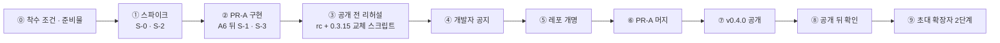

# Nova Design 전환 계획 — Colo Design → Nova Design

> **한 줄 요약 — 최종: 완전 단절.** 사람이 읽는 이름은 모두 바꾸고, 옛 데이터는 읽지도
> 옮기지도 않는다(2026-09-29, 요청자가 "옛 데이터 · 옛 초대장 지원 안 함"을 확정). 데이터
> 폴더 `~/.nova-design/` · userData `…/Nova Design` · 초대 확장자 `*.nova-invite` 에서 새로
> 시작한다. appId 는 바꾸되 NSIS 가 옛 GUID 설치를 먼저 지운다(병설 방지). 쓰기 값이 nova
> 하나뿐인지 `nova-names` 시험이 지킨다 — 이 문서의 이주([§3.3](#33-이주-설계))와 이중 읽기
> ([§1.2](#12-이중-계약--읽기는-둘-다-쓰기는-nova)) 설계는 **폐기된 중간안의 기록**이다.

- **기준**: 2026-09-28 작업 트리(`lifecycle`, 데스크톱 0.3.15, 커밋되지 않은 변경 50파일
  포함). 줄 번호는 이 트리의 것이다 — 착수 때 [§2.2](#22-조사-명령)로 다시 맞춘다.
- **목표**: 0.4.0 — 이름이 바뀌는 업데이트. 저장 위치도 옮기므로 되돌리기는 공짜가 아니다([§9](#9-되돌리기)).
- **산출**: PR-A 하나(0.4.0 릴리스 — 보이는 이름 · 저장 위치 이주 · 설치 정체성 · 내부 식별자
  전부), 뒤따르는 작은 변경 둘(버전 올림, 초대 확장자 2단계).
- **경로 표기**: `packages/*/src/` 는 뺐고, 이름이 겹치면 폴더를 붙였다(`protocol/repo.ts`,
  `next/labels.ts`, `codex/session.ts`). `main.ts` 는 desktop, `index.ts` 는 daemon 의 것이다.
  `electron-builder.yml` 은 `packages/desktop/`, `desktop-release.yml` 은 `.github/workflows/` 에
  있다.

## 실행 기록 (2026-09-29, `nova/rename` 브랜치)

구현은 세 커밋으로 끝났다 — 결정의 흐름대로 세 층으로 읽는다.

1. `dfe7bb1a` **개명 본체** — 계획의 PR-A + D · E · G · F 뭉치를 그대로: 보이는 이름 · 내부
   식별자(패키지 · 타입 · IPC 채널 20종 · 환경 변수 39종) 전부, 저장 위치 이주
   (`daemon/src/migrate-home.ts`), userData 이주와 mac 번들 정리(`desktop/src/identity.ts`),
   NSIS include(옛 GUID `8e8a724d-…` 설치 제거), 표식 이중 읽기 전부, 초대 확장자 1단계.
2. `ef1d8088` 포맷터가 표식을 흔들지 않게 한 줄.
3. `692bdde9` **완전 단절로 선회** — 요청자의 최종 결정으로 이주 · 이중 읽기 · 복호화 실패
   판정을 전부 걷고(순감소 1,490줄), 초대 확장자를 2단계 없이 `*.nova-invite` 로 완전 전환.

남은 옛 이름은 설치 정체성을 치우는 세 곳뿐이다 — `installer.nsh`(옛 GUID 제거) ·
`identity.ts`(LEGACY 상수) · `index.ts`(옛 환경 변수 경고 한 줄). 시험 867 통과,
`nova-names` 잔여 검사 0줄. **아직 요청자 몫**: ⑤ 레포 개명 → ⑥ 머지 → ⑦ 데스크톱 버전
0.4.0 올리고 태그 → ⑧ 공개. S-0 · S-2 스파이크와 ③ 리허설(R-01~)은 건너뛰었다 — 단절
이후 이관·이주 검증이 필요 없어졌다.

## 용어

- **요청자** — 이 계획을 맡긴 사람. [§0](#0-결정)의 질문에 답하고, 레포 admin 과 태그 권한을
  가진다. **앱 사용자**는 앱을 쓰는 비개발자, **개발자**는 연결 레포에서 제출을 받는 사람이다.
- **연결 레포 · 클론** — 앱이 화면을 고치는 서비스의 레포와, 앱이 받아 둔 사본
  (`~/.nova-design/projects/<slug>/repo`. 옛 `~/.colo-design/` 은 읽지 않는다 — 폐기된 중간안에서는 옮겼다).
- **사이클 · 요청 · 반영** — 작업 한 묶음(사이클 브랜치 하나), 그것을 넘긴 PR, 그 PR 의 병합.
  **원장**은 프로젝트마다의 `cycle.json` 으로, 사이클 브랜치 이름과 제출 상태를 기억한다.
- **턴 마커 · 카드** — 도구가 쓴 턴의 첫 줄에 붙는 HTML 주석 표식과, 대화에서 그것을 그린
  카드(코멘트 · 게이트 · 브리프 등).
- **공통 규칙** — 모든 대화의 시스템 프롬프트 끝에 붙는 규칙 블록(`common-instructions.ts`).
  **옛 저장본**은 규칙이 턴 글 안에 실려 있던 예전 대화 기록이다.
- **게스트** — 미리보기 칸의 `<webview>` 안에 뜬 연결 레포의 페이지.
- **rc** — 태그 없이 지은 시험용 설치물. mac 은 로컬에서
  `pnpm --filter @colo-design/desktop exec electron-builder --publish never -c.mac.identity=-`,
  Windows 는 릴리스 워크플로의 수동 실행(`workflow_dispatch`, 빌드만 하고 artifacts 에 남긴다).
- **스모크** — `COLO_DESIGN_DESKTOP_SMOKE` 로 격리된 userData 를 쓰는 데스크톱 실행.
  **P2** — 이번 릴리스에 없어도 되는 일.

## 원칙

1. 사람이 읽는 이름은 모두 바꾼다 — 앱 사용자 · 개발자 · AI 가 읽는 글과 설치물의 이름.
2. 저장되거나 밖에 나가 있어 **누군가 다시 읽는** 기계용 이름은 이름이 아니라 계약이다 — 쓰기를
   nova 로 바꾸되 읽기는 둘 다 남긴다([§1.2](#12-이중-계약--읽기는-둘-다-쓰기는-nova)). 이중 읽기
   줄에는 `// read-legacy` 표식을 달고, `nova-names` 시험이 쓰기 값을 못 박는다. 저장 **위치**(데이터
   폴더 · userData)는 이주로 옮긴다([§3.3](#33-이주-설계)). 아무도 다시 읽지 않는 이름(user-agent
   같은 밖으로 나가는 꼬리표)은 내부 식별자로 친다.
3. 옛 이름이 이미 쓰여 있는 자리는 **읽기는 둘 다, 쓰기는 새 것** — 공통 규칙 머리 · 초대 파일
   확장자 · [§1.2](#12-이중-계약--읽기는-둘-다-쓰기는-nova)의 표식들. mac 키체인 항목은 우리가
   고르는 이름이 아니라 앱 이름을 따라 저절로 바뀌므로 [§5](#5-mac-연결-코드)에서 따로 다룬다.
4. 한 배포 안에서만 오가는 내부 이름(패키지명 · 타입 · IPC 채널 · 환경 변수)은 같은 0.4.0 안에서
   기계적으로 바꾼다(§7.2 F).
5. 회사 디자인 시스템 CDS(`@colosseumcoinckr/*`), 조직명 `inkwonjung-colosseum`, 타사
   이름(Claude · Codex · omp, 테마 이름)은 건드리지 않는다.

## 0. 결정

| # | 논점 | 결정 | 근거 |
|---|---|---|---|
| D-1 | 보이는 이름 | 제품명 `Nova Design`, 슬러그 `nova-design` — UI · 메뉴 · 알림 · 창 제목 · 설치 파일 · 앱 번들 · 사이트 · README · 릴리스 노트 | [§1.1](#11-바꾸는-이름) |
| D-2 | 데이터 폴더 | `~/.colo-design/` → `~/.nova-design/` **이주** — 첫 시작에 폴더째 옮기고 에이전트 대화 저장소의 경로도 따라 고친다 | 세 에이전트가 클론 경로로 대화를 찾는다 [§3.1](#31-데이터-폴더와-에이전트의-대화-저장소) · [§3.3](#33-이주-설계) |
| D-3 | userData 폴더 | `…/Colo Design/` → `…/Nova Design/`(productName 기본값) **이주** — 잠금 앞에서 폴더째 rename | localStorage · desktop-settings · DPAPI 키가 폴더를 따라 온다 [§3.2](#32-userdata) · [§3.3](#33-이주-설계) |
| D-4 | appId | `org.colo-design.desktop` → `org.nova-design.desktop` — NSIS include 가 옛 GUID 설치를 설치 전에 조용히 지운다 | 병설 설치를 막는다 [§4.2](#42-windows) |
| D-5 | Windows 실행 파일 | `Nova Design.exe`(executableName 기본값). 옛 설치는 지워지고 새로 깔리므로 옛 exe 경로는 남지 않는다 — 재실행은 안내로 잇는다 [§4.2](#42-windows) | 0.3.x 교체 스크립트가 옛 exe 를 다시 띄우려는 것은 어차피 실패한다 |
| D-6 | mac 번들 폴더 | 첫 실행에 `Colo Design.app` → `Nova Design.app` 으로 이름을 바꾸고 다시 실행 | 0.3.x 교체가 새 앱을 옛 폴더 이름에 놓는다 [§4.1](#41-mac) |
| D-7 | mac 연결 코드 | 옛 키체인 항목에서 이관(S-2 통과 시), 아니면 재연결. 어느 쪽이든 복호화 실패를 `다시 연결이 필요해요` 로 잇는다 | 키체인 항목 이름이 앱 이름을 따른다 [§5](#5-mac-연결-코드) |
| D-8 | 기계용 표식 | [§1.2](#12-이중-계약--읽기는-둘-다-쓰기는-nova)의 목록 전부 — **쓰기 nova · 읽기 둘 다** — 턴 마커 · PR 도구 구간 · 이슈 표식 · 에셋 브랜치 · 보관 ref · 미리보기 pid 파일 · 게스트 전역 · localStorage 키(키는 한 번 복사해 옮긴 뒤 새 것만 쓴다) | 다시 읽는 쪽이 있다 |
| D-9 | 개발자가 보는 새 쓰기 | 사이클 브랜치 `nova-design/…`(새 사이클부터), 커밋 identity `Nova Design <nova-design@localhost>`, PR · 이슈 · 커밋 문구, 이슈 라벨 `nova-design` | 다시 읽는 쪽이 없다 [§2.1](#21-새로-쓰되-옛것도-읽는-곳) |
| D-10 | AI 가 읽는 이름 | 공통 규칙 머리 `# Nova Design 공통 규칙`, 옛 머리도 걷어낸다 | 옛 저장본의 제목 파생 [§2.1](#21-새로-쓰되-옛것도-읽는-곳) |
| D-11 | 초대 파일 | 형식(바깥 봉투 v3 · 안쪽 v4)과 키 불변. 0.4.0 은 두 확장자를 연다. 생성기는 v0.4.0 공개 2주 뒤 `.nova-invite` 로 | 0.3.x 는 `.nova-invite` 를 거절한다 [§4.3](#43-초대-파일) |
| D-12 | GitHub 레포 | `inkwonjung-colosseum/colo-design` → `…/nova-design`, **PR-A 머지 전에** 개명 | 프로젝트 Pages 주소만 리다이렉트되지 않는다 [§6](#6-릴리스-시퀀스) |
| D-13 | 내부 식별자 | 같은 0.4.0 안에 넣는다(§7.2 F 묶음) — 사용자 릴리스 노트에 줄이 없다. 개발자 공지만 한다 | [§7.3](#73-pr-b--내부-식별자040-의-f-묶음) |
| D-14 | 서명 인증서 | CN `Nova Design Dev` 를 새로 만든다(없으면 ad-hoc — 릴리스는 어차피 ad-hoc) | 키체인에서 한 번 만들면 끝 |
| D-15 | 버전 | 전 패키지 0.4.0 으로 정렬(지금 0.3.9 · 0.3.10 · 0.3.15) | — |

**요청자의 답(2026-09-29).**

1. 이름 값 확정 — `Nova Design` · `nova-design` · `.nova-invite` · 레포 `nova-design`.
   마크 파일 `colonova-icon.svg` 는 마크의 이름이라 그대로 둔다.
2. 동결하지 않고 **완전 개명** — D-2~D-4 를 이주로 풀고 D-8 을 읽기 둘 다로 푼다([§3.3](#33-이주-설계)).
   대가: Windows 0.3.x 에서 건너올 때 앱이 저절로 다시 열리지 않고(시작 메뉴 안내로), mac 은 알림
   허용을 다시 한 번 받는다.
3. Pages 주소 — **커스텀 도메인 없이 새 주소(`…github.io/nova-design/`)로 그대로 간다**(확정).
   옛 주소는 끊기므로 개발자 공지(시퀀스 ④)에 새 주소를 실는다.

**요청자의 답(2026-09-29, 후반 — 최종).**

4. **옛 데이터 · 옛 초대장은 지원하지 않는다** — 이주(§3.3)와 이중 읽기(§1.2)를 전부
   걷는다. 0.4.0 은 `~/.nova-design/` · `…/Nova Design` · `*.nova-invite` 에서 새로 시작하고,
   옛 사용자는 새 초대 파일로 다시 시작한다. 초대 확장자의 2단계(D-11)도 즉시 완전 전환으로
   대체된다. 구현: `692bdde9`(실행 기록 참조).

## 1. 이름 사전

### 1.1 바꾸는 이름

문구는 `Colo Design` → `Nova Design` 치환이 원칙이다. 둘 다 `Design` 으로 끝나 붙는 조사가
그대로다. 새로 쓰는 문장은 셋뿐이다 — 업데이트 완료 알림의 한 문장(A2), 초대 파일 오류 문장과
첫 화면 표기([§4.3](#43-초대-파일)).

| 옛 | 새 | 자리 |
|---|---|---|
| `Colo Design`(제품명) | `Nova Design` | `desktop/package.json:3·6`, `electron-builder.yml:25`, `web/index.html:9`, `ConnectScreen.tsx:23`, `next/labels.ts:65·536`, `main.ts:104·226`, `menu.ts:104`, `windows.ts:203`, `app-updates.ts:166·204·327`, `agent-install.ts:148`(IT 담당자에게 보내는 문장), `site/index.html:6·11·35·74·476·481`, `site/invite.js:199·204·942`, `site/invite-format.mjs:21`, README |
| 설치 파일 `colo-design-<v>-mac-arm64.{dmg,zip}` · `colo-design-Setup-<v>-win-x64.exe` | `nova-design-…` | `electron-builder.yml:61·76`, `desktop-release.yml:11-13·212-214`, `self-update.ts:82·103`(내려받은 파일 이름), `site/invite.js:223-224`, README |
| 앱 번들 `Colo Design.app` | `Nova Design.app` | productName 이 짓는다. `self-update.ts:87·92`, `desktop-release.yml:160·245`, README 의 서명 명령 |
| 공통 규칙 머리 `# Colo Design 공통 규칙` | `# Nova Design 공통 규칙` | `common-instructions.ts:22`, 옛 머리 읽기 `:56` |
| 사이클 브랜치 `colo-design/<YYYYMMDD>-<n>` | `nova-design/…` | `repo-core.ts:58` — 새 사이클만. 진행 중 사이클은 원장이 기억한 이름으로 끝난다 |
| 커밋 identity `Colo Design <colo-design@localhost>` | `Nova Design <nova-design@localhost>` | `repo-core.ts:997-998` |
| 커밋 · 요청 기본 문구 | Nova 문구 | `repo-core.ts:47·49·53`, `protocol/repo.ts:382` |
| 개발자 알림 문구 · 라벨 `colo-design` | Nova 문구 · 라벨 `nova-design` | `developer-notice.ts:74·201·267·298·440`, `developer-replies.ts:55`, `cycle-supervisor.ts:1459`, `dispatch.ts:792` |
| 초대 확장자 `.colo-invite` | 읽기 둘 다, 쓰기 `.nova-invite`(2단계) | [§4.3](#43-초대-파일) |
| 릴리스 레포 `inkwonjung-colosseum/colo-design` | `…/nova-design` | `protocol/update.ts:18`, `site/index.html:42·59·298·482`, `site/invite.js:223-224`, README |
| 릴리스 제목 · 노트 | Nova | `desktop-release.yml:1·245·259·271` |

### 1.2 이중 계약 — 읽기는 둘 다, 쓰기는 nova

저장된 표식은 쓰기를 nova 로 바꾸되 읽는 곳은 옛 것도 열어 둔다. 이중 읽기를 하는 줄에는
`// read-legacy` 주석을 단다(§7.2 F 의 치환 제외 표식). 앞의 세 줄(저장 위치)은 표식이 아니라
**위치**라 [§3.3](#33-이주-설계)의 이주로 푼다.

| 이름 | 사는 곳 | 이중 계약이 없으면 |
|---|---|---|
| 데이터 폴더 `~/.colo-design/`(`environment.ts:19`) | → `~/.nova-design/` 이주 | 이주 없이 바꾸면 모든 프로젝트의 지난 대화가 목록에서 사라진다 [§3.1](#31-데이터-폴더와-에이전트의-대화-저장소) |
| userData `Colo Design`(productName 이 기본값을 짓는다) | → `…/Nova Design/` 이주 | 이주 없이 바꾸면 테마 · 대화 제목 · 초안 · 핀이 초기화되고 Windows 연결 코드가 풀린다 [§3.2](#32-userdata) |
| appId `org.colo-design.desktop`(`electron-builder.yml:24` ↔ `main.ts:45`) | → `org.nova-design.desktop` | 옛 설치 제거 include 와 짝이어야 병설이 생기지 않는다 [§4.2](#42-windows) |
| 턴 마커 `<!-- colo-design:<kind> {…} -->`(`turn-marker.ts:172·184`, 읽는 곳 `turn-stats.ts:157-161·235-238` · `pin-files.ts:281-287`) | 모든 대화 기록 | 읽는 곳 하나만 빠져도 카드가 날 글로 보이고, 되돌려 깐 옛 앱은 새 마커를 못 읽는다 |
| PR 도구 구간 `<!-- colo-design:start/end -->`(`handoff-body.ts:115-116`) | 열린 PR 본문 | `mergeToolBlock`(`:126`)은 구간을 못 찾으면 새 구간을 덧붙인다 — 같은 PR 에 도구 구간이 둘 |
| 이슈 표식 `<!-- colo-design:problem <key> -->`(`developer-notice.ts:72·419`) | 열린 이슈 | 같은 문제의 이슈를 새로 연다 |
| 에셋 브랜치 `colo-design-assets`(`repo-publish.ts:54`) | 연결 레포마다 | 옛 PR 본문의 화면 미리보기 이미지가 이 브랜치를 가리킨다 — 두 번째 에셋 브랜치가 생긴다 |
| 보관 ref `refs/colo-design/shelf`(`repo-core.ts:77`) | 클론 | v0.3.8~0.3.10 에 치워 둔 작업을 되찾는 길이다(`repo-shelf.ts`) |
| 옛 캡처 `.colo-design/shots/`(`repo-core.ts:51`) | 2026-09-24 이전 사이클 브랜치 | 옛 제출의 `제출한 때의 화면 보기` 가 빈다(`repo-publish.ts:715-723`) |
| 설치 해시 `.git/colo-design-install-hash`(`repo-core.ts:38`) | 클론 | 모든 프로젝트가 한 번씩 설치를 다시 돈다 |
| 미리보기 pid `.git/colo-design-preview.pid`(`repo-bringup.ts:289·454`) | 클론 | 다음 시작이 남은 미리보기 서버를 못 거두어 포트를 빼앗긴다 |
| 첨부 `.git/colo-design-attachments/` · `<cwd>/.colo-design/attachments`(`attachments.ts:57·61`) | 클론 | 옛 대화에 실린 절대 경로가 끊기고, 7일 청소가 옛 폴더를 놓친다 |
| stash 태그 `Colo Design: 최신화 임시 보관`(`repo-core.ts:119`) | 클론의 stash | 옛 앱이 남긴 임시 보관을 도구의 것으로 못 알아본다(`repo-core.ts:920·1125`, `cycle-supervisor.ts:1533`) |
| MCP 서버 `colo-browser`(`browser-launch.ts:21`, 읽는 곳 `turn-stats.ts:275`) | 대화 기록의 도구 이름 | 이어 든 대화가 옛 도구 이름을 부르고, 턴 통계의 묶음이 갈린다 |
| localStorage 키 `colo-design.*`(`settings.ts:275·473·605·681·716`, `App.tsx:8`, `Composer.tsx:25`, `problem.ts:118`, `usePins.ts:56`, `useSessions.ts:40`, `open-link.ts:5`, `crash.ts:37`, `daemon-client.ts:948·1046`, `public/boot-watchdog.js:12`), 게스트 쪽 `colo-design.pin-hint`(`preview-preload.ts:340`) | 창의 저장소 | 부팅 때 옛 키 → 새 키를 한 번 복사한다(§7.2 G). `desktop/scripts/dev.mjs:232` 도 이 문자열로 vite 서버를 알아본다 |
| 사이트 테마 키 `colo-site-theme` · `colo-theme`(`site/demo.js` · `site/hero3d.js`) | 방문자 브라우저 | 방문자의 테마가 초기화된다 |
| 게스트 전역 `window.coloDesign`(`preview-preload.ts:201`) | 연결 레포의 코드 | 게스트 페이지에서 레포 코드가 부를 수 있는 유일한 문이라 `novaDesign` 을 같은 객체로 추가하고 `coloDesign` 을 별칭으로 남긴다. 그 메시지(`colo-design.navigate`)는 이미 아무도 처리하지 않으므로(`preview-view.ts:1010-1028`) 채널은 옛 것만 읽도록 둔다. 같은 페이지의 `data-colo-*` 속성과 `colo-pins-sync` 이벤트는 우리 preload 와 메인만 읽으므로 내부 식별자다 |
| 개발 경로 키체인 서비스 `Colo Design`(`credentials.ts:22`) | 이 도구를 짓는 기계 | 브라우저 개발 경로만 쓴다 — 옮길 이득이 없다 |
| 서명 CN `Colo Design Dev`(`electron-builder.yml:50`) | 이 도구를 짓는 기계의 키체인 | `Nova Design Dev` 인증서를 새로 만든다(D-14) |

### 1.3 내부 식별자 — PR-B

- 패키지명 `@colo-design/*` 5개와 bin `colo-design-daemon`
- 타입 `ColoDesign*`(9파일)과 창 전역 `window.coloDesignDesktop`
- IPC 채널 20종 — `colo-overlay:*` 9 · `colo-preview:*` 9 · `colodesign:*` 2
- 게스트 DOM 의 속성 `data-colo-design-overlay` · `data-colo-pick` · `data-colo-hover` 와 이벤트
  `colo-pins-sync` — preload 와 메인(`preview-view.ts`)이 문자열로 짝을 이룬다
- 환경 변수 39종 — `COLO_DESIGN_*` 36종과 MCP 자식에게 건네는 `COLO_DAEMON_URL` ·
  `COLO_BROWSER_SECRET` · `COLO_BROWSER_SUBMIT`(`browser-launch.ts:69-74`). 상수
  `COLO_DESIGN_DIR` 은 환경 변수가 아니다
- 임시 이름 — 원자 쓰기 접미사 `.colo-design-${pid}` 12곳, 업데이트 스크립트 · 로그
  (`app-updates.ts:423·432·443`), Codex 한 번 호출 폴더(`codex/one-shot.ts:19`), 시험 임시 폴더
  접두
- 밖으로 나가는 꼬리표 — user-agent(`agent-install.ts:517`, `agent-update.ts:126`,
  `scripts/make-invite.mjs:119·147`), Codex `clientInfo.name`(`codex/session.ts:211`)
- 시험 손잡이 `coloDesignPlannerPreview`(`main.ts:320`)

### 1.4 건드리지 않는 것

- CDS 스코프(`@colosseumcoinckr/*`), 조직명, 타사 이름, 마크 파일 `colonova-icon.svg`.
- 날짜가 박힌 기록 — `packages/web/test/cold/RESULT-2026-09-25.md`, 과거 태그, git 역사. 루트의
  다른 계획 문서는 그 계획이 고친다.
- 이름에 제품명이 없는 파일 — `daemon-YYYY-MM-DD.log`, `turn-stats-*`, `cycle.json`,
  `comments.json`, `screen-map.jsonl`.

## 2. 호환성과 조사

### 2.1 새로 쓰되 옛것도 읽는 곳

| 자리 | 읽기 | 쓰기 | 시험 |
|---|---|---|---|
| 공통 규칙 머리 | `stripCommonInstructions`(`common-instructions.ts:56`)가 두 머리로 시작하는 블록을 모두 걷어낸다. 옛 저장본은 규칙을 턴 글에 품고 있어, 못 걷으면 옛 대화의 제목과 커밋 제목이 규칙 문구가 된다 | 새 머리 | 옛 머리 픽스처의 `meaningfulFirstLine` 이 사용자의 말을 돌려준다 |
| 초대 확장자 | `invite-bus.ts:10`, `invite-import.ts:25`, `use-invite-import.ts:103`(accept), `invite-discard.ts:4` 가 둘 다 받는다 | 2단계에 `.nova-invite` | `invite-discard.test.ts` 에 새 확장자, 웹 가져오기 시험 |

[§1.2](#12-이중-계약--읽기는-둘-다-쓰기는-nova)의 표식 줄도 같은 규칙으로 간다 — 턴 마커 · PR 도구
구간 · 이슈 표식 · 에셋 브랜치 · 보관 ref · stash 태그 · MCP 서버 이름 · `update-result.json` 의 옛
자리(0.3.x 교체 스크립트가 `~/.colo-design/` 에 쓴다). 원장이 브랜치의 전체 이름을 기억하고
(`alignCycleBranch`), 번호 고르기(`pickCycleBranchName`)는 접두까지 붙인 이름으로 원격을 보므로
두 접두가 부딪히지 않는다. 개발자 알림의 이슈는 만든 사람과 표식으로 찾는다(`github.ts:530`,
`developer-notice.ts:419-437`) — 라벨은 찾기에 쓰이지 않는다. 기본 문구와 커밋 identity 는 쓰기만
한다.

### 2.2 조사 명령

```bash
# 이름의 모든 자리 — colo 로 시작하되 color·colour·colosseum(CDS 스코프)·colonova(마크)·colon 이 아닌 것
git grep --untracked -P -n -i 'colo(?!r|ur|sseum|nova|n\b)' -- . ':!pnpm-lock.yaml'
# IPC 채널 짝 — preload 두 개와 메인 쪽이 같은 집합이어야 한다(PR-B 뒤에도 돌도록 두 접두를 다 본다)
CH='"(colo|nova)(-[a-z]+|design):[a-z-]+"'
grep -h -o -E "$CH" packages/desktop/src/preload.ts packages/desktop/src/preview-preload.ts | sort -u
grep -h -o -E "$CH" $(ls packages/desktop/src/*.ts | grep -v preload) | sort -u
```

2026-09-28 결과(이 문서 제외): 234파일 — daemon src 70 · web src 60 · daemon test 44 · desktop
src 18 · web test 12 · protocol src 7 · site 6 · 패키지 매니페스트와 설정 6 · scripts 3 · desktop
scripts 2 · workflow 2 · web public 1 · 루트 package.json 1 · README 1 · 다른 계획 문서 1. 변종별로
`colo-design` 450회/190파일, `Colo Design` 85회/42파일, `ColoDesign*` 54회/9파일,
`coloDesign*` 49회/22파일, `.colo-invite` 38회/16파일, 환경 변수 39종, IPC 채널 20종(짝 일치).

## 3. 앱 사용자 기계 — 저장 위치도 옮긴다

> 처음 계획은 동결이었으나(2026-09-28), 요청자가 완전 개명을 택했다(2026-09-29). 이 절은 옮기는
> 방식과 이주의 안전장치를 정한다.

### 3.1 데이터 폴더와 에이전트의 대화 저장소

세 공급자가 모두 **클론의 경로**로 지난 대화를 찾는다.

- Claude — SDK `listSessions({ dir: cwd })` · `getSessionInfo` · `getSessionMessages` 가
  `~/.claude/projects/<cwd 의 영숫자 밖 글자를 - 로 바꾼 이름>/` 을 읽는다
  (`claude/driver.ts:136-196`). 이 기계에서도
  `-Users-developjik--colo-design-projects-cds-design-first-repo-repo` 로 산다.
- Codex — 롤아웃 첫 줄의 `cwd` 가 클론 경로와 같은 것만 고른다(`codex/driver.ts:228·312`).
- omp — `~/.omp/agent/sessions/<인코딩된 cwd>/`(`omp/store.ts:11-52`).

그래서 폴더 이름만 바꾸면 끝이 아니라, 아래 §3.3의 이주가 짝으로 가야 한다. 폴더와 함께 머무는
것은 클론(node_modules 포함, 이 기계 1.4GB), `tools/bin` 의 Codex, git 가드 훅, 로그, 그리고
`update-result.json` 이다 — 0.3.x 교체 스크립트가 **옛 이름 폴더**에 결과를 쓰고 새 앱은 두 자리를
다 읽는다. `~/.claude.json` 의 신뢰 항목도 경로에 묶이지만, 시작 때마다 다시 쓴다(`server.ts:955-968`).

### 3.2 userData

productName(`Nova Design`)이 Electron 의 기본 userData(`~/Library/Application Support/Nova Design`,
`%APPDATA%\Nova Design`)을 짓는다. 거기 사는 것:

- `Local Storage` — 창의 설정 전부(테마 · 알림 · 채팅 설정 · 레이아웃 · 직접 바꾼 대화 제목),
  입력 초안, 핀, 마지막 대화, 닫은 문제 줄. localStorage 는 origin 단위라 데스크톱은 데몬 포트를
  저장해 origin 을 붙잡아 둔다(`desktop-settings.ts:9-11`).
- `desktop-settings.json` — 포트 · 배율 · 알림 정책.
- `credentials.json` — safeStorage 암호문. Windows 는 복호화 키가 같은 폴더의 `Local State` 에
  있다(DPAPI) — 폴더째 옮기면 열쇠와 자물쇠가 함께 간다.
- `Partitions` — 미리보기 게스트의 저장소.

옛 폴더 `…/Colo Design` 은 단일 인스턴스 잠금보다 **먼저** 통째로 rename 한다(§3.3, 시작 순서는
[§7.1](#71-pr-a--040) A6). 잠금이 userData 안에 서므로 순서가 바뀌면 잠금과 데이터가 다른 폴더를
가리킨다. 폴더 이름 계산은 electron 없는 순수 모듈(`desktop/src/identity.ts`)에 두고 시험한다.

### 3.3 이주 설계

0.4.0 첫 시작이 한 번만 돌며, 전부 멱등이다(두 번째 실행은 아무 것도 하지 않는다). 어느 단계가
실패해도 앱은 뜬다 — 이주가 남은 것과 앱이 죽는 것 중 전자가 싸다. 실패는 로그 한 줄로 남는다.

**데이터 폴더(daemon 시작 맨 앞)**

1. `~/.colo-design` 가 있고 `~/.nova-design` 이 없으면 rename. 둘 다 있으면 새 것을 쓰고 경고 한 줄.
2. `config/projects.json` 의 절대 경로 접두를 다시 쓰고, 프로젝트마다의 `cycle.json` 도 같은 규칙으로.
3. 각 클론의 `.git/config` 가 `core.hooksPath` 를 절대 경로로 적었다면 다시 쓴다.
4. 에이전트 대화 저장소 — 클론 경로가 바뀌므로 짝으로 고친다. 새 이름이 이미 있으면 건너뛴다.
   - Claude — `~/.claude/projects/<munged(옛 경로)>` 폴더를 `<munged(새 경로)>` 로 rename.
   - omp — `~/.omp/agent/sessions/<인코딩된 옛>` → 새(인코딩은 `omp/store.ts` 의 규칙).
   - Codex — `~/.codex/sessions` 의 롤아웃 파일 가운데 첫 줄 `cwd` 가 옛 접두면 그 필드만 다시 쓴다.
5. `~/.claude.json` 신뢰 항목은 시작마다 다시 쓰므로 손볼 것이 없다.

**userData(desktop, 단일 인스턴스 잠금 앞)**

- `appData/Colo Design` 이 있고 `appData/Nova Design` 이 없으면 rename. `Local State`(DPAPI)와
  `Partitions` 이 따라온다. 스모크 폴더는 그대로.

**0.3.x 교체 스크립트와의 이음**

- mac — 교체는 옛 번들 자리에 새 앱을 놓고([§4.1](#41-mac)) 첫 실행이 `Nova Design.app` 으로 이름을
  바꾼다. 이주(D-2)는 그 뒤 첫 시작에 돈다.
- Windows — 새 설치 정체성([§4.2](#42-windows))때문에 옛 설치는 지워지고, 0.3.x 스크립트의
  재실행은 실패한다. "업데이트 뒤 앱이 다시 열리지 않으면 시작 메뉴의 Nova Design" 을 시퀀스 ④에서
  직접 알린다.
- `update-result.json` — 0.3.x 스크립트가 옛 폴더에 쓰므로 새 앱은 두 자리를 다 읽는다.

**되돌리기와의 관계** — 이주는 저절로 되돌아가지 않는다. 0.3.15 로 되돌리면 폴더 이름을 손으로
되돌려야 옛 앱이 대화를 본다([§9](#9-되돌리기)).

## 4. 설치 정체성 — 0.3.x 에서 건너오기

0.3.x 앱은 자기 코드로 업데이트한다. 그 코드가 새 설치물에 무엇을 하는지가 이 절의 전부다.

### 4.1 mac

0.3.x 교체 스크립트는 zip 에서 처음 찾은 `*.app` 을 **지금 도는 번들의 자리**에 놓고 연다
(`mac-self-update.ts:52·60`, 자리는 `process.execPath` 의 셋 위 — `app-updates.ts:362-363`).
그래서 Nova 는 `/Applications/Colo Design.app` 안에서 첫 실행을 한다. appId 가 바뀌므로(D-4) 알림
허용은 다시 한 번 받는다 — 릴리스 노트의 mac 줄이 말한다.

첫 실행 정리(D-6)는 이렇게 돈다.

1. 조건 — 패키징됨 · darwin · 번들 이름이 `Colo Design.app` · 옆에 `Nova Design.app` 이 없음 ·
   경로에 `/AppTranslocation/` 이 없음 · 이번 버전의 시도 표식이 없음.
2. 시도 표식(`~/.nova-design/run/bundle-rename-<버전>`)을 먼저 적는다 — 실패가 재실행 고리가
   되지 않게. 옛 자리 `~/.colo-design/run/` 도 본다(이주 전에 적힌 0.3.x 흔적).
3. `renameSync` 가 되면 `app.relaunch({ execPath: <새 번들>/Contents/MacOS/Nova Design })` 뒤
   `app.exit(0)`. 안 되면 로그 한 줄을 남기고 옛 자리에서 그대로 돈다 — 다음 버전의 첫 실행이
   다시 시도한다.

판정은 순수 함수 `bundleRenamePlan` 으로 두고 시험한다. 같은 번들 ID 의 옛 `Colo Design.app` 이
옆에 따로 남은 경우(앱 사용자가 Nova 를 dmg 로 따로 깐 경우)의 휴지통 이동은 P2 다.

### 4.2 Windows

NSIS 는 설치를 `HKCU\Software\<GUID>` 로 찾고, GUID 는 `UUIDv5(appId)` 다(`app-builder-lib`
`NsisTarget.js:157`, `multiUser.nsh:26-28`). 무인 설치는 `--force-run` 없이는 앱을 띄우지
않고(`installSection.nsh:105-108`), 0.3.x 교체 스크립트는 `/S` 만 넘긴 뒤 **옛 exe 경로**를
다시 띄운다(`win-self-update.ts:100·118·123`).

| appId | exe 이름 | 0.3.x 가 0.4.0 을 받으면 |
|---|---|---|
| **바꿈** | **바꿈** | 새 GUID — 옛 설치 옆에 따로 깔린다. **include 로 옛 설치를 먼저 지우면** 병설이 아니라 정리된 교체가 된다. 스크립트의 옛 exe 재실행은 실패 — 안내로 잇는다 |

채택(D-4 · D-5): appId `org.nova-design.desktop`, exe `Nova Design.exe`(executableName 기본값).
`packages/desktop/build/installer.nsh`(builder 의 `include:` 로 연다)에서 옛 GUID
(`UUIDv5(org.colo-design.desktop)` — `app-builder-lib` `NsisTarget.js:157` 의 규칙으로 미리 계산해
박는다)의 레지스트리를 보고, 옛 제거 프로그램을 `ExecWait '"…uninstall.exe" /S _?=…'` 로 조용히
돌린 뒤 설치를 계속한다. 옛 바로 가기는 옛 제거가 지운다. 0.3.x 교체 스크립트가 `/S` 뒤에 띄우려는
옛 exe(`win-self-update.ts:100·118·123`)는 이미 지워졌으므로 아무 일도 일어나지 않는다 — 그래서
"업데이트 뒤 앱이 다시 열리지 않으면 시작 메뉴의 Nova Design" 안내를 시퀀스 ④에서 Windows 앱
사용자에게 직접 보낸다. 설치 폴더는 `%LOCALAPPDATA%\Programs\Nova Design` 로 새로 생긴다.

제거 목록 · 시작 메뉴는 새 GUID · productName 을 따른다. Windows 연결 코드(DPAPI)는 userData
이주(§3.3)로 이어진다.

### 4.3 초대 파일

- 바깥 봉투 v3(앱 내장 키의 AES-256-GCM)과 안쪽 v4, `INVITE_KEY` 는 그대로다 — 이미 보낸 초대장이
  계속 열린다.
- **1단계(0.4.0)** — 읽는 쪽 네 곳이 두 확장자를 받는다([§2.1](#21-새로-쓰되-옛것도-읽는-곳)).
  화면에서는 확장자를 말하지 않는다 — 앱 사용자가 알 필요 없는 말이다. 첫 화면(`FirstRun.tsx:347`
  의 `<b>*.colo-invite</b>` 와 `L.onboarding.inviteDrop`)은 새 라벨 "초대 파일을 여기에 놓으세요"
  하나로, 오류 문장(`invite-import.ts:28`)은 "초대 파일이 아닙니다 — 개발자가 보낸 파일을 선택해
  주세요."로 쓴다. 문장은 `next/labels.ts` 에 둔다. 안내문 `INVITE_README`(`invite-format.mjs:21`)와
  메일 문구(`invite.js:199·204·942`)는 Nova 로.
- **2단계** — v0.4.0 공개일에서 2주 뒤(핫픽스가 나와도 다시 세지 않는다), 그리고 초대장을 다시 받을
  기존 앱 사용자가 0.4.0 이상임을 요청자가 확인한 뒤. 생성기(`invite-format.mjs:157`,
  `make-invite.mjs:8·72·228`)와 `site/index.html:313` 이 `.nova-invite` 로 넘어간다. 0.3.x 는
  `.nova-invite` 를 "초대 파일이 아닙니다"로 거절하므로, 업데이트하지 않은 기계에 새 확장자가 먼저
  닿지 않게 하는 간격이다. 새로 까는 기계는 늘 최신을 받으므로 상관없다. 사이트 배포만 있고 앱
  릴리스는 없다.

### 4.4 업데이트 피드

`RELEASES_REPO`(`update.ts:18`)를 새 슬러그로 바꾼다. 0.3.x 는 옛 주소를 계속 묻는다. 피드는
지금도 302 를 두 번 거쳐 읽히므로(`releases/latest/download/latest.json` →
`releases/download/v0.3.15/latest.json` → 에셋), 개명이 더하는 301 한 번도 `net.request` 가
그대로 따라간다. 0.3.x 는 에셋 이름을 스스로 짓지 않고 `latest.json` 의 `url` · `winUrl` 만
따른다(`update.ts` `fetchLatest`, `app-updates.ts:385`) — 에셋 이름이 바뀌어도 된다. 그 두 주소는
CI 가 `GITHUB_REPOSITORY` 로 짓는다(`desktop-release.yml:211`).

## 5. mac 연결 코드

safeStorage 의 mac 키는 키체인 항목 `<앱 이름> Safe Storage` / `<앱 이름> Key` 에 산다 — 이
기계에서 `Colo Design Safe Storage` · `Colo Design Key` 로 확인했고, Electron 바이너리에는 접미사
` Safe Storage` 만 박혀 있다. productName 이 바뀌면 Nova 는 새 항목을 만들고 `credentials.json` 의
암호문을 풀지 못한다. 미리보기 게스트의 쿠키도 같은 키로 잠겨 있어 한 번 풀린다. Windows 는 DPAPI
키가 userData 의 `Local State` 에 있어 D-3 만으로 이어진다. AI 로그인은 Claude Code · Codex 가 각자
보관하므로 영향이 없다.

지금 코드는 이 경우를 조용히 넘긴다. 복호화 실패는 "없음"으로 읽히고(`safe-storage-store.ts`
`load`), 없는 토큰은 온보딩에서 경고일 뿐이며(`onboarding.ts:274-287`), `다시 연결이 필요해요` 는
인증이 **거절**됐을 때만 선다(`github-bridge.ts:89-91`). 그대로 두면 앱 사용자는 아무 안내 없이
일하다가 제출에서 막힌다.

- **반드시(PR-A)** — 저장소가 "암호문은 있는데 풀 수 없음"을 따로 알리고, `GitHubBridge.load()`
  (`github-bridge.ts:125`)가 그것을 만료로 받는다(`noteAuth(true)`). 그러면
  `다시 연결이 필요해요` 와 `초대 파일 열기` 가 선다.
- **이관(S-2 가 통과하면 PR-A 에 넣는다)** — `credentials.json` 에 항목이 있는데 하나라도 풀리지
  않으면, 자식 프로세스(`<exe> --legacy-credential-export`)가 준비 전에 `app.setName("Colo Design")`
  과 임시 userData 로 떠서 옛 암호문을 풀어 파이프로 건네고, 부모가 새 키로 다시 암호화한다. 옛
  항목이 없거나 앱 사용자가 거절하면 자식이 실패하고 위의 재연결로 떨어진다. 끝나면(성공이든
  실패든) 표식 파일을 남겨 다시 시도하지 않는다. 옛 키체인 항목은 지우지 않는다 — 지우는 일에도
  허용 창이 뜨고, 남아도 해가 없다.
  - 부모가 스스로 `setName` 을 부르지 않는 이유 — 키체인 이름은 프로세스가 시작할 때 한 번 정해진다.
    부모가 옛 이름을 쓰면 새 항목으로 옮길 길이 없고, 업데이트마다 뜨는 허용 창에 옛 이름이 영영
    남는다.
  - 앱 사용자는 허용 창을 한 번 본다 — ad-hoc 서명이라 업데이트마다 이미 보던 창이다.
- **이관을 못 하면** — 릴리스 전에 요청자가 mac 앱 사용자 전원에게 새 초대 파일을 보내 둔다. 첫
  가져오기 뒤 `파일 지우기` 를 눌렀다면 앱 사용자에게는 초대 파일이 없다.

## 6. 릴리스 시퀀스



0. **착수 조건과 준비물** — 요청자의 진행 중 작업(`lifecycle` 의 커밋되지 않은 변경)이 main 에
   들어간 뒤 `nova/rename` 브랜치에서 시작하고, [§2.2](#22-조사-명령)를 다시 돌려 줄 번호를 맞춘다.
   준비물은 이렇다.
   - 사람 — 요청자(결정 · 레포 개명 · 태그).
   - 기계 — 0.3.15 가 깔리고 초대 파일로 프로젝트 하나와 대화 몇 개를 만든 **mac 새 사용자
     계정**과 **Windows 11 VM 의 일반 사용자 계정**(README 의 깨끗한 기계 점검과 같은 자리).
   - 시험 연결 레포 — 0.3.15 가 연 요청(PR) 하나와 개발자 알림 이슈 하나가 열려 있는 레포(지금
     기계의 `colo-beta-fixture` 같은 것).
   - 명단 — mac 앱 사용자(이관 실패 시 초대 파일), 연결 레포의 개발자(공지).
1. **스파이크 S-0 · S-2**([§8.4](#84-스파이크)) — 코드 없이 되는 둘. 결과가 D-7 · D-12 의 갈래를
   정한다.
2. **PR-A 구현** — A1 → A9([§7.1](#71-pr-a--040)). A6 을 마치면 rc 를 지어 S-1 · S-3 을 돌린다.
   관문은 `pnpm typecheck && pnpm build && pnpm test`, `nova-names` 시험,
   [§8.2](#82-잔여-검사), mac rc 산물(`Nova Design.app`, Info.plist 의 번들 ID
   `org.nova-design.desktop`, `codesign -v`).
3. **공개 전 리허설** — 준비한 두 계정에서, 0.3.15 의 `buildSwapScript` 로 만든 교체 스크립트를 rc
   산물로 손수 돌려 [§8.3](#83-전이-시나리오)의 공개 전 항목을 확인한다. 업데이트 줄 자체(피드
   읽기)만 공개 뒤로 남는다 — 그 길은 S-0 이 따로 본다.
4. **개발자 공지** — 개명과 공개 **전에**. 새 사이클 브랜치 `nova-design/…`(진행 중 사이클은 옛
   이름으로 끝난다), 커밋 이메일 `nova-design@localhost`(작성자 이메일 규칙을 둔 레포는 첫 Nova
   커밋 전에 허용 목록 갱신), 이슈 라벨 `nova-design`(레포의 `colo-design` 라벨을 GitHub 에서 이름만
   바꿔 두면 옛 이슈도 한 라벨에 모인다), 소개 페이지와 레포의 새 주소. S-2 가 실패했으면 이때 mac
   앱 사용자에게 새 초대 파일도 보낸다.
5. **레포 개명**(GitHub Settings → Rename) — 머지 **전에**. git · API · 웹 · 릴리스 주소는
   리다이렉트되고, 프로젝트 Pages 주소만 `…github.io/colo-design/` 에서 `…/nova-design/` 으로
   옮겨지며 옛 주소는 끊긴다. 머지와 동시에 사이트가 새 슬러그로 링크하므로 그 전에 새 주소가
   살아 있어야 한다. 옛 이름으로 레포를 다시 만들지 않는다 — 그 순간 리다이렉트가 죽는다. 개명
   직후 옛 피드의 리다이렉트 사슬과 본문을 보고, 로컬 클론의 원격을 옮긴다(옮기지 않아도
   리다이렉트로 돈다).

   ```bash
   OLD=https://github.com/inkwonjung-colosseum/colo-design/releases/latest/download/latest.json
   curl -sIL "$OLD" | grep -iE '^(HTTP|location)'   # 301 로 시작해 200 으로 끝난다
   curl -sL "$OLD"                                   # {"version":"0.3.15",…}
   git remote set-url origin https://github.com/inkwonjung-colosseum/nova-design.git
   ```

6. **PR-A 머지** — `site/**` 변경으로 Pages 가 새 주소에 배포된다. 새 주소가 열리는지 본다.
7. **v0.4.0 공개** — `packages/desktop/package.json` 의 버전을 0.4.0 으로 올리고 주석 태그 `v0.4.0`
   을 민다(본문이 아래의 릴리스 노트). CI 가 에셋 넷 — `nova-design-0.4.0-mac-arm64.{dmg,zip}`,
   `nova-design-Setup-0.4.0-win-x64.exe`, `latest.json` — 을 공개 릴리스에 올린다.
8. **공개 뒤 확인** — 두 계정의 설정 → 업데이트 줄로 R-01 · R-03 을 다시 밟고, 새 기계로 R-09 를
   밟는다.
9. **초대 확장자 2단계**([§4.3](#43-초대-파일)).
10. **PR-B**([§7.3](#73-pr-b--내부-식별자040-의-f-묶음)) — ② 의 F 묶음으로 이미 main 에 들어 있다(같은
    v0.4.0 에 실린다).
11. **exe 이름** — D-5 로 0.4.0 에서 이미 `Nova Design.exe` 다([§4.2](#42-windows)).

**릴리스 노트** — 릴리스 페이지에 선다. 앱은 `latest.json` 의 `notes` 를 읽기만 하고 그리지
않으므로(`update.ts:96·114`), 0.3.x 에서 건너온 앱 사용자에게 미리 알릴 길은 앱 안에 없다. 건너온
뒤에는 업데이트 완료 알림이 이름이 바뀐 것을 한 문장으로 말하고(A2), 키체인 허용 창은 그보다 먼저
뜨며, 재연결이 필요하면 `다시 연결이 필요해요` 가 스스로 선다([§5](#5-mac-연결-코드)).

> 이름이 Nova Design 으로 바뀌었어요. 업데이트하면 대화 · 작업 · 설정은 그대로 옮겨져요. 예전
> 초대 파일도 그대로 열려요.
>
> mac: 처음 열 때 키체인 허용을 한 번 물을 수 있어요 — `허용` 을 눌러 주세요.
>
> Windows: 업데이트가 끝난 뒤 앱이 저절로 다시 열리지 않으면 시작 메뉴의 `Nova Design` 을 눌러
> 주세요.

이관을 못 했으면 mac 줄을 "처음 한 번 `다시 연결이 필요해요` 가 뜨면, 개발자에게 받은 새 초대 파일을
창에 놓아 주세요."로 바꾼다. 워크플로가 붙이는 서명 안내의 경로(`desktop-release.yml:245`)도
`"/Applications/Nova Design.app"` 으로.

## 7. 작업 분해

### 7.1 PR-A — 0.4.0

| 단계 | 할 일 | 시험 |
|---|---|---|
| A1 정체성 모듈 먼저 | `APP_BUNDLE_ID`(nova)와 폴더 이름 계산을 electron 없는 `desktop/src/identity.ts` 에 둔다. 이중 읽기(§1.2)를 하는 줄에는 `// read-legacy` 표식을 단다 — §7.2 F 의 치환 제외 표식이다 | 신설 `daemon/test/nova-names.test.ts` — 쓰기 값 전부(markTurn 접두 · appId ↔ identity.ts · 데이터 폴더 경로), `// read-legacy` 줄의 존재. 기대값은 조각을 이어 만든다(`["co","lo"].join("")`) — 치환이 기대값까지 바꾸지 않게 |
| A2 보이는 이름 | [§1.1](#11-바꾸는-이름)의 제품명 · 설치 파일 · 앱 번들 줄. 업데이트 완료 알림(`app-updates.ts:204`)은 0.4.x 동안 "이름이 Nova Design 으로 바뀌었어요 — 대화와 작업은 그대로예요" 를 덧붙인다 | `next-labels.test.ts` · `vocab-sweep.test.ts` 통과, 문구를 단언하는 시험 갱신 |
| A3 AI 가 읽는 이름 | 공통 규칙 머리와 두 머리 걷어내기 | 옛 머리 픽스처 |
| A4 개발자가 보는 새 쓰기 | 브랜치 접두 · 커밋 identity · 기본 문구 · 알림 문구 · 라벨 | `cycle-branch.test.ts` · `developer-notice.test.ts` 와 문구 단언 시험 갱신, 원장의 옛 브랜치 이어 쓰기 |
| A5 초대 1단계 | 읽는 네 곳, 화면 표기, 안내문([§4.3](#43-초대-파일)) | `invite-discard.test.ts` 에 새 확장자, 웹 가져오기 시험 |
| A6 데스크톱 정체성 | productName, artifactName 2곳, appId(D-4) · NSIS include([§4.2](#42-windows)), userData 이주(§3.3), 번들 정리([§4.1](#41-mac)), 교체 스크립트 `--force-run`([§4.2](#42-windows)), `self-update.ts` 의 이름과 기본 자리, 메뉴 · 창 · 알림 문구, `desktop-release.yml:1·11-13·160·212-214·245·259·271`. `main.ts` 맨 앞의 순서는 아래 | `identity.ts` · `bundleRenamePlan` · 교체 스크립트 인자 · 교체 계획의 이름 · userData 이주 계획. 데스크톱의 순수 모듈은 `daemon/test` 가 경로로 연다 — 상대 임포트가 있는 모듈은 빌드된 `dist` 를 연다 |
| A7 연결 코드 | 풀 수 없음 → 만료, S-2 통과 시 이관([§5](#5-mac-연결-코드)) | 가짜 safeStorage 의 복호화 실패 → `authExpired`, 이관 조율의 순수 부분 |
| A8 피드 · 사이트 · 문서 | `update.ts:18`, `site/index.html` · `invite.js`. README 앱 사용자 부분 — 이름 · 설치 파일 · 릴리스 페이지, FAQ 의 저장 폴더는 `~/.nova-design/`(옛 폴더는 첫 실행에 저절로 옮겨졌다고 한 줄). 개발자 부분 — 패키징 · 릴리스 에셋 · 서명 명령의 앱 경로 · 이중 계약 요약, 끝의 `## 이름` 절에 옛 이름 한 줄. 깨끗한 기계 점검에 0.3.x 에서 건너오는 단계 | — |
| A9 버전 | protocol · daemon · web · 루트를 0.4.0 으로. 데스크톱은 시퀀스 ⑦에서 | — |

`main.ts` 맨 앞의 순서(A6 · A7) — 앞 단계가 프로세스를 끝내면 뒤는 돌지 않는다.

1. `--legacy-credential-export` 로 떴으면 이관 자식의 일만 하고 끝난다([§5](#5-mac-연결-코드)).
2. mac 번들 정리 — 이름을 바꾸면 다시 실행하고 끝난다([§4.1](#41-mac)).
3. userData 이주 — 스모크면 스모크 폴더, 아니면 옛 `…/Colo Design` → `…/Nova Design` rename 뒤
   기본 경로를 그대로 쓴다(§3.3).
4. 단일 인스턴스 잠금(`main.ts:91`).
5. 준비 → 업데이트 결과 보고(두 자리) → 연결 코드 읽기, 풀리지 않으면 이관, 그래도 안 되면 만료.

### 7.2 완전 개명 묶음

PR-A(§7.1) 위에 얹는다(2026-09-29 결정). 묶음마다 워크트리를 나눠 위임하고, 파일이 겹치지 않게
한다.

| 단계 | 할 일 | 시험 |
|---|---|---|
| D 저장 이주(데몬 · 프로토콜) | §3.3 전부 — 폴더 rename · projects.json/cycle.json 경로 · hooksPath · Claude/omp 폴더 rename · Codex cwd 다시 쓰기. 턴 마커 · PR 도구 구간 · 이슈 표식 · 에셋 브랜치 · 보관 ref · stash 태그 · MCP 서버 이름은 **쓰기 nova · 읽기 둘 다**(`// read-legacy`) | 임시 폴더로 이주의 순수 부분(rename · 경로 다시 쓰기 · munged 이름 · Codex cwd), 마커 이중 읽기 |
| E 설치 정체성(데스크톱) | appId · userData 이주 · NSIS include(옛 GUID 제거) · executableName 기본값 · update-result 두 자리 · 서명 CN(D-14) · 시도 표식 두 자리 | installer.nsh 의 옛 GUID 문자열, identity 시험, userData 이주 순수 시험 |
| G 웹 저장 키(웹) | §1.2 localStorage 키 rename + 부팅 때 옛 키 → 새 키 한 번 복사. dev.mjs 의 vite 인식 문자열 | 키 이주 순수 시험 |
| F 기계적 치환(머지 뒤, 통합 브랜치) | §7.3 의 치환 — `// read-legacy` 줄과 §2.1 은 제외 | 잔여 검사 [§8.2](#82-잔여-검사) |

### 7.3 PR-B — 내부 식별자(0.4.0 의 F 묶음)

치환 스크립트는 PR 설명에 남긴다. F 묶음은 D · E · G 를 머지한 통합 브랜치 위에서 돈다.

- **치환 규칙** — `colo-design` → `nova-design`, `Colo Design` → `Nova Design`, `ColoDesign` →
  `NovaDesign`, `coloDesign` → `novaDesign`, `COLO_DESIGN_` → `NOVA_DESIGN_`, `COLO_DAEMON_` →
  `NOVA_DAEMON_`, `COLO_BROWSER_` → `NOVA_BROWSER_`, `colodesign:` → `novadesign:`,
  `colo-overlay:` · `colo-preview:` · `colo-pins-sync` · `data-colo-` 의 `colo` → `nova`.
- **제외** — `// read-legacy` 줄, [§2.1](#21-새로-쓰되-옛것도-읽는-곳)의 옛것 읽기,
  [§1.4](#14-건드리지-않는-것), `nova-names.test.ts`. 제외가 새면 `nova-names` 가 실패한다.
- **B1 패키지명** `@nova-design/*` — package.json 5개(루트 `name` 포함), 모든 import, 루트
  scripts(`package.json:12-15`), `desktop/scripts/dev.mjs:43-47·150·191`,
  `desktop-release.yml:148·152`, `electron-builder.yml:42` asarUnpack, `pnpm install` 로 lockfile.
  bin `nova-design-daemon`, 데몬 콘솔 문구(`index.ts:128·161`). 데스크톱 패키지 `name` 은 NSIS
  에서 제거할 때의 앱 데이터 지우기(`uninstaller.nsh:242-243`)에만 쓰여 설치 정체성에 닿지 않는다.
- **B2 타입과 채널** — `NovaDesign*`, 창 전역 `novaDesignDesktop`(`preload.ts` ·
  `desktop-bridge.d.ts` · 웹 사용처), IPC 채널 20종, 게스트 DOM 의 속성과 이벤트, 시험 손잡이.
  문자열 짝은 타입 검사가 못 잡으므로 한 커밋에서 양쪽을 함께 바꾼다.
- **B3 환경 변수 39종** — `COLO_DESIGN_` 뒤의 36종: `CLAUDE_BIN` `CLAUDE_INSTALL_CMD`
  `CLAUDE_LATEST_API` `CODEX_BIN` `CODEX_RELEASE_API` `COMMAND_STALL_MS` `CREDENTIAL_STORE`
  `DESKTOP_SMOKE` `DESKTOP_UNIT` `DEV_AGENTS` `DEV_SERVER` `ENFORCE_REPO_SETTINGS` `EXTRA_PATH`
  `GITHUB_API` `GITHUB_FIXTURE` `GITHUB_SLUG` `GIT_BIN` `GIT_GUARD_DIR` `LANE_STRICT` `LOG_DIR`
  `NPMRC` `OMP_BIN` `OPEN_BIN` `PERMISSION_LOG` `PIN_EFFORT` `PLAN_USAGE` `PORT` `PROJECTS_DIR`
  `PROJECTS_SETTINGS` `READY_TIMEOUT_MS` `REPO_DIR` `REPO_PAT` `REPO_SETTINGS` `REPO_URL`
  `RUN_DIR` `UNDO_LOG`, 그리고 `COLO_DAEMON_URL` · `COLO_BROWSER_SECRET` · `COLO_BROWSER_SUBMIT`.
  앱은 옛 이름을 읽지 않는다 — 앱 사용자의 기계에서는 모두 앱이 스스로 세우는 값이다. 개발자 셸에
  남은 옛 이름(`COLO_DESIGN_REPO_PAT`, `COLO_DESIGN_PORT` 따위)이 조용히 무시되지 않도록, 데몬이 시작
  때 `COLO_DESIGN_` 으로 시작하는 환경 변수를 보면 새 이름을 알려 주는 경고를 로그에 한 줄 남긴다.
  상수 `COLO_DESIGN_DIR` 은 `NOVA_DESIGN_DATA_DIR` 로 바꾸고 값은 `~/.nova-design`(§3.3 이주 뒤
  값). README 의 환경 변수 표, 시험 스크립트(`web/test/cold/*`)도 함께.
- **B4 나머지** — [§1.3](#13-내부-식별자--pr-b)의 임시 이름 · 밖으로 나가는 꼬리표 · 시험 손잡이,
  주석.
- **B5 데이터 폴더 철자를 한 곳으로** — `log.ts:30` · `git-guard.ts:30` 이 `environment.ts` 에서
  받고, `scripts/orphan-check.mjs:13` 은 이유 주석과 함께 둔다.

관문은 PR-A 와 같다.

## 8. 검증

### 8.1 새로 못 박는 시험

| 시험 | 단언 |
|---|---|
| `nova-names` | 쓰기 값 전부 — markTurn 접두 `nova-design:` · appId ↔ identity.ts · 데이터 폴더 `~/.nova-design` · localStorage 키 접두. `// read-legacy` 줄에서만 옛 이름이 허용된다 |
| 공통 규칙 걷어내기 | 옛 · 새 머리 모두 걷히고, 제목 파생이 사용자의 말을 돌려준다 |
| 초대 확장자 | 두 확장자 모두 가져오기 · 지우기, 옛 초대장 픽스처 복호화 |
| 사이클 브랜치 | 새 사이클 `nova-design/<date>-<n>`, 원장의 `colo-design/…` 이어 쓰기 |
| 턴 마커 · PR 구간 | 옛 표식 카드가 그려지고 새 표식을 쓴다; PR 본문의 도구 구간이 하나로 합쳐진다 |
| 데이터 폴더 이주 | 임시 홈에서 rename · projects.json 경로 · Claude munged rename · Codex cwd 재작성 · 멱등성(두 번 돌리면 변화 없음) |
| userData 이주 | 옛 폴더 → 새 폴더, 새 폴더가 있으면 건너뛴다 |
| localStorage 키 이주 | 옛 키 값이 새 키로 한 번 복사된다 |
| 번들 정리 | `bundleRenamePlan` — 이름 · 옆자리 · AppTranslocation · 시도 표식 조건 |
| 교체 스크립트 | Windows 스크립트가 `--force-run` 을 넘기고, 옛 재실행을 조건부로 한다 |
| NSIS include | 옛 GUID 제거 분기가 있다(레지스트리 읽기 · `ExecWait`) |
| 연결 코드 | 풀 수 없는 암호문 → 만료 → reconnect |
| 옛 환경 변수 경고(F) | `COLO_DESIGN_*` 가 있으면 경고 한 줄, 값은 읽지 않는다 |

### 8.2 잔여 검사

통과 기준은 줄 수가 아니라 **허용 목록 밖의 줄이 0** 이다. 허용 목록은 `// read-legacy` 줄,
[§2.1](#21-새로-쓰되-옛것도-읽는-곳)의 옛것 읽기, [§1.4](#14-건드리지-않는-것), 주석이다.

- **PR-A 뒤** — `git grep -n 'Colo Design' -- 'packages/*/src' site .github` 의 모든 줄이 허용
  목록에 든다. 시험의 옛 머리 픽스처는 이 검사 밖이다. 설치 파일 이름
  `colo-design-[^/]*\.(dmg|zip|exe)` 는 0.
- **F 뒤** — [§2.2](#22-조사-명령)의 첫 명령의 모든 줄이 허용 목록에 든다. IPC 채널의 두 집합이
  같고, 20종이 모두 `nova` 접두다.

### 8.3 전이 시나리오

공개 전은 준비한 두 계정에서 0.3.15 교체 스크립트를 rc 산물로 손수 돌려 확인하고(시퀀스 ③),
공개 뒤는 실제 업데이트 줄로 R-01 · R-03 을 다시 밟는다(시퀀스 ⑧).

| ID | 때 | 시나리오 | 기대 |
|---|---|---|---|
| R-01 | 전 · 뒤 | mac 0.3.15 → 0.4.0 | 새 이름으로 다시 열리고 `/Applications/Nova Design.app` 에 있다. Dock 항목 따라옴, 알림 허용은 다시 한 번(D-4), 대화 목록 · 직접 바꾼 제목 · 테마 · 초안 그대로(이주) |
| R-02 | 전 | mac 연결 코드 | 이관 — 허용 창 한 번 뒤 제출이 된다. 재연결 — `다시 연결이 필요해요` → 초대 파일 → 회복 |
| R-03 | 전 · 뒤 | Windows 0.3.15 → 0.4.0 | 옛 설치가 지워지고 새 자리에 설치(제거 목록 항목 하나), 앱은 저절로 다시 열리지 않는다 — 시작 메뉴 `Nova Design` 으로 열면 연결 코드 유지(userData 이주) |
| R-04 | 전 | 0.3.x 에서 만든 대화 | 목록 · 카드(코멘트 · 게이트 · 브리프) · 제목 정상, 규칙을 품은 옛 저장본의 제목이 규칙 문구가 아니다 |
| R-05 | 전 | 0.3.x 가 연 요청에 더해 제출 | 같은 PR, 도구 구간 하나, 화면 미리보기 이미지 표시 |
| R-06 | 전 | 반영 뒤 새 작업 | `nova-design/…` 브랜치, 커밋 작성자 Nova, 요청 기본 문구 Nova |
| R-07 | 전 | 0.3.x 가 이슈를 연 문제가 다시 남 | 같은 이슈에 코멘트, 새 이슈 없음 |
| R-08 | 전 | `.colo-invite` 와 `.nova-invite` | 둘 다 가져오기 · 지우기 |
| R-09 | 뒤 | 깨끗한 기계 점검(README 10단계) | Nova 이름과 새 에셋 이름으로 전부 통과 |
| R-10 | 전 | 0.4.0 → 0.3.15 되돌려 깔기([§9](#9-되돌리기)) | 폴더를 손으로 되돌리면 대화 · 설정이 보인다(§9). mac 은 연결 코드를 다시 놓으면 제출이 된다 |
| R-11 | 전 | 브라우저 개발 경로 | `pnpm dev:daemon` + `pnpm dev:web` 가 개발 경로 키체인을 그대로 읽는다 |
| R-12 | 전 | mac 미리보기 앱의 로그인 상태 | 풀려도 미리보기가 뜨고, 다시 로그인하면 이어진다 |

### 8.4 스파이크

| ID | 때 | 확인 | 방법 | 통과 | 실패하면 |
|---|---|---|---|---|---|
| S-0 | 코드 전 | 개명 리다이렉트 | 버리는 공개 레포에 릴리스와 `latest.json` 을 올리고 개명한 뒤, 옛 `releases/latest/download/latest.json` 을 시퀀스 ⑤의 두 `curl` 로 | 사슬이 200 으로 끝나고 본문이 JSON | D-12 를 미룬다 — `RELEASES_REPO` · 사이트 링크는 옛 슬러그 그대로, 시퀀스 ⑤를 건너뛴다 |
| S-2 | 코드 전 | 준비 전 `app.setName` 이 safeStorage 의 키체인 이름을 바꾸는가 | Electron 44 버리는 앱 — 이름 A 로 암호화한 뒤, productName B + `setName(A)` 로 복호화. 끝나면 두 키체인 항목을 지운다 | 복호화가 된다 | 이관을 빼고 재연결 — 시퀀스 ④에서 초대 파일을 미리 보내고, 릴리스 노트의 mac 줄과 R-02 의 기대를 재연결로 |
| S-1 | A6 뒤 | Windows 건너오기 | VM 계정에서, 0.3.15 의 `buildSwapScript` 로 만든 스크립트를 Windows rc 설치 파일(appId 변경 · include 포함)로 손수 돌린다 | 옛 설치가 지워지고 새 자리에 Nova 가 깔리며, 제거 목록 항목 하나, 바로 가기 `Nova Design`. 재실행은 실패가 정상(안내가 이음) | 옛 설치가 남으면 include 를 고친다 — 그 외는 정상이어야 한다 |
| S-3 | A6 뒤 | 도는 번들의 이름 바꾸기와 재실행 | mac rc 앱을 `/Applications/Colo Design.app` 에 두고 연다 | 이름이 바뀌고 다시 뜨며, Dock 고정 항목이 따라온다 | 이름 바꾸기가 안 되면 → 다음 버전의 첫 실행이 다시 시도한다. Dock 항목이 따라오지 않으면 → D-6 을 빼고 번들 폴더 이름도 동결한다(Finder 에 옛 이름이 남는다). R-01 의 기대를 그에 맞춘다 |

## 9. 되돌리기

- **릴리스 전** — PR revert 한 번. 레포 개명은 되돌리지 않는다(리다이렉트 방향이 다시 흔들린다).
- **릴리스 후** — 기본은 0.4.1 핫픽스다. 옛 판으로 되돌려 까는 것은 요청자가 하는 비상 절차다 —
  릴리스 페이지의 0.3.15 설치 파일을 덮어 깐다. mac 은 `/Applications/Nova Design.app` 을 지우고
  dmg 의 `Colo Design.app` 을 놓는다. 0.3.15 는 옛 이름 폴더를 읽으므로 대화가 안 보인다 —
  `~/.nova-design` 을 `~/.colo-design` 으로 손으로 되돌리면 돌아온다(userData 도 같은 방식).
  Windows 는 0.3.15 설치 프로그램이 옛 GUID 자리에 다시 깔린다(0.4.0 이 옛 설치를 지웠으므로 자리는
  비어 있다). mac 연결 코드는 새 키로 다시 암호화된 뒤라 풀리지 않는데, 0.3.15 는 이것을 알리지
  않는다 — 되돌린 즉시 초대 파일을 다시 놓는다.

## 10. 리스크

| 리스크 | 확률 | 완화 |
|---|---|---|
| 치환이 이중 읽기 줄을 건드림 | 중 | `// read-legacy` 표식과 `nova-names` 시험, F 의 제외 목록 |
| 이주 도중 실패 | 중 | 단계별 멱원, 실패해도 앱은 뜬다(§3.3) — 남은 이주는 다음 실행이 다시 시도 |
| mac 앱 사용자 전원 재연결 | S-2 에 달림 | 이관, 아니면 초대 파일 사전 배포와 만료로 잇기([§5](#5-mac-연결-코드)) |
| Windows 앱이 다시 뜨지 않음 | 확정(D-4) | 시작 메뉴 안내(시퀀스 ④), R-03 의 기대가 그것 |
| 번들 이름 바꾸기의 실패나 고리 | 낮음(S-3) | 시도 표식, 실패하면 옛 자리에서 계속 |
| Pages 옛 주소를 쓰는 곳 | 확정 | 개발자 공지, 필요하면 커스텀 도메인 |
| 업데이트 안 한 기계에 `.nova-invite` 가 닿음 | 중 | 2단계의 두 조건([§4.3](#43-초대-파일)) |
| F 가 열린 브랜치와 충돌 | 중 | 열린 브랜치가 없을 때, 치환 스크립트로 다시 만들 수 있게 |
| IPC 채널 짝 어긋남(타입 검사가 못 잡는다) | 낮음 | [§8.2](#82-잔여-검사)의 두 집합 비교 |
| 개발자 셸의 옛 환경 변수가 조용히 무시됨 | 중 | F 의 시작 경고 |

## 11. 체크리스트

- [x] 요청자의 답 — 2026-09-29: 완전 개명([§0](#0-결정)) → 같은 날 후반, **완전 단절로 최종
      확정**(옛 데이터 · 옛 초대장 미지원 — 아래 실행 기록)
- [x] [§2.2](#22-조사-명령) 재조사 — 255파일 · 변종 전수 확인
- [x] ~~S-0 · S-2~~ — 단절 확정으로 불필요해져 건너뛰다(리다이렉트 스파이크는 레포 개명 때
      선택, 키체인 이관은 이주가 없어 무의미)
- [x] PR-A — A1 → A9 + 묶음 D · E · G · F 를 구현 뒤, 이주 · 이중 읽기만 걷어 단절로 마무리
      (`dfe7bb1a` → `692bdde9`, 시험 867 통과 · `nova-names` 잔여 0)
- [x] 초대 확장자 — 2단계를 기다리지 않고 `*.nova-invite` 로 완전 전환
- [ ] ~~공개 전 리허설 — R-01 ~ R-08 · R-10 ~ R-12~~ — 이주 · 이관 검증은 단절로 무의미;
      공개 뒤 깨끗한 기계 점검(R-09 · README 10단계)만 남는다
- [ ] 개발자 공지 — 단절 안내(옛 초대장 재발급 · Windows 시작 메뉴 재실행)
- [ ] 레포 개명 + 옛 피드 확인
- [ ] 머지 → Pages 새 주소 확인
- [ ] 데스크톱 버전 0.4.0 → 태그 → v0.4.0 공개 → 공개 뒤 확인(R-09)
