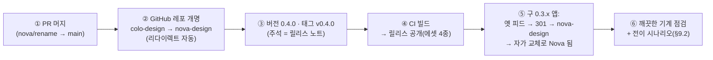

# Nova Design 전환 계획 — Colo Design → Nova Design

> **한 줄 요약.** 제품명 교체는 190개 파일의 기계적 치환이지만, 진짜 일은
> "이미 세상에 나가 있는 것들"과의 계약이다 — 과거 세션의 턴 마커, 열려 있는 풀 리퀘스트
> 본문, 원격의 사이클 브랜치, 사용자의 `~/.colo-design/` 폴더와 키체인, 연결 레포가
> 구현한 프리뷰 브리지, 이미 배포된 초대 파일과 0.3.x 앱의 자가 업데이트. 이 문서는
> 이름 사전 → 호환성 정책 → 마이그레이션 → 작업 분해 → 릴리스 시퀀스 → 검증까지를
> 하나의 실행 계획으로 묶는다.

- **기준**: 워크트리 `durable-spider`, 데스크톱 버전 `0.3.15`(릴리스 버전의 기준은
  `packages/desktop/package.json`). 조사 수치는 아래 §2·§3.
- **목표 버전**: `v0.4.0`(사용자 데이터 마이그레이션을 수반하는 파괴적 전환).
- **원칙**: ① 읽는 쪽은 옛 이름과 새 이름을 **둘 다** 열고, 쓰는 쪽은 새 이름만 쓴다.
  ② 도구 안에서만 오가는 이름(패키지명·IPC 채널·내부 타입)은 원자적으로 바꾸고
  흔적을 남기지 않는다. ③ 회사 디자인 시스템 CDS는 건드리지 않는다.

---

## 0. 결정 요약(이 문서가 권하는 값)

| # | 논점 | 결정 |
|---|---|---|
| D-1 | 데이터 폴더 | `~/.colo-design/` → `~/.nova-design/` **1회 rename** 이동. 실패 시 이번 실행은 옛 폴더로 계속(§5.1) |
| D-2 | 키체인 서비스명 | `Colo Design` → `Nova Design`. 기동 시 옛 서비스에서 읽어 새 서비스로 옮기는 1회 마이그레이션(§5.2) |
| D-3 | 초대 파일 | 포맷(v3/v4·키) **불변**. 확장자는 **읽기 양쪽**(`.colo-invite`/`.nova-invite`), **쓰기 `.nova-invite`**(§4.2) |
| D-4 | 턴 마커·PR 본문 마커 | `colo-design:` 읽기 유지 + `nova-design:` 쓰기(§4.1) |
| D-5 | 사이클 브랜치 prefix | 신규 사이클만 `nova-design/<date>-<n>`. 진행 중 사이클은 원장(`cycle.json`)이 기억한 옛 브랜치를 이어 씀(§4.3) |
| D-6 | 연결 레포 브리지 | `window.coloDesign`·`colo-design.navigate` 계속 노출 + `novaDesign` 신규 노출. **레포 쪽 코드는 우리 손 밖이므로 옛 문은 닫지 않는다**(§4.4) |
| D-7 | appId / productName | 둘 다 교체(`org.nova-design.desktop` / `Nova Design`). Windows는 구버전과 병설되므로 릴리스 노트로 정리 안내(§5.4) |
| D-8 | mac 번들 폴더명 | 구 앱이 자가 업데이트로 Nova가 되면 `/Applications/Colo Design.app` 경로가 남는다 — 첫 실행 시 1회 `Nova Design.app`으로 rename 후 재실행(§5.4) |
| D-9 | GitHub 레포 | `inkwonjung-colosseum/colo-design` → `inkwonjung-colosseum/nova-design` 개명(리다이렉트 자동). 태그 밀기 **직전**에 실행(§8) |
| D-10 | 환경변수 37종 | 전량 `COLO_DESIGN_*` → `NOVA_DESIGN_*`. 내부 핸드셰이크라 하위호환 읽기 불요(§7) |
| D-11 | 패키지 버전 | 전 패키지 `0.4.0`으로 정렬(현재 0.3.9/0.3.10/0.3.15 제멋대로 — 정렬할 기회) |
| D-12 | 서명 인증서 | 자체 서명 CN `"Colo Design Dev"` → `"Nova Dev"` 신규 생성 안내로 교체. ad-hoc 릴리스 CI는 무관(§6 P3) |

**사용자 확인 필요**(진행 전에만 답하면 된다): D-7~D-9의 새 슬러그/이름값
(`nova-design`, `Nova Design`)이 최종 확정인지. 이하 본문은 위 값을 기본으로 쓴다.

---

## 1. 이름 사전 — 모든 표기 변종

| 옛 이름(불변후보 그대로 둘 것은 ✝ 표시) | 새 이름 | 사는 곳 |
|---|---|---|
| `Colo Design`(제품명, 공백 포함) — 45곳 | `Nova Design` | UI 문장, 알림, 메뉴, 다이얼로그, 사이트, 문서 |
| `ColoDesign`(합성 식별자) — 23곳 | `NovaDesign` | TS 타입명(`ColoDesignPinEnvelope` 등), `window.coloDesignDesktop` → `novaDesignDesktop` |
| `colo-design`(kebab) — 190파일 | `nova-design` | 패키지명 `@colo-design/*`, 브랜치 prefix, 마커, IPC 채널, user-agent, 경로 조각 |
| `COLO_DESIGN_*`(환경변수) — 37종 | `NOVA_DESIGN_*` | 데몬·데스크톱·테스트 전반(§7) |
| `colo-invite`(확장자) | **읽기 유지** ✝ + 쓰기 `nova-invite` | 초대 파일(§4.2) |
| `coloDesign`(게스트 전역) | **노출 유지** ✝ + `novaDesign` 추가 | 프리뷰 preload가 레포 게스트에 노출(§4.4) |
| `colo-design.navigate`(봉투 타입) | **수용 유지** ✝ + `nova-design.navigate` | 레포 브리지 계약(§4.4) |
| `colo-overlay:*`(IPC 채널) | `nova-overlay:*` | preload↔main↔web, 도구 내부라 원자 교체 |
| `colo-preview:error`(postMessage) | `nova-preview:error` | 브라우저 개발 경로, 도구 내부 |
| `data-colo-design-overlay`, `data-colo-pick` | `data-nova-design-overlay`, `data-nova-pick` | preload↔web 짝, 도구 내부 |
| `colo-design.pin-hint`(localStorage) | `nova-design.pin-hint` | 힌트 1회 재노출 — 무해 |
| `colo-site-theme`/`colo-theme`(site) | `nova-site-theme`/`nova-theme` | site 내부 짝 |
| `org.colo-design.desktop`(appId) | `org.nova-design.desktop` | electron-builder.yml + `main.ts APP_BUNDLE_ID`(양쪽 같이) |
| `Colo Design Dev`(인증서 CN) | `Nova Dev` | electron-builder.yml `mac.identity`, 문서 |
| `colo-design-daemon`(bin) | `nova-design-daemon` | daemon package.json |
| `~/.colo-design/` | `~/.nova-design/` | 데이터 루트(D-1) |
| `Colo Design`(키체인 서비스) | `Nova Design` | `credentials.ts CREDENTIAL_SERVICE`(D-2) |
| `inkwonjung-colosseum/colo-design` | `inkwonjung-colosseum/nova-design` | `update.ts RELEASES_REPO`, site 링크, 문서 |
| `colo-design-<v>-mac-arm64.dmg` 등 에셋명 | `nova-design-…` | electron-builder.yml `artifactName` 2곳, 워크플로 리터럴, 문서·안내문 |
| `Colo Design에서 만든 화면입니다…`(PR 기본 본문) | `Nova Design에서…` | `protocol/repo.ts DEFAULT_HANDOFF_BODY` |

### 절대 바꾸지 않는 것

| 대상 | 이유 |
|---|---|
| `@colosseumcoinckr/cds` 참조 전부(`environment.ts:372,541`, `protocol/project.ts:277`) | **회사 디자인 시스템 CDS의 스코프명** — 이 도구 이름이 아니다 |
| `inkwonjung-colosseum`(계정/오그명) 자체 | 조직명. 바뀌는 건 레포 슬러그뿐 |
| 초대 파일 포맷 v3/v4와 내장 키 `INVITE_KEY` | 이미 배포된 초대장이 열려야 한다(§4.2) |
| Claude Code / Codex / omp, `Claude`·`Codex` 테마명 | 타사 이름 |
| `daemon-YYYY-MM-DD.log`, `turn-stats-*`, `comments.json`, `screen-map.jsonl`, `cycle.json` 등 파일명 | 이름에 제품명이 없다 |
| 날짜 스냅샷 문서 `QC-REPORT-2026-09-26.md` | 그날의 기록. 역사를 다시 쓰지 않는다(§6 P6) |

---

## 2. 현황 조사(2026-09-27 기준)

- 표 포함 대상 파일 수(git grep, 대소문자 무시 `colo-design|Colo Design|COLO_DESIGN`):
  **190개 파일**. 분포 — daemon src 53 / daemon test 35 / desktop src 17 / web src·test ~40 /
  protocol 6 / site 4 / workflow 2 / 루트 문서·스크립트·pnpm-lock 나머지.
- 변종별: `colo-design` 190파일, `Colo Design` 45곳, `ColoDesign` 23곳, `COLO_DESIGN` 52곳,
  `colo-invite` 18곳, `org.colo-design` 3곳.

## 3. 옛 이름이 이미 박혀 있는 곳(지속 저장·외부 계약 인벤토리)

단순 치환이 안 되는 곳 — 읽기·쓰기 정책은 §4:

- `turn-marker.ts:172,184`(마커 정규식·생성), `handoff-body.ts:115-116`(PR 본문 툴 블록),
  `developer-notice.ts:72,419`(이슈 dedupe 마커), `pin-files.ts:281-287`·`turn-stats.ts:157-238`
  ·`claude/driver.ts:26`(마커 접두 판정), `repo-core.ts:58 BRANCH_PREFIX`,
  `attachments.ts:57`(첨부 디렉터리), `credentials.ts:22 CREDENTIAL_SERVICE`,
  `environment.ts:19 COLO_DESIGN_DIR`, `preview-preload.ts:201`(게스트 문),
  `protocol/preview.ts`(레포 브리지 계약), `protocol/invite.ts`+`site/invite-format.mjs`(초대 파일),
  `self-update.ts:87`(mac 교체 대상 경로 상수), `main.ts:45 APP_BUNDLE_ID`.

---

## 4. 호환성 정책 — 이미 세상에 있는 것들(계획의 심장)

> 규칙: **읽기는 둘 다, 쓰기는 새 것만.** 예외는 §4.4(레포 브리지 — 옛 문을 영구 유지).

### 4.1 턴 마커 · PR 본문 마커 · 이슈 마커(읽기 양쪽)

옛 이름이 **이미 쓰인 채 저장되어 있는** 곳과, 새 코드가 마커를 **찾아내야** 하는 곳:

| 자산 | 옛 형태가 저장된 곳 | 새 코드가 해야 할 일 |
|---|---|---|
| 턴 마커 `<!-- colo-design:<kind> {…} -->` | SDK 세션 트랜스크립트(과거 대화 전부) | `turn-marker.ts`의 `MARKER` 정규식을 `/(?:colo\|nova)-design:…/`로. `formatTurn`은 `nova-design:` 생성. `pin-files.ts`·`turn-stats.ts`·`claude/driver.ts`의 `startsWith("<!-- colo-design:")` 접두 판정은 **turn-marker 파서로 통일**(상수가 네 곳에 흩어져 있어 드리프트 위험 — 이번에 한 곳으로 모은다) |
| PR 본문 툴 블록 `<!-- colo-design:start/end -->` | **열려 있는 풀 리퀘스트 본문**. "같은 요청에 더해 제출"은 기존 본문에서 이 블록을 찾아 교체한다 | `handoff-body.ts` 파싱·교체가 옛 블록도 인지. **갱신 시에는 기존 PR이 쓴 옛 마커를 그대로 보존**(같은 PR 안에서 마커 어숨바꿈 금지), 새 PR에만 `nova-design:` 블록 |
| 개발자 알림 이슈 마커 `<!-- colo-design:problem <key> -->` | 서비스 레포에 열린 이슈들 — dedupe가 이 마커로 같은 문제인지 본다 | `developer-notice.ts` 탐색이 `(?:colo\|nova)-design:problem` 매치. 새 이슈는 `nova-design:problem` |
| 사이클 브랜치 `colo-design/<YYYYMMDD>-<n>` | 원격 브랜치 + `cycle.json`의 `branch` 필드 | 다음 §4.3 |

### 4.2 초대 파일(포맷 동결, 확장자만 진화)

- **봉투 v3(앱 내장 키 AES-256-GCM)과 안쪽 v4는 그대로.** `INVITE_KEY` 불변 →
  기존 `.colo-invite` 전부 계속 열린다.
- 확장자 판정(`web/invite-bus.ts isInviteFile`, `invite-import.ts`, `use-invite-import.ts`
  `input.accept`, `desktop/invite-discard.ts` 검증)은 **`.colo-invite`와 `.nova-invite` 둘 다 수용**.
- 생성(`site/invite-format.mjs inviteFileName`, `scripts/make-invite.mjs`)은 기본 `.nova-invite`.
  안내문(`INVITE_README`, 메일 제목/본문)은 Nova 문구로.
- 오류 문장 "초대 파일(.colo-invite)이 아닙니다…"는 두 확장자를 말하도록 수정.

### 4.3 사이클 브랜치와 원장

- `BRANCH_PREFIX = "nova-design"`. **새 사이클만** 새 prefix로 브랜치를 만든다.
- 진행 중 사이클: `cycle.json`의 `branch`에 옛 브랜치명이 저장되어 있으므로 이어 쓰는 데
  코드 변경이 없다(브랜치명은 원장이 기억한다).
- 다음 번호 탐색(`repo-publish.ts` — 원격에 없는 첫 번호)은 **두 prefix를 모두 훑어** 같은 날
  `colo-design/20260927-1`과 `nova-design/20260927-1`이 따로 열리더라도 번호 충돌·오해가
  없게 한다(전환기 하루 이틀의 과도 상태).
- 옛 prefix가 프론트에 노출되는 면은 없다(브랜치는 개발자의 어휘 — E10 위반 아님).

### 4.4 연결 레포 브리지 — 닫지 않는 문(영구 호환)

레포 쪽에 손으로 심견다는 브리지 코드(레퍼런스 클론 `src/preview-bridge/types.ts`)가
`window.coloDesign.post({type:"colo-design.navigate",…})`를 부른다. **이 코드는 우리
레포 밖에 있다** — 배포된 연결 레포들은 갱신되지 않는다. 따라서:

- `preview-preload.ts`: `exposeInMainWorld("novaDesign", …)` 추가, **`coloDesign`도 계속
  노출**(같은 IPC로 연결). 봉투 타입도 `nova-design.navigate`와 `colo-design.navigate` 둘 다 수용.
- 브라우저 개발 경로의 postMessage 리스너(PreviewHost)도 두 타입 수용.
- 도구 내부 봉투(`colo-design.pin`·`colo-design.error`·`colo-preview:error`)는 preload와 web이
  한 배포에 함께 움직이므로 `nova-*`로 원자 교체 — 외부와 무관.
- 코멘트: 이 문은 "레퍼런스 클론이 신규 셰이프로 갱신될 때까지"가 아니라 **영구**다.
  레포는 초대장 없이는 갱신되지 않으므로.

### 4.5 첨부 잔여물

첨부는 클론의 `.git/colo-design-attachments/`(7일 보존 스윕)에 쓴다. 상수를
`nova-design-attachments`로 바꾸면 옛 디렉터리 파일을 스윕이 못 찾는다 → **스윕만
두 이름 모두 훑고**, 새 쓰기는 새 디렉터리로. `.git` 안이라 git에 보이지 않으므로
마이그레이션 불요(7일 뒤 저절로 빈다).

---

## 5. 사용자 기계의 데이터 마이그레이션

### 5.1 `~/.colo-design/` → `~/.nova-design/`(D-1)

- 자리: `environment.ts:19 COLO_DESIGN_DIR`. 이름 교체와 함께 **1회 이동 헬퍼** 추가
  (순수 함수로, 데몬 기동 초입과 데스크톱 main 모두 거친다):
  1. `~/.nova-design` 있음 → 그대로.
  2. 없고 `~/.colo-design` 있음 → `renameSync`. 새 폴더에 `.migrated-from-colo-design`
     마커 파일.
  3. rename 실패(권한·파일 점유) → 한국어 경고 로그 한 줄, **이번 실행은 옛 폴더로 계속**.
     다음 실행이 다시 시도한다(부분 상태 없음 — rename은 원자적).
- 영향: config(projects.json — 프로젝트 레지스트리), projects(클론 포함 — 용량 문제 없이
  통째로 옮겨짐), logs, tools(Claude/Codex 설치본 — 재설치 불요)가 한꺼번에 이어진다.
- **롤백 주의**: rename 후 구버전(0.3.x)을 다시 깔면 구버전은 빈 `~/.colo-design`을 새로
  만든다(로컬 진행 작업은 `~/.nova-design`에 남아 있으나 구버전은 못 본다). §10 참조.

### 5.2 키체인 연결 코드(D-2)

- 브라우저 개발 경로의 `KeychainCredentialStore`는 서비스명 `"Colo Design"`
  (`credentials.ts:22`)으로 `security` CLI를 쓴다. 서비스명을 `Nova Design`으로 바꾼 뒤,
  기동 시 1회: 새 서비스에 값이 없고 옛 서비스에 있으면 **읽어서 새 서비스로 save + 옛
  항목 delete**(`migrateProjectPats`와 같은 모양의 순수 함수 + 단위시험).
- 데스크톱의 `SafeStorageCredentialStore`: 암호문은 `userData/credentials.json`에 있고
  mac의 safeStorage 키는 제품명을 따르므로 productName 교체 시 **어차피 복호화 불가**.
  설계가 이미 이 경우를 품는다(`load()`가 복호화 실패를 null 처리) → 연결 코드가 비면
  사용자는 초대 파일을 다시 놓는다("다시 연결이 필요해요"의 설계된 길). **코딩 불요,
  릴리스 노트에 "한 번 다시 연결해 주세요" 안내.**

### 5.3 데스크톱 userData

productName 교체로 Electron 기본 userData가 `…/Colo Design/` → `…/Nova Design/`로 바뀐다.
`desktop-settings.json`(배율·알림 정책·저장 포트) 이어가기: main 기동 초입(smoke의
`setPath` 직후)에 새 userData가 비어 있고 옛 경로의 파일이 있으면 `desktop-settings.json`
**한 파일 복사**. `credentials.json`은 복사해도 무의미(§5.2) — 복사하지 않는다.

### 5.4 설치 정체성과 자가 업데이트(D-7·D-8)

- **mac**: 자가 교체는 실행 중인 번들 경로(`process.execPath` 상위)를 그대로 덮는다
  (`self-update.ts:87`, `app-updates.ts:362-371`). 구 0.3.x 앱이 리다이렉트된 피드에서
  Nova zip으로 갈아입으면 **내용은 Nova인데 폴더는 `/Applications/Colo Design.app`**.
  → main 기동 초입 1회 정리: packaged && 번들 dirname이 `Colo Design.app`이면 옆으로
  rename 후 `app.relaunch()`(실패해도 계속 — 파일 잠금 시 다음 실행이 다시 시도).
- **Windows**: NSIS 재설치는 appId 레지스트리를 따른다. appId가 바뀌면 구 0.3.x의
  무인 갱신(`/S`)은 **Nova를 새 위치에 병설 설치**하고 구 앱이 남는다. → 릴리스 노트에
  "구 Colo Design 제거" 한 줄. (선택 P2: Nova 첫 실행 시 구 설치 감지·제거 안내.)
- `main.ts:45 APP_BUNDLE_ID`와 `electron-builder.yml appId`는 **반드시 같은 값으로 같이**
  바뀐다(Windows 토스트 AUMID·알림 설정 딥링크가 이 문자열 하나를 공유).

---

## 6. 작업 분해(WBS)

> 순서대로 하나의 PR(`nova/rename` 브랜치)로. 단계 뒤의 ⟂는 기계적 치환(검색→교체→검증),
> ✍는 판단·설계가 필요한 변경.

### P0. 이름 사전 확정 · 브랜치 ⟂
D-1~D-12 값 확정(특히 새 레포 슬러그). 브랜치 `nova/rename`.

### P1. protocol — 계약의 뼈 ✍
- `update.ts`: `RELEASES_REPO`/`RELEASES_FEED_URL` 신규 슬러그.
- `turn-marker.ts`: 마커 정규식 dual-read(§4.1), 생성은 `nova-design:`. 접두 판정을 이
  모듈로 수렴시킬 퍼블릭 헬퍼(`markerPrefixOf(text)`) 추가.
- `preview.ts`: `ColoDesign*` 타입 → `NovaDesign*`(워크스페이스 내부 사용처 전부 동반).
  레포 브리지 봉투 타입 상수에 legacy 수용 주석.
- `repo.ts`: `DEFAULT_HANDOFF_BODY` 문구. 브랜치 doc 주석.
- `invite.ts`, `messages.ts`: 주석 갱신.
- package.json `@colo-design/protocol` → `@nova-design/protocol`.

### P2. daemon — 지속 저장의 해일 ✍+⟂
- `environment.ts`: `COLO_DESIGN_DIR`→`NOVA_DESIGN_DIR` + §5.1 이동 헬퍼(순수 함수).
- `credentials.ts`: `CREDENTIAL_SERVICE` 교체 + §5.2 legacy 이동 함수.
- `repo-core.ts`: `BRANCH_PREFIX` 교체. `repo-publish.ts`: 번호 탐색이 두 prefix 훑기.
- `handoff-body.ts`: TOOL_BLOCK dual 파싱(§4.1), 새 PR은 nova 블록.
- `developer-notice.ts`: ISSUE_MARKER dual 매치, 신규은 nova.
- `pin-files.ts`·`turn-stats.ts`·`claude/driver.ts`: 접두 판정을 P1 헬퍼로 교체.
- `attachments.ts`: 디렉터리 상수 교체 + 스윕 dual(§4.5).
- `codex/session.ts` `clientInfo.name`, `agent-install/agent-update` user-agent → `nova-design`.
- 환경변수 37종 전량 교체(§7) — `environment.ts`·각 reader·`agent-env.ts`·로그 문구.
- package.json: 이름, bin `nova-design-daemon`, 의존 임포트 경로.
- **test 35파일**: 픽스처 문자열(마커·브랜치·경로·env) 전부 동반. 여기에 신규 시험
  더함(§9.1).

### P3. desktop — 설치 정체성 ✍
- `package.json`: `@nova-design/desktop`, `productName: "Nova Design"`, 버전 `0.4.0`,
  설명문.
- `electron-builder.yml`: `appId`, `productName`, `mac.identity: "Nova Dev"`,
  `artifactName` 2곳(`nova-design-…`), `asarUnpack` 경로의 패키지명.
- `main.ts`: `APP_BUNDLE_ID`(builder와 짝), §5.3 userData 파일 복사, §5.4 번들 rename,
  오류 상자 제목, `COLO_DESIGN_*` env 교체.
- `preview-preload.ts`: `novaDesign` 노출 + `coloDesign` 유지(§4.4), IPC 채널
  `nova-overlay:*`, `data-nova-*` 속성, `nova-design.pin-hint`.
- `preload.ts`/`bridge.ts`: `coloDesignDesktop` → `novaDesignDesktop`(채널명 포함).
- `self-update.ts`/`mac-self-update.ts`/`app-updates.ts`/`win-self-update.ts`: 안내문 3곳,
  기본 경로 상수·주석.
- `invite-discard.ts`: `.nova-invite` 수용(+`.colo-invite` 유지).
- `menu.ts` 앱 메뉴 라벨, `notices.ts`·`app-notify.ts` 문장 점검.
- 신규 인증서 생성 안내 문서화: 키체인에 CN `"Nova Dev"` 자체 서명 인증서 생성
  (README·AGENTS 의 codesign 안내 갱신).

### P4. web — 보이는 이름 ⟂ (+브리지 ✍)
- `desktop-bridge.d.ts` + 사용처 전부(`App.tsx`, `PreviewFrame.tsx`, `ChatColumn.tsx`,
  `PreviewColumn.tsx`, `PreviewHost.tsx`, `SettingsDialog.tsx`, `use-shell-nav.ts`,
  `use-invite-import.ts`, `open-link.ts`, `daemon-client.ts`, `ProblemLine.tsx`,
  `InviteConfirm.tsx`): `coloDesignDesktop` → `novaDesignDesktop`.
- 게스트 → 웹 방향 postMessage 수용 dual(§4.4).
- 초대 확장자 dual(§4.2) — `invite-bus.ts`, `invite-import.ts`(오류 문구),
  `use-invite-import.ts` accept, `FirstRun.tsx`의 `*.colo-invite` 표기 → `*.nova-invite`(옛
  파일도 열린다는 주석은 labels에).
- `ConnectScreen.tsx` 브랜드, `labels.ts:526` 온보딩 제목("Nova Design 을 시작해요"),
  `styles.css` 머리 주석. `next-labels.test.ts`·`vocab-sweep.test.ts`는 문장 규칙이라
  브랜드 교체와 무관하게 통과해야 함(실행으로 확인).
- package.json 이름.

### P5. site · 스크립트 — 첫인상 ⟂
- `site/index.html`: title·OG·브랜드 4곳·앱창 마케팅 문구·에셋 파일명 안내·GitHub 링크
  5곳(신규 슬러그).
- `site/invite.js`: 메일 제목/본문/안내문·설치 안내 2문장(신규 슬러그·에셋명).
- `site/invite-format.mjs`: `INVITE_README` Nova 문구, `inviteFileName` 확장자(포맷·키 불변).
- `site/style.css` 머리, `demo.js`/`hero3d.js` 이벤트·스토리지 키(짝).
- `scripts/make-invite.mjs`: 기본 확장자·안내문·help.
- `.github/workflows/desktop-release.yml`: 에셋 리터럴 3종(`nova-design-…`)·주석·릴리스
  노트 템플릿 문구(파일명·전환 안내).

### P6. 살아있는 문서 ⟂
- `README.md`·`AGENTS.md`: 전면(제품명·경로·env 표·에셋명·레포 슬러그·인증서 안내·설치
  문구·`~/.nova-design` 표). **초대 파일 안내에 "`*.colo-invite`(옛 초대장)도 계속
  열립니다" 한 줄.**
- `BETA-LONGTERM.md`·`QC-TEST-CASES.md`(살아있는 런북): 경로·마커·브랜치 기대값 갱신.
- `QC-REPORT-2026-09-26.md`·과거 태그·git 역사: **불변**.
- 루트 `package.json`(name·scripts의 `@colo-design/*` 필터), `pnpm-lock.yaml`은
  `pnpm install`로 재생성.

### P7. 릴리스 시퀀스 — §8 참조.

---

## 7. 환경 변수 치환표(37종, 전량 `COLO_` → `NOVA_` 접두 교체)

`CLAUDE_BIN` `CLAUDE_INSTALL_CMD` `CLAUDE_LATEST_API` `CODEX_BIN` `CODEX_RELEASE_API`
`COMMAND_STALL_MS` `CREDENTIAL_STORE` `DESKTOP_SMOKE` `DESKTOP_UNIT` `DEV_AGENTS`
`DEV_SERVER` `DIR`(→ `NOVA_DESIGN_DIR`) `ENFORCE_REPO_SETTINGS` `EXTRA_PATH` `GITHUB_API`
`GITHUB_FIXTURE` `GITHUB_SLUG` `GIT_BIN` `GIT_GUARD_DIR` `LANE_STRICT` `LOG_DIR` `NPMRC`
`OMP_BIN` `OPEN_BIN` `PERMISSION_LOG` `PIN_EFFORT` `PLAN_USAGE` `PORT` `PROJECTS_DIR`
`PROJECTS_SETTINGS` `READY_TIMEOUT_MS` `REPO_DIR` `REPO_PAT` `REPO_SETTINGS` `REPO_URL`
`RUN_DIR` `UNDO_LOG`

- 전부 **도구 안의 핸드셰이크**(데몬↔데스크톱↔테스트)라 옛 이름 fallback 읽기 불요 —
  함께 배포되는 셋이 같은 PR에서 움직인다.
- 바꾼 뒤 `git grep -i colo_design` 이 0인지 확인(문서 표 포함).
- 주의: `BETA-LONGTERM.md`의 `QC_HOME`·`COLO_BETA_*`는 런북 전용 값 — 문서만 갱신.

---

## 8. 릴리스 시퀀스(레포 개명과 업데이트 피드)

1. **머지**: §6의 PR. 관문: `pnpm typecheck && pnpm build && pnpm test`(CI와 같은 문).
2. **레포 개명**: GitHub Settings → rename. 리다이렉트(git 원격·API·릴리스·Pages)는 자동,
   옛 이름 재사용 금지(누가 가져가면 리다이렉트가 죽는다 — 조직 내 예약).
3. **태그 `v0.4.0`**: 주석 본문에 ①이름이 바뀌었다 ②mac은 앱이 스스로 Nova가 된다
   ③Windows는 Nova 설치 후 구 앱 제거 ④연결 코드를 한 번 다시 연결(초대 파일 재놓기).
4. **구버전 경로 검증**: 0.3.x의 `RELEASES_FEED_URL`(옛 슬러그)이 301을 따라
   `nova-design`의 `latest.json`을 읽는지 실제 확인(무인 fetch는 리다이렉트를 따른다).
   릴리스는 계속 **공개** 유지.
5. **개발자 레지스트리**: 이 레포 자체의 git 원격은 로컬 clone마다
   `git remote set-url` — README 개발 실행 절에 한 줄 추가.

---

## 9. 검증 계획

### 9.1 자동(단위시험 — 이번에 새로 못 박는 것)

| 시험 | 간 것 |
|---|---|
| 턴 마커 dual | 옛 `colo-design:` 트랜스크립트가 카드로 파싱됨 + 새 턴은 `nova-design:` 생성 |
| 툴 블록 dual | 옛 마커 PR 본문을 찾아 교체·갱신, 새 PR은 nova 블록, 갱신 시 옛 마커 보존 |
| 이슈 마커 dual | 옛 `colo-design:problem` 이슈 dedupe |
| 브랜치 | 새 prefix 생성, 원장의 옛 브랜치 이어 쓰기, 번호 탐색이 두 prefix 훑음 |
| 초대 | `.colo-invite`·`.nova-invite` 둘 다 열림, 생성기 기본 `.nova-invite`, `INVITE_KEY` 불변(옛 픽스처 복호화) |
| 데이터 마이그레이션 | §5.1 헬퍼(이동/실패/이미 있음), §5.2 키체인 이동, §5.3 파일 복사 |
| 환경변수 | `NOVA_DESIGN_*` reader 전부(기존 35 테스트 파일이 곧 검증) |
| 잔여 스윕 | `git grep -iE 'colo[-_ ]?design|colo-invite'`가 허용 목록(§4.4·§4.1의 legacy 리터럴·QC 스냅샷·`@colosseumcoinckr`) 외 0 |

관문: `pnpm typecheck && pnpm build && pnpm test`.

### 9.2 수동 — 전이 시나리오(QC-TEST-CASES에 "R-*(rename)" 절로 추가)

| ID | 시나리오 | 기대 |
|---|---|---|
| R-01 | 0.3.x 실사용 폴더(`~/.colo-design` + 프로젝트 1) 위에 Nova 첫 실행 | 폴더 이동, 프로젝트·클론·지켜줄 것 그대로, 로그는 `~/.nova-design/logs` |
| R-02 | 옛 초대장(`.colo-invite`, 0.3.x에서 만든 것) 가져오기 | 열림 · 등록 · `지우기` 동작 |
| R-03 | 0.3.x에서 만든 대화 열기 | 마커 카드(코멘트·게이트·브리프) 정상 렌더 |
| R-04 | 0.3.x가 연 요청(옛 브랜치 PR)에 Nova에서 추가 제출 | **같은 PR** 갱신, 옛 툴 블록 보존 |
| R-05 | 연결 코드 재연결 | `다시 연결이 필요해요` → 초대 파일 → 정상(릴리스 노트 안내의 실증) |
| R-06 | 레포 브리지(옛 셰이프 `coloDesign.post`)를 가진 연결 레포에서 핀 | 화면 이동·핀 동작(§4.4) |
| R-07 | mac: `/Applications/Colo Design.app` 상태에서 Nova 자가 교체 | 부팅 시 `Nova Design.app` 정리 + 재실행, 알림 정상 |
| R-08 | win: 구 앱 → Nova 무인 갱신 | Nova 설치(병설 허용), 안내문 확인 |
| R-09 | 깨끗한 기계 점검(AGENTS §릴리스 9단계) 전 단계 | 전부 Nova 이름·에셋명으로 통과 |
| R-10 | 새 초대장 생성(페이지·make-invite) → 가져오기 | `.nova-invite`, 문구 Nova |

### 9.3 눈 검증

`pnpm dev:desktop` — 브랜드 표기(연결화면·온보딩 제목·메뉴·설정·알림 문장)에 "Colo"가
남지 않는지. `pnpm --filter @nova-design/desktop pack` — 언팩 앱 이름·appId·서명.

---

## 10. 롤백

- **코드**: 단일 PR이므로 revert 한 번. 릴리스 전이라 데이터 이동도 일어나지 않았다.
- **릴리스 후**: v0.4.0 결함 시 v0.4.1 핫픽스가 기본 경로(피드는 항상 latest). 구버전
  재배포는 비권장 — §5.1의 rename이 이미 일어난 기계에서 구버전은 **빈 옛 폴더로 시작**해
  로컬 진행 작업(보관된 턴·클론)이 보이지 않는다. 복구가 필요하면
  `mv ~/.nova-design ~/.colo-design`(§5.1 마커 파일 삭제) — 릴리스 노트가 아닌
  개발자용 문서(AGENTS 개발자 폴드)에만 적는다.
- **레포 개명**: 되돌리기보다 핫픽스 릴리스를 권장(개명 되돌리기는 리다이렉트 방향을
  다시 흔든다).

## 11. 리스크 등록부

| 리스크 | 확률 | 완화 |
|---|---|---|
| 마커 판정 상수 4곳 중 한 곳을 빠뜨려 과거 대화가 카드로 안 그려짐 | 중 | P1에서 접두 판정을 turn-marker로 수렴(§4.1) + R-03 |
| 연결 레포 브리지가 옛 문에만 남아 핀 이동이 죽는다는 가정이 틀림(레포들이 이미 신 셰이프) | 낮 | §4.4는 어느 쪽이든 살아있음(이중 노출) + R-06 |
| 레포 개명 후 옛 이름을 누가 재사용해 리다이렉트 단절 | 낮 | 조직에서 옛 슬러그 예약(§8-2) |
| Windows 병설로 사용자 혼란 | 중 | 릴리스 노트 한 줄 + (P2) 감지 안내 |
| safeStorage 재암호화로 전 사용자 재연결 필요 | 확정 | 설계된 길(§5.2) — 릴리스 노트에 명시 |
| mac 번들 rename이 파일 점유로 실패 | 중 | 실패해도 앱은 계속, 다음 실행 재시도(§5.4) |
| 190파일 치환 중 의미가 다른 `colo`(CDS·계정명) 오염 | 중 | §1 "절대 바꾸지 않는 것" 목록 + §9.1 잔여 스윕 grep |
| QC 스냅샷을 실수로 고침 | 낮 | `QC-REPORT-2026-09-26.md`를 치환 대상에서 제외 목록에 |

## 12. 실행 체크리스트

- [ ] D-1~D-12 값 확정(신규 레포 슬러그·인증서 CN)
- [ ] P1 protocol(마커 dual·타입 개명·RELEASES_REPO)
- [ ] P2 daemon(지속 저장 6곳 dual·env 37종·bin·테스트 35파일)
- [ ] P3 desktop(builder 5값·APP_BUNDLE_ID 짝·마이그레이션 3종·브리지 개명)
- [ ] P4 web(브리지 개명·초대 dual·브랜드 문장)
- [ ] P5 site·스크립트·워크플로
- [ ] P6 문서(README·AGENTS·런북) + `pnpm-lock.yaml` 재생성
- [ ] §9.1 관문 통과(grep 잔여 0 포함)
- [ ] §9.2 R-01~R-10 수행
- [ ] §8 시퀀스: 머지 → 레포 개명 → v0.4.0 태그 → 릴리스 공개 → 구버전 전이 확인
- [ ] 릴리스 노트: 이름 변경·재연결 안내·Windows 구앱 제거·옛 초대장 계속 열림
