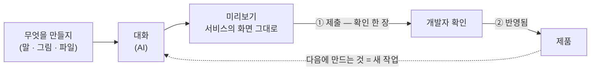

# Nova Design 사용 설명서

> 처음이라면 [README](../README.md) 부터 — 세 걸음이면 시작한다. 이 문서는 화면 하나하나,
> 버튼 하나하나를 적은 전체 안내다. 개발자 · 운영자 안내는 [DEVELOPERS.md](DEVELOPERS.md) 에 있다.

**목차** — [알아 둘 말](#알아-둘-말은-둘뿐이다) · [한 바퀴](#작업은-한-바퀴로-흘러간다) ·
[처음 한 번](#1-처음-한-번--체크리스트-한-장) · [틀](#2-틀--사이드바--상태-줄--대화--미리보기) ·
[홈](#3-홈--큰-입력창과-받은-편지함) · [준비](#4-처음-여는-프로젝트--준비) ·
[화면 만들기](#5-화면-만들기--말로) · [미리보기](#6-미리보기에서-확인) ·
[찍기](#7-고칠-곳은-찍어서--말풍선) · [제출](#8-제출--확인-한-장) ·
[코멘트](#9-개발자-코멘트--ai-가-반영한다) · [반영된 뒤](#10-반영된-뒤--받아오기는-도구가-먼저-한다) ·
[작업 기록](#마음이-바뀌면--작업-기록-서랍) · [설정](#설정--여섯-쪽) ·
[문제 문장](#화면의-문제-문장은-셋이다) · [알아두면 편한 것](#알아두면-편한-것) ·
[자주 묻는 질문](#자주-묻는-질문)

## 알아 둘 말은 둘뿐이다

배치는 Claude Desktop 과 같다 — 왼쪽에 대화, 오른쪽에 결과물. 다른 점은 결과물 자리에
**서비스의 실제 화면**이 서고, 그 위에 **상태 줄 하나와 `제출` 하나**가 얹힌다는 것뿐이다.
Claude 를 써 본 사람이 새로 배울 것은 셋이다 — 상태 줄, 찍기, 작업 기록.

- **제출** — 만든 것을 개발자에게 보낸다. 개발자에게 가는 일은 전부 이 말로 부른다.
  (AI 에게 말을 전하는 것은 `보내기` 다 — 두 뜻에 같은 말을 쓰지 않는다.)
- **반영됨** — 개발자가 그 작업을 제품에 합쳤다.

**저장이라는 말은 없다** — AI 가 한 차례 답할 때마다 도구가 스스로 그 시점을 보관하므로,
누를 것은 `제출` 하나뿐이다. 보관된 차례들은 `작업 기록`에서 다시 보고 되돌릴 수 있다.

## 작업은 한 바퀴로 흘러간다

대화와 미리보기 위에 걸친 **상태 줄**이 지금 어디쯤인지 말한다 — 대화 제목, 세 점의
여정, 그리고 `제출`. 여정은 `제출 전 ─ 개발자 확인 ─ 반영됨` 이고 지금 점이 글자를
갖는다. 판정은 전부 기계적 신호(이번 작업에 보관된 것이 있는지, 개발자 쪽에서 보고하는
요청 상태)라 사람이 임의로 바꿀 수 없다.

| 지금 | 첫 점 | 둘째 점 | 셋째 점 |
| --- | --- | --- | --- |
| 아직 제출 전 | `제출 전 · 화면 N개` (막히면 `제출 전 · 제출하지 못했어요`) | `개발자 확인` | `반영됨` |
| 개발자에게 가 있음 | `제출됨` | `개발자 확인을 기다려요 · 코멘트 N` | `반영됨` |
| 합쳐짐 | `제출됨` | `확인됨` | `반영됐어요` |

AI 가 도는 동안은 여정 앞에 `만드는 중 · 12초` 가 붙는다(시계는 앱이 아니라 도구의
것이라, 창을 새로 열어도 실제 시작부터 이어 센다).

여정을 누르면 **`이번 작업`** 이 열린다 — 바뀐 화면(제목 · 한 줄 · 시각), 제출(시각 ·
작성자 · 받은 개발자 · `제출한 내용 열기` · 최근 제출 기록), 개발자 코멘트(사람 · 글 ·
`반영됨`/`고치는 중`), 그리고 `작업 기록 열기`.

## 사용 안내

### 1. 처음 한 번 — 체크리스트 한 장

앱을 처음 열면 마법사 대신 체크리스트 한 장이 선다 — **도구 준비 · AI 연결 · 초대
파일**. 항목은 스스로 채워지고, 셋이 다 채워지면 누를 것 없이 작업 화면으로 넘어간다
(`시작하기` 버튼은 없다). 터미널은 열지 않는다.

- **도구 준비** — 앱이 싣고 온 도구를 확인한다(`필요한 도구 확인됨`).
- **AI 연결** — Claude Code 는 이 앱이 AI 를 부르는 데 쓰는 프로그램이다. 설치 버튼
  하나로 사용자 폴더에 깔리고 진행 줄이 한 줄씩 흐른다. 끝나면 브라우저가 열리고, 내
  Claude 계정으로 로그인하면 저절로 돌아온다(브라우저가 안 열리면 `브라우저가 열리지
  않았나요?` 안에 주소와 코드 붙여넣기 칸이 있다). 회사 정책이 설치를 막으면 빨간 안내와
  함께 IT 담당자에게 보낼 문장이 서고, `문장 복사` · `다시 시도` 가 옆에 있다.
  `Codex 도 쓰시나요?` 줄은 `건너뛰기` 로 넘겨도 된다.
- **초대 파일** — 개발자에게 받은 `*.nova-invite` 를 셋째 항목 안의 자리에 놓거나
  `파일 고르기` 로 고른다. 초대장에 실린 프로젝트가 모두 등록되고 첫 프로젝트가 먼저
  열린다.

첫 작업 화면 위에는 `초대 파일을 가져왔어요 — 파일 지우기 · 나중에` 한 줄이 선다. 파일에
연결 코드가 들어 있어서다 — `파일 지우기` 를 누르면 앱이 대신 지운다.

### 2. 틀 — 사이드바 · 상태 줄 · 대화 · 미리보기

왼쪽 사이드바는 위에서부터 `새 대화 · 홈 · 찾기`, 프로젝트 전환기, **다른 프로젝트
줄**, 대화 목록, 접힌 `도구가 한 일`, 바닥의 `설정` 이다.

- **프로젝트 전환기** — 사이드바 머리의 드롭다운. 프로젝트마다 상태 점과 기다리는
  숫자가 서고, 아직 열지 않은 프로젝트에는 `처음 열 때 준비해요` 가 붙는다.
- **다른 프로젝트 줄** — 지금 열려 있지 않은 프로젝트마다 한 줄, 이름과 가장 급한 것
  하나: `준비 중` > `만드는 중` > `답을 기다려요 N` > `코멘트 N` > `반영됐어요` > 작업 상태.
  누르면 그 프로젝트로 옮긴다. (`AI가 답을 못 했어요` 는 그 프로젝트의 대화 안에서 카드로
  기다린다 — 여기에는 서지 않는다.)
- **도구가 한 일** — 도구가 스스로 연 대화(준비 · 코멘트 반영 · 문제 해결)는 이 접힌 묶음에
  산다. 사람의 대화 목록이 도구의 기록으로 덮이지 않는다.
- **찾기(⌘K)** — 대화 · 프로젝트를 이름으로 찾아 연다. 아래 칩으로 `새 대화` · `홈` ·
  `설정` 에도 닿는다 — ↑ ↓ 로 훑다 마지막 줄 다음에는 칩이 이어 서고(칩 위에서는 ← →),
  Enter 로 연다. 칩 이름을 쳐도 그 칩이 걷는 자리에 서서 Enter 한 번이면 된다. 새 대화는
  ⌘T, 설정은 ⌘, 사이드바를 접고 펴는 것은 ⌘B 다(Windows 는 Ctrl — 화면의 표기도 그렇게
  바뀐다).

창이 900px 보다 좁아지면 사이드바는 `≡` 뒤로 들어가고, 대화와 미리보기는
`대화 | 화면 · <이름>` 두 탭이 된다. 찍은 곳의 수가 화면 탭에 선다.

넓은 창에서는 대화와 미리보기 사이의 경계를 끌어 폭을 바꾼다 — 대화는 320~640px 안에서
움직이고(미리보기가 360px 밑으로 좁아지지 않게 창이 좁으면 상한이 함께 내려온다), 경계에서
←/→ 는 24px 씩, 두 번 누르면 원래 폭으로 돌아온다. 고른 폭은 다음에 켤 때도 그대로다.

화면이 작으면 ⌘= · ⌘- · ⌘0 으로 앱 전체를 키우고 줄인다 — 사이드바 · 대화 ·
상태 줄 · 미리보기가 함께 커지고, 다음에 켤 때도 그대로다. 설정 → 테마의 `글자 크기` 줄에도
같은 안내가 있다.

### 3. 홈 — 큰 입력창과 받은 편지함

사이드바의 `홈` 은 `<이름>님, 무엇을 만들까요?` 와 큰 입력창으로 시작한다. 여기서 보내면
지금 프로젝트의 새 대화가 열리고 작업 화면으로 넘어간다. 아래는 받은 편지함이다.

- **답을 기다려요** — AI 가 물어보거나 허락을 구하는 카드. 홈에서 바로 답한다. 홈 행의
  숫자 배지는 이것만 센다 — 내 손이 필요한 일의 수.
- **지금 진행 중** — 도는 대화와 준비 중인 프로젝트.
- **방금 있던 일** — 답이 온 대화, 다른 프로젝트의 소식(코멘트 도착 · 반영 · 요청 닫힘),
  그리고 도구가 AI 프로그램을 새 버전으로 바꾼 한 줄(`Claude Code 를 2.2.0 으로
  업데이트했어요`).

### 4. 처음 여는 프로젝트 — 준비

등록만 된 프로젝트를 처음 고르면 미리보기 칸이 준비 화면이 된다 — `이 서비스를 이
컴퓨터에서 처음 켜요`, 세 단계(`내려받기 · 설치하기 · 미리보기 켜기`)와 진행 막대. 준비에
몇 분 걸리지만 기다릴 필요는 없다: **준비되는 동안 먼저 말해 두면** 대화에
`준비가 끝나면 바로 보낼게요` 로 줄을 섰다가 끝나는 대로 나간다. 다른 프로젝트로 갔다
와도 준비는 이어지고, 뒤에서 끝나면 OS 알림이 온다. 준비 중에는 찍기가 잠긴다.

### 5. 화면 만들기 — 말로

원하는 화면을 말로 보낸다 — 그림이나 문서(한 건 8MB 까지)를 끌어다 놓거나 붙여도 된다.
입력창의 모델 칩에서 모델과 생각 시간을 고른다. 모델이 빠른 응답을 받으면(Claude 는
Opus) 칩 옆에 번개가 서서 같은 모델의 빠른 응답을 켤 수 있다 — 구독의 빠르게는 요금제
사용량이 아니라 사용량 크레딧에서 같은 답에 약 2배로 빠진다. 번개에 마우스를 올리면 그
말이 뜬다. AI 는 대화를 열기 전에만 고른다 — 열린 대화의 칩은 그 대화의 AI 를 이름으로만
말한다. 모델이 많으면 칩 팝의 거르는 칸에 이름을 치자 — `opus` 처럼 한 조각으로도
닿는다. 사용량은 한도에 가까워질 때만 모델 칩 옆에 한 단어로 선다. 칩 팝의 `사용량` 칸은 창을
모두 한 줄씩 세운다 — `이번 5시간` · `이번 주` · 모델마다 따로 있는 창(`Fable · 이번 주`),
줄마다 쓴 비율과 다시 차는 때(`10월 3일(토) 03:00에 다시 차요`). Codex 도 같다(무료 요금제는
`이번 달` 한 줄). 열린 대화가 없어도 칸을 열 때 그 AI 계정을 다시 읽으므로, 다른 곳에서 쓴
만큼도 따라온다. 확인 방식은 고를 것이 없다 — AI 는 묻지 않고 진행한다.

AI 의 답마다 아래에 **`고친 화면` 카드**가 선다 — 그 답이 만진 화면의 제목과
`미리보기에서 보기`. 답이 끝나면 미리보기가 그 화면으로 스스로 옮겨 간다(이미 보고 있으면
그대로 둔다). 답 끝에 AI 가 남긴 화면 링크 줄은 이 카드가 대신하므로 글에서는 빠진다 —
문장 속에 섞인 링크는 그대로 남는다. 한 요청이 끝난 줄에는 걸린 시간 · `전체 복사` ·
`···`(`여기서 새 대화`)가 선다.

보낸 말에 마우스를 올리면 `고쳐서 다시 보내기` 가 뜬다 — 그 말 앞까지 이어받은 새 대화를
열고 입력창에 그 말을 채운다. 화면은 지금 그대로다.

### 6. 미리보기에서 확인

미리보기는 그 서비스의 앱을 그대로 띄운 것이고, 화면의 모든 컨트롤(검색 · 버튼 ·
폼)은 실제 목 데이터와 동작한다. 막대에는 뒤로 · 앞으로 · 새로 고침, 주소창, 화면 크기
(PC · 태블릿 · 휴대폰), `찍기`, `작업 기록`, `···` 가 있다.

- **주소창**은 화면 이름을 보인다. 누르면 `이 대화에서 만든 화면` 과 `다른 화면` 이 제목으로
  줄을 서고, 글자를 치면 거른다(`/` 로 시작하면 그 주소로 간다).
- **`···`** — 배율(작게 · 실제 크기로 · 크게 — 미리보기 칸만 움직인다), `AI에게 이 화면
  보여 주기`(짚을 곳이 없는데 이상할 때 지금 화면을 입력창에 담는다), `제출한 때의 화면
  보기`(개발자가 받은 모습 그대로), 단축키.

화면에 오류가 나거나 앱이 뜨지 않아도 사람이 할 일은 없다 — 오류 문장도, 고쳐 달라는
버튼도 뜨지 않는다. 도구가 그 화면을 다시 열어 확인하고, 정말 깨져 있으면 AI 가 알아서
고친다(`AI가 막힌 곳을 고치고 있어요`). PC 크기에서 멀쩡한 화면은 도구가 휴대폰 크기로
한 번 더 열어 보고, 화면이 옆으로 밀리면 그것도 같은 길로 AI 가 고친다. 화면 낭독기가
읽을 이름이 없는 버튼 · 입력칸이나 너무 흐려서 읽기 어려운 글자가 새로 생겨도 마찬가지다 —
같은 화면에서 이미 말한 것은 다시 말하지 않는다. 미리보기가 저절로 꺼지면 도구가 먼저
다시 켠다(`화면을 다시 켜는 중이에요`).

### 7. 고칠 곳은 찍어서 — 말풍선

막대의 `찍기`(⌘⇧P)를 켜면 미리보기 아래쪽에 `찍기 켜짐` 알약이 뜬다 — 화면을 밀지
않는다. 켜지 않아도 option(⌥)+클릭은 언제든 된다. 요소를 누르면 그 자리에 핀이 찍히고,
끌면 영역을 짚는다.

찍는 순간 핀 옆에 **말풍선**이 뜬다 — 번호 · 짚은 것의 이름(버튼의 글자 같은 것, 알 수
없으면 `찍은 곳`) · 화면 이름 · 메모 한 줄. `담기`(↵)는 메모를 입력창의 같은 번호 칩에 담아
두고 더 찍게 하는 주 단추이고, `지금 보내기`(⌘↵)는 바로 보낸다.
휴지통은 그 핀을 뺀다. 핀은 첨부다 — 여러 곳을 찍은 뒤 입력창에서 문장 하나와 함께
보내면 된다. 보낸 핀은 답이 도는 동안 흐린 색으로 남았다가 답이 끝나면 사라진다.
뜻은 문장이 정한다 — "고쳐 줘" 면 고치고 "이게 뭐야?" 면 설명한다.

### 8. 제출 — 확인 한 장

상태 줄의 `제출` 을 누르면 확인 한 장이 뜬다 — `개발자에게 제출할까요?`, 제출할 화면
목록(찍어서 가리킨 화면 — 가리키지 않고 만진 변경은 `바뀐 부분 N건` 으로 목록 아래에
센다), **`개발자에게 한마디`**(선택), 받을 개발자(리뷰어를 정해 둘 때만 선다),
`그만두기` · `제출`. Enter 로 보낸다. 이미 열린 요청이 있으면 제목이
`같은 요청에 더해 제출할까요?` 이고 목록은 제출한 뒤 바뀐 곳이다. 제목과 설명은 도구가
쓰고, 서비스의 원본은 건드리지 않는다.

버튼이 스스로 답한다 — `제출하는 중…` → `제출됐어요`. 잠겨 있으면 누를 때 이유가 버튼
아래 한 줄로 선다(예: `AI가 고치는 중 — 끝나면 제출할 수 있어요`). 제출이 끝나면 대화에
영수증이 선다 — `개발자에게 제출했어요`, 받을 개발자 수, 내 한마디. 제출은 대화로도 된다 —
"개발자에게 보내 줘"라고 분명히 말하면 확인 없이 AI 가 제출을 부탁한다.

제출이 잠깐 막히면 버튼이 `다시 제출하는 중…` 이 되고 도구가 다시 제출한다. 개발자가
풀어야 하는 문제면 상태 줄이 `제출 전 · 제출하지 못했어요` 가 되고, 문제 문장
`개발자에게 알렸어요` 가 서며, 계속 만들어도 된다 — 풀리면 도구가 다시 제출한다.

### 9. 개발자 코멘트 — AI 가 반영한다

개발자가 코멘트를 남기면 대화에 카드가 선다 — 사람 · 글 · 상태(`AI가 반영하는 중` →
`반영해 같은 요청에 다시 제출했어요`) · `답하기`. 동의 버튼은 없다: AI 가 바로 반영하고
같은 요청에 다시 실어 보낸다. `이번 작업` 의 코멘트 칸이 그 장부다.

### 10. 반영된 뒤 — 받아오기는 도구가 먼저 한다

요청이 합쳐지면 여정의 셋째 점이 `반영됐어요` 가 되고, 다음에 만드는 것은 새 작업이다.
개발자가 반영한 내용은 도구가 스스로 받아 온다 — 늘 지켜보다가(지금 프로젝트는 2 분마다,
그 밖은 10 분마다) 반영을 보면 그 자리에서 받아 온다. 아직 보관되지 않은 작업이 있으면
잠시 치워 뒀다가 그 위에 다시 얹는다 — 겹치지 않는 편집은 저절로 합쳐지고, 정말 겹치는
부분만 AI 의 첫 과제가 된다. 받아오기를 기다리는 버튼은 없다.

### 마음이 바뀌면 — 작업 기록 서랍

미리보기 막대의 `작업 기록` 이 오른쪽에 서랍을 연다. AI 가 한 차례 답할 때마다 저절로
보관된 차례가 **그 차례를 연 내 말**을 제목으로 줄을 서고, 둘째 줄은 그 차례가 만진
화면이다. 제출한 시점이 구분선이다. 줄 어디를 눌러도 확인이 뜨고, 확인은 시각이 아니라
제목으로 말한다:

> 「회원 목록에 검색창을 넣어 줘」 직후의 화면으로 되돌릴까요?
> 기록은 지워지지 않고, 되돌리기도 기록에 남아요. 개발자에게는 다음 제출 때 전해져요.
> 그 뒤에 한 변경 N가지(개발자 코멘트 반영 포함)만 화면에서 빠져요.

되돌리기도 새 기록으로 쌓이므로 역사는 지워지지 않는다. 대화만 되감고 싶으면 한 요청이
끝난 줄의 `···` → `여기서 새 대화` 로 그 답까지를 이어받은 새 대화를 연다(화면은 그대로 —
같은 메뉴에 `작업 기록에서 되돌리기` 링크가 있다). 작업이 반영되고 나면 그 작업의 기록은
사라진다 — 합쳐진 것을 거슬러 갈 수는 없으므로.

### 설정 — 여섯 쪽

사이드바 바닥의 `설정`(⌘,)은 왼쪽에 쪽 목록, 오른쪽에 고른 쪽 하나가 서는 창이다 —
`AI · 테마 · 알림 · 연결 · 업데이트` 다섯 쪽과, 맨 아래에 따로 앉은 `개발자용` 이다. 목록은
↑ ↓ 로도 옮긴다. 새 버전이 있거나 연결이 곧 끝나는 쪽은 목록에 점이 서고, 사이드바 설정
바퀴에 점이 켜진 채 열면 `업데이트` 쪽이 먼저 열린다. 창이 좁아지면 목록은 위로 올라가 가로
띠가 된다.

- **AI** — 다음 새 대화가 쓰는 AI 를 카드로 고른다. 이미 열린 대화는 처음 고른 AI 그대로다.
  쓸 수 없는 AI(설치가 안 됐거나 로그인이 필요한 것)는 접히지 않고 흐린 점선 카드로 같이
  서서 이유와 `설치` · `로그인` 단추를 든다.
- **테마** — 화면 전체의 색깔을 고른다. 카드마다 그 테마를 입은 작은 앱 창이 미리 보인다.
  `Claude` 가 기본(지금 모습)이고 `Codex` · `밝음` · `어두움` · `GitHub 밝음/어두움` ·
  `시스템 따르기`(밝음과 어두움을 반반으로 보인다)가 따른다. 고르면 바로 적용된다.
- **알림** — `다 만들었을 때` 를 `끔 · 오래 걸린 답만(기본) · 모든 답` 세 칸에서 고르고, 소리
  스위치와 `알림이 오는지 확인`(`시험 알림`)이 아래에 있다. 확인 요청과 멈춤은 언제나 알린다.
  시험 알림이 오지 않으면 컴퓨터가 알림을 막아 둔 것이다 — 같은 줄의 `시스템 알림 설정 열기`
  로 켠다.
- **연결** — 작업에 적을 이름(제출에 작성자로 적힌다), 연결 상태(`연결 정상 · 프로젝트
  N개` — 곧 끝나거나 끝났으면 노랑 · 빨강으로 말한다), 초대 파일(`초대 파일 열기`).
- **업데이트** — 앱 · Claude Code · Codex 가 한 목록이다. 앱 줄은 쪽을 열면 스스로 확인해
  채운다. 새 버전은 `2.1.4 → 2.2.0 있어요` 와 `업데이트` 버튼으로 서고, 누르면 그 줄 안에서
  진행 막대가 흐른 뒤 `2.2.0 · 최신이에요 · 11:27에 업데이트했어요` 가 된다. `지금 확인`
  은 쪽 머리 오른쪽에 있다. `새 AI 버전은 스스로 설치해요` 가 기본으로 켜져 있고,
  도는 작업이 있으면 끝난 뒤에 설치한다. 새 버전은 다음 새 대화부터 쓴다. 앱은 `지금 다시
  시작해 설치` 로 스스로 바뀐다.
- **개발자용** — 보통은 열 일이 없다. 도구 폴더 · 하루 로그 · 진단 줄이 여기 있다.

### 화면의 문제 문장은 셋이다

상태 줄 바로 아래, 대화와 미리보기에 걸쳐 한 줄로 선다.

| 문장 | 뜻 | 할 일 |
| --- | --- | --- |
| `AI가 고치는 중이에요` | 준비 · 미리보기 · 화면의 문제를 AI 가 맡았다 | 없다 |
| `개발자에게 알렸어요` | AI 도 고칠 수 없는 문제(제출이 막힘 등)를 개발자에게 넘겼다. 풀리면 저절로 이어진다 | 없다 — 계속 만들어도 된다 |
| `다시 연결이 필요해요` | 연결 코드가 만료됐거나 AI 로그인이 끝났다 | `초대 파일 열기` 로 새 초대 파일을 놓거나, `브라우저에서 로그인` 한 번 |

셋째만 사람의 손이 필요하다. 문제 문장이 없을 때 그 자리는 방금 가져온 초대 파일의
`파일 지우기 · 나중에` 줄이 쓴다. `개발자에게 알렸어요` 는 끝의 ✕ 로 닫을 수 있다 —
닫아도 문제는 개발자 몫으로 남고, 같은 문제는 다시 서지 않으며 풀렸다 새로 막히면 다시
선다(앱을 다시 켜도 다시 선다 — 알림은 잊으라고 있는 줄이 아니지만, 보고 있는 동안은
같은 말을 반복하지 않게).

### 알아두면 편한 것

- **스스로 다시 시도** — 보낸 말이 일시적인 문제로 답을 못 받으면 도구가 같은 말로
  조금씩 기다리며 다섯 번 다시 묻는다. 그래도 안 되면 `AI가 답을 못 했어요` 카드가
  `다시 시도` 를 기다린다. 사용량이 다시 채워질 시각을 알면 그때 이어서 한다.
- **여러 프로젝트** — 한 번에 하나가 열려 있지만, 떠난 프로젝트의 미리보기는 따뜻하게
  남는다(최근 두 개까지) — 돌아오면 보던 자리 그대로다. 다른 프로젝트에서 돌던 AI 작업은
  끝까지 돌고, 다른 프로젝트 줄이 그것을 말한다.
- **알림** — AI 가 작업을 마치거나 확인을 기다리거나 화면 확인이 대화를 다시 열었을 때 OS
  알림이 온다. 창이 앞에 있으면 조용히 하고, 알림을 누르면 그 대화가 열린다(다른
  프로젝트면 옮기기까지). 창이 뒤에 있는 동안 온 것은 dock 배지가 센다.
- **개발자 알림** — AI 도 고칠 수 없는 문제(연결 코드 만료 · 제출 실패 · 두 번 고쳐도 못 넘은
  준비)는 도구가 개발자에게 알린다 — 열린 요청이 있으면 거기에, 없으면 서비스 쪽 게시판에.
  AI 가 대화 안에서 개발자에게 쪽지를 남길 수도 있다 — 프로젝트마다 하루 세 번, 사용자 화면에는
  문제 문장이 서지 않는다. 같은 문제는 한 곳에만 쌓이고, 풀리면 도구가 흔적을 남긴다.
- **미리보기 자리** — 미리보기가 쓰려는 자리를 다른 프로그램이 쓰고 있으면 도구가 그
  프로그램을 정리하고 미리보기를 띄운다.

## 자주 묻는 질문

**연결 코드와 AI 로그인은 어디에 보관되나요?**
OS 자격 증명 저장소(맥 키체인 등)에만 있다. 연결 코드는 컴퓨터에 하나뿐이고 공유 서버를
거치지 않으며, 화면 쪽 코드에는 절대 전달되지 않는다.

**도구가 내 컴퓨터에 남기는 것은 뭔가요?**
홈의 숨은 폴더 하나 `~/.nova-design/` 전부다 — 설정 파일과 작업 중인 서비스의 복사본.
설정 → `개발자용` 의 `폴더 열기`로 열어 볼 수 있다.

* 옛 버전(Colo Design)의 `~/.colo-design/` 폴더는 0.4.0 부터 읽지 않는다 — 새로 시작하며, 폴더가 남아 있어도 지워도 된다.

**AI 가 엉뚱한 화면을 만들었어요.**
말로 고쳐 달라고 하면 된다. 말부터 다시 하고 싶으면 보낸 말의 `고쳐서 다시 보내기`,
대화만 되감으려면 `···` → `여기서 새 대화`, 화면까지 되돌리려면 `작업 기록` 서랍에서 그
시점으로 돌아간다.

**AI 프로그램이 죽으면 어떻게 되나요?**
도구가 스스로 다시 일으킨다 — 새 프로그램이 같은 대화를 이어받아 방금 하던 일을 계속하고,
대화에는 그 사실이 한 줄 남는다. 10분에 세 번을 넘게 되살려야 하면 개발자에게 알리고,
화면에는 문제 문장 한 줄만 선다.

**인터넷이 끊기거나 앱을 다시 켜도 되나요?**
연결이 끊겨 다시 붙어도 잃는 것이 없다 — 기다리던 확인 카드는 이중으로 쌓이지 않고,
멈춰 있던 작업의 상태도 그대로 돌아온다.

**터미널이나 프로그램을 직접 설치해야 하나요?**
아니요. 앱이 필요한 도구를 싣고 오고, AI 프로그램의 설치 · 로그인 · 업데이트도 앱 안에서
끝난다. 회사 정책이 설치를 막는 경우에만 IT 담당자에게 보낼 문장을 복사해 준다.

**우리 서비스를 이 도구에 연결하려면요?**
개발자가 소개 페이지의 `초대장 만들기` 폼으로 초대 파일을 만들어 보내면, 사용자는 그 파일을
처음 화면에 놓는 것만으로 연결된다. 자세한 동작은 [연결 레포 만들기](DEVELOPERS.md#연결-레포-만들기)에.

**연결 코드가 만료됐다고 나와요**
문제 문장 `다시 연결이 필요해요` 의 `초대 파일 열기` 로, 개발자에게 받은 새 초대 파일을
놓아 주세요 — 대화와 보관된 작업은 그대로 남아 있어요.
