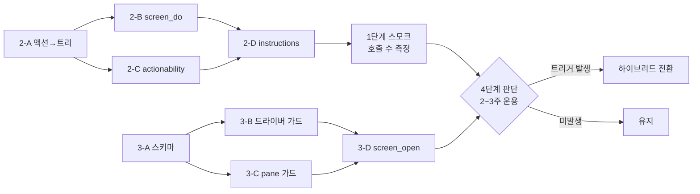

# 미리보기 브라우저 도구 개선 계획 (호출 절감 → 스코프 확장 → 단일 브라우저 판단)

> 작성일: 2026-09-16
> 배경: `colo-preview` MCP(`screen_*` 도구)의 실사용 중 호출 수가 많다는 문제 제기 → 원인 분석(도구 반환값, 아키텍처 아님) → Orca/Paseo식 "에이전트-사용자 단일 브라우저 공유" 전환 여부 검토
> 범위: 데몬(`packages/daemon/src`)의 `colo-preview` 도구 표면, 데스크톱(`packages/desktop/src`)의 `ElectronPreviewDriver`/`PlannerPreviewView`

---

## 0. TL;DR

- 호출 수가 많은 원인은 브라우저 아키텍처가 아니라 **액션 도구가 확인 텍스트만 반환**하기 때문 (look-act-look 루프). 1단계로 해결.
- "dev 서버 포트를 알려주는 설정"은 **이미 존재**(`colo-design.json`의 `preview.port` — 이후 선택 사항이 됐다: 미선언 시 데몬이 서버 출력·LISTEN 소켓에서 포트를 감지한다). 남은 스코프 확장은 **preview 서버 외 추가 origin 허용**. 2단계.
- Orca/Paseo식 단일 공유 브라우저(에이전트와 사용자가 같은 WebContents를 봄)는 **에이전트의 조작 난이도나 호출 수를 개선하지 않는다** — 사용자 가시성과 로그인 세션 공유를 위한 제품 결정이며, 게이트의 무오염 재검증과 상충한다.
- **상태 (2026-09-16)**: 1·2단계와 §4의 하이브리드 전환이 모두 구현됐다. 세션 도구는 `PanePreviewDriver`가 사용자 pane의 WebContents를 그대로 drive 하고(`PreviewDriverFactory.for`), 게이트·넘기기는 `forIsolated`로 숨은 `ElectronPreviewDriver`를 쓴다 — 재검증 무오염 원칙 유지. pane이 없으면 `for`가 숨은 창으로 폴백한다.

---

## 1. 현재 구조 요약

```
Daemon (in-process)                    Desktop main process
┌─────────────────────┐               ┌──────────────────────────────┐
│ AI session (SDK)     │               │ ElectronPreviewDriver         │
│   └─ colo-preview MCP│──screen_*────▶│   숨은 offscreen BrowserWindow │
│        (screen gate) │◀─재검증(별도)─│   = 세션당 1개, CDP 직결       │
└─────────────────────┘               │                               │
                                       │ PlannerPreviewView            │
                                       │   보이는 WebContentsView       │
                                       │   = 사용자 pane, 피커 오버레이 │
                                       └──────────────────────────────┘
                                              │ 둘 다 http(s) 요청
                                              ▼
                                    repo preview server (loopback)
```

- 에이전트용 창(숨은)과 사용자용 pane(보이는)은 **같은 서버의 다른 페이지 인스턴스**. 상태 공유 없음, 간섭 없음.
- 게이트(`screen-gate.ts`)는 턴이 연 화면을 **별도 드라이버**로 재오픈해 콘솔 오류·미정착(`unsettled`)을 검사 — "세션이 쓰던 창을 빌리지 않는다"가 명시된 설계 원칙.
- 스코프는 코드 레벨에서 preview 서버 origin으로 강제(`ElectronPreviewDriver.open`, `PlannerPreviewView.loopbackHttp`, `guardNavigations`).

Orca/Paseo와의 구조적 차이는 호스팅 기술(`<webview>`/`WebContentsView`)이 아니라 **WebContents가 1개(공유)냐 2개(분리)냐**. 공유형은 사용자가 에이전트 액션을 실시간으로 보고 로그인 세션을 물려주지만, 게이트의 독립 재검증과 상충하고 에이전트 조작 자체는 쉬워지지 않는다 (도구 표면·ref 체계·CDP 명령이 동일하기 때문).

---

## 2. 1단계 — 호출 수 절감 (도구 표면 수정)

**목표**: look-act-look 루프 제거. 아키텍처 변경 없음.

### 2-A. 액션 도구가 새 AX 트리를 반환

**파일**: `packages/daemon/src/preview-tools.ts`

`screen_click`·`screen_type`·`screen_press`·`screen_scroll`·`screen_hover`가 현재 확인 텍스트만 반환. 변경:

```
액션 실행 → driver.axTree() → serializeAxTree(compact=true) →
반환: "눌렀습니다: e12\n\n" + 트리
```

- `axTree()` 호출이 ref 세대를 갱신하므로 반환된 트리의 ref가 다음 액션에 바로 유효.
- `screen_open`도 동일 — settled 메시지 + 트리. "열고 바로 읽기"가 고정 패턴이라 1회 절약.
- 트리 길이는 기존 `MAX_TREE_LINES=400` 캡 유지.
- `screen_read`는 그대로 유지 — 액션 없이 재독해하거나 `compact:false`로 전체를 볼 때 사용.
- 부수 효과: `screen_hover` 후 트리를 주면 툴팁이 AX 트리에 잡혀 스크린샷 없이 hover 검증 가능.

### 2-B. `screen_do` 배치 도구

**파일**: `packages/daemon/src/preview-tools.ts` (신규 도구, `PreviewDriver` 인터페이스는 변경 없음)

```
screen_do({ steps: [
  { click: "e3" },
  { type: { ref: "e7", text: "hello", clear: true } },
  { press: "Enter" },
  { scroll: { dy: 400 } }
]})
```

- 순차 실행, 첫 실패에서 중단 → 실패한 스텝 인덱스 + 오류 + 그 시점 트리 반환.
- 성공 시 마지막 트리 1회 반환.
- 스텝 간 ref는 배치 시작 시점의 한 세대로 해석. 중간 스텝이 DOM을 바꿔 ref가 무효화되면 그 스텝에서 실패 (모델에게 "배치를 나누라"는 신호).
- 스텝 스키마는 기존 개별 도구 인자와 동일.
- `open`은 배치에 포함하지 않음 — 세대 리셋이 배치의 전제를 깨기 때문.

### 2-C. actionability 대기

**파일**: `packages/desktop/src/main.ts` — `rectOfRef`

현재 `RECT_OF_SELF`는 scrollIntoView + getBoundingClientRect 1회. 변경:

1. scrollIntoView
2. 두 rAF 연속 rect 동일 여부 확인 (안정)
3. disabled / aria-disabled / pointer-events:none 검사 (enabled)
4. elementFromPoint(center)가 대상을 가리키는지 확인 (가려지지 않음)
5. 실패 시 100ms 간격 재시도, 최대 2초 → 초과 시 사유가 담긴 오류 (`"e12 는 지금 누를 수 없습니다 (가려짐)"`)

- `Runtime.callFunctionOn`의 `functionDeclaration`을 async 함수로 바꾸고 `awaitPromise: true` 지정.
- 사유별 오류 메시지로 모델이 다음 행동(스크롤/모달 닫기/다른 요소)을 판단하도록 함.

### 2-D. 서버 instructions 갱신

`SERVER_INSTRUCTIONS`: "액션 결과에 트리가 포함되니 screen_read를 다시 부르지 마십시오. 여러 스텝은 screen_do로 묶으십시오."

### 검증

- `packages/daemon/test/preview-tools.test.mjs`: 기존 액션 도구 테스트를 트리 포함 반환으로 갱신. `screen_do` 테스트 추가 — 중간 실패 시 인덱스 반환, ref 세대 단일성 검증.
- `packages/desktop/test/desktop.test.mjs`: actionability — disabled 버튼 클릭이 오류로 떨어지는지, 애니메이션 중 요소가 안정 후 눌리는지 (capture harness 활용).
- 스모크: 실제 세션에서 폼 채우기 플로우 1회 → 호출 수 before/after 비교 (기대: 절반 이하).

**규모**: `preview-tools.ts` ~150줄 추가, `main.ts` ~60줄 변경.

---

## 3. 2단계 — 스코프 확장 (추가 origin 허용)

**정정**: dev 서버 포트를 알려주는 설정은 이미 존재한다 — `colo-design.json`의 `{ "preview": { "port": 5274 } }`(`repo-config.ts`). 데몬이 그 포트로 dev 서버를 띄우고 `previewUrl`을 구성하므로 에이전트는 이미 dev 서버를 보고 있다. (2026-09-16 이후: 포트 선언은 선택이다 — 없으면 데몬이 서버 출력과 프로세스 트리의 LISTEN 소켓에서 감지한다.)

2단계의 실질 범위는 **preview 서버 외의 origin도 열 수 있게 하는 것** — 디자인 시스템 스토리북, 별도 API 문서, 백엔드 admin 등.

### 3-A. 설정 스키마

**파일**: `packages/daemon/src/repo-config.ts`

```json
{ "preview": { "port": 5173, "origins": ["http://localhost:6006"] } }
```

- `RepoOverrides.preview.origins?: string[]`, `RepoConfig.preview.origins: string[]` (기본 `[]`).
- `parseRepoOverrides`에 검증 추가: 각 항목이 `http:`/`https:` URL이고 origin으로 정규화 가능해야 함. `file:`/`javascript:` 등 거절.
- `validateBootstrapOverrides`는 변경 없음 — 준비 턴은 port만 사용.

### 3-B. 드라이버 origin 가드 확장

**파일**: `packages/daemon/src/preview-tools.ts`, `packages/desktop/src/main.ts`

- `PreviewDriverFactory.for(baseUrl)` → `for(baseUrl, allowedOrigins: string[])`.
- `ElectronPreviewDriver.open`의 origin 검사: `url.origin === base.origin || allowedOrigins.includes(url.origin)`.
- `PreviewDrivers.toolsFor`/`runGate`/`captureHandoffShots`에서 `repo.repoConfig().preview.origins` 전달.
- 게이트는 **preview origin의 화면만** 재검증 — 외부 origin은 repo가 고친 대상이 아니므로 `noteOpened`에서 origin 비교 후 preview origin만 기록.

### 3-C. 사용자 pane origin 가드 확장

**파일**: `packages/desktop/src/preview-view.ts`

- `loopbackHttp`에 허용 목록 주입 — `PlannerPreviewView` 생성자에 `allowedOrigins: () => string[]` 콜백 추가.
- `sameOrigin`/`PreviewPage.origin`은 그대로 (페이지는 origin당 하나). `open()`/`navigate()`의 origin 검사가 허용 목록도 통과.
- `guardNavigations`도 동일 목록 참조.

### 3-D. `screen_open` 인자 확장

`route`가 절대 URL이면 허용 origin 검사 후 그대로 열기. 상대 경로면 기존대로 preview origin 기준.

### 검증

- repo-config 테스트: origins 파싱·거절 케이스.
- preview-tools 테스트: 허용 origin 열림, 비허용 거절 메시지.
- 게이트 테스트: 외부 origin 화면이 `openedThisTurn`에 안 잡히는지.

**규모**: ~120줄. **1단계와 파일이 겹치지 않아 병렬 진행 가능.**

---

## 4. 3단계 — 단일 브라우저 전환 (판단 게이트, 구현 계획 아님)

1·2단계를 배포하고 2~3주 운용한 뒤 아래 기준으로 판단한다.

### 전환 트리거 (하나라도 해당 시 진행)

- 사용자가 "에이전트가 뭘 하는지 안 보인다"를 반복 보고 (PiP 8fps 스트림으로 불충분).
- 핀 → 에이전트 재탐색 실패가 실제로 관찰됨 (다른 DOM 인스턴스라 못 찾는 경우).
- 로그인 필요 화면을 에이전트가 검증해야 하는 요구 발생.
- offscreen 렌더링 불일치 버그가 보고됨.

### 유지 트리거

- 게이트가 실제로 문제를 잡아내고 있음 (게이트 턴 발생 빈도로 측정).
- 에이전트 병렬 탐색과 사용자 작업 시간대가 자주 겹침 (분리의 이점이 실사용에서 확인됨).

### 전환 시 권장 설계 (하이브리드 — 완전 이관 아님)

```
보이는 pane WebContents ← 세션 드라이버 (사용자와 공유, 실시간 조작)
숨은 offscreen 창      ← 게이트·핸드오프 전용 (무오염 재검증 유지)
```

- `PreviewDriver` 구현체 2종: `PaneDriver`(`pane.webContents.debugger`) + 기존 `ElectronPreviewDriver`.
- `PreviewDrivers.toolsFor`는 `PaneDriver` 사용, `runGate`/`captureHandoffShots`는 기존 `ElectronPreviewDriver` 유지.
- 게이트 독립성과 사용자 가시성을 동시에 확보.
- 추가로 처리할 문제: DevTools attach 충돌 시 fallback, 사용자 입력과의 경합 시 액션 재시도, parked 페이지 중 어느 것을 drive할지(현재 화면 것으로 고정).

**주의**: 완전한 "에이전트=사용자 단일 인스턴스" 전환(하이브리드 없이)은 게이트의 무오염 재검증 전제를 깨므로 권장하지 않는다. 하이브리드도 3~4일 규모의 별도 작업이며, 1·2단계 결과 없이는 착수하지 않는다.

---

## 5. 실행 순서



(위 다이어그램의 2-*/3-* 번호는 본 문서의 §2/§3 절 번호와 대응한다.)

1단계(§2)와 2단계(§3)는 파일이 겹치지 않아 병렬 진행 가능. 3단계(§4)는 판단 게이트이며 별도 착수 시점 없음.

---

## 6. 비교 참고 — Orca/Paseo와의 구조 차이 (배경 요약)

| 차원 | 분리형 (현재) | 공유형 (Orca/Paseo) |
|---|---|---|
| WebContents 수 | 2개 (숨은 창 + pane) | 1개 |
| 에이전트-사용자 상태 일치 | 갈라짐 | 완전 일치 |
| 간섭 | 없음 | 있음 (navigate 탈취, 입력 경합) |
| 게이트 무오염 재검증 | 가능 | 불가 (같은 인스턴스 재사용 시) |
| 에이전트 조작 난이도 | 기준 | **동일** (도구·ref·CDP 명령 동일) |
| 호출 수 | 기준 | **동일** (도구 반환값 문제, 아키텍처 무관) |
| 사용자 가시성 | PiP 8fps | 실시간 |
| 로그인 세션 공유 | 불가 (별도 파티션) | 가능 |

결론: 공유형 전환은 **에이전트를 위한 개선이 아니라 사용자 경험(가시성·로그인 공유)을 위한 결정**이며, 호출 수·조작 난이도 문제는 §2(1단계)로 해결한다.
